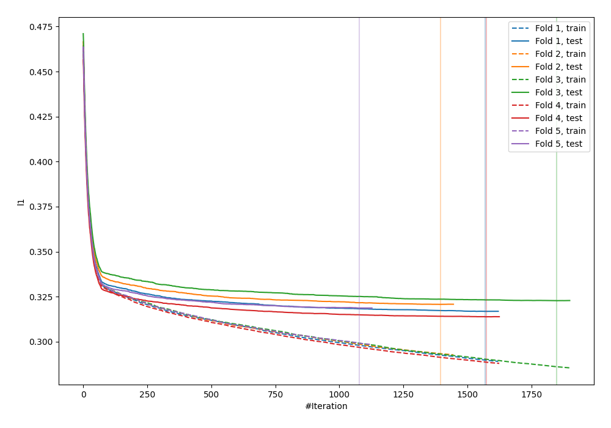
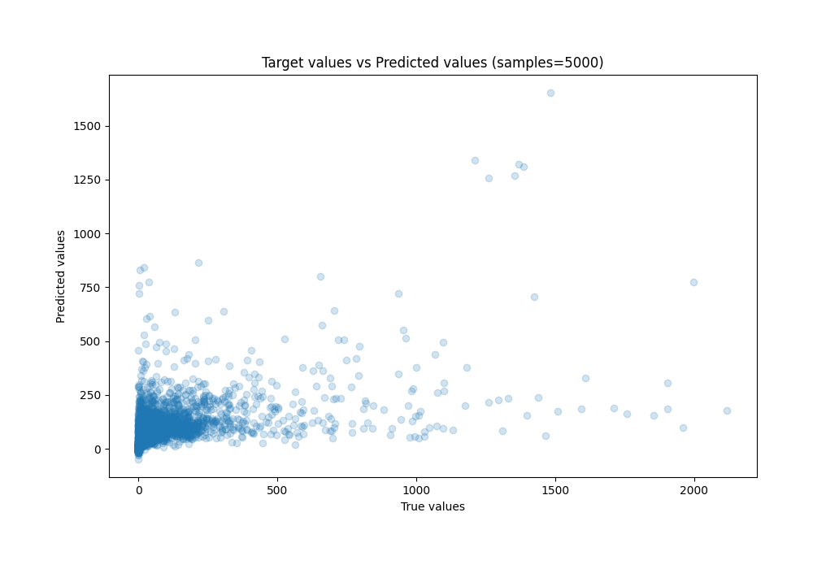
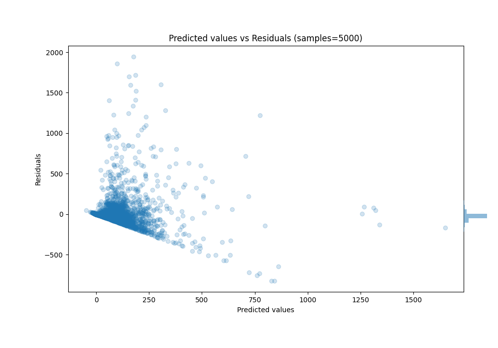

# Summary of 17_LightGBM

[<< Go back](../README.md)

## LightGBM
- **n_jobs**: -1
- **objective**: regression
- **num_leaves**: 31
- **learning_rate**: 0.05
- **feature_fraction**: 0.9
- **bagging_fraction**: 0.9
- **min_data_in_leaf**: 20
- **metric**: l1
- **custom_eval_metric_name**: None
- **explain_level**: 0

## Validation
 - **validation_type**: kfold
 - **k_folds**: 5
 - **shuffle**: True
 - **random_seed**: 42

## Optimized metric
mae

## Training time

42.0 seconds

### Metric details:
| Metric   |          Score |
|:---------|---------------:|
| MAE      |    54.4139     |
| MSE      | 20155.7        |
| RMSE     |   141.971      |
| R2       |     0.309173   |
| MAPE     |     3.8408e+15 |

## Learning curves

## True vs Predicted

## Predicted vs Residuals

[<< Go back](../README.md)
