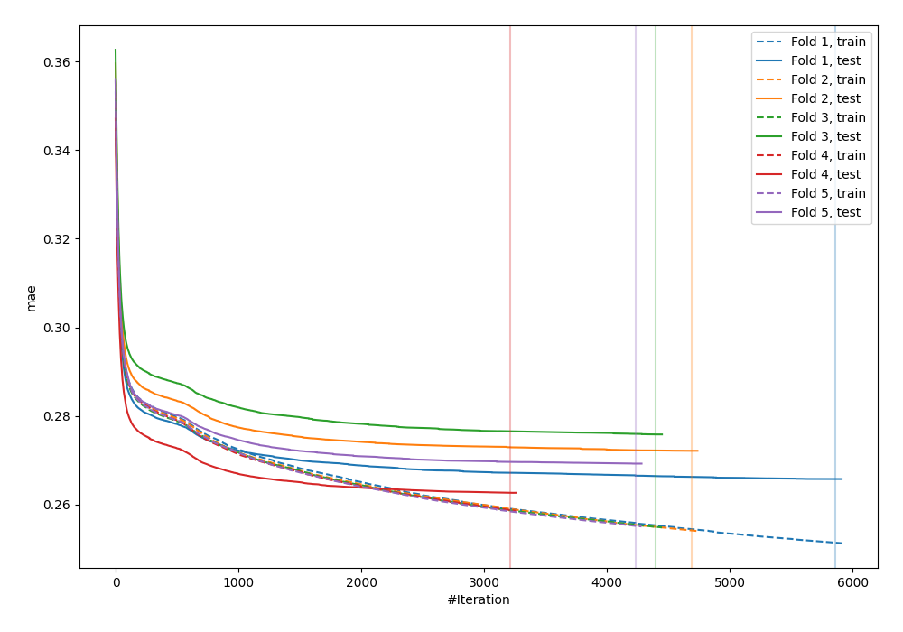
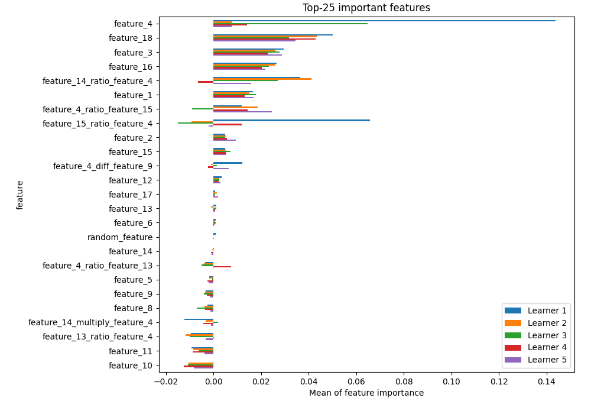
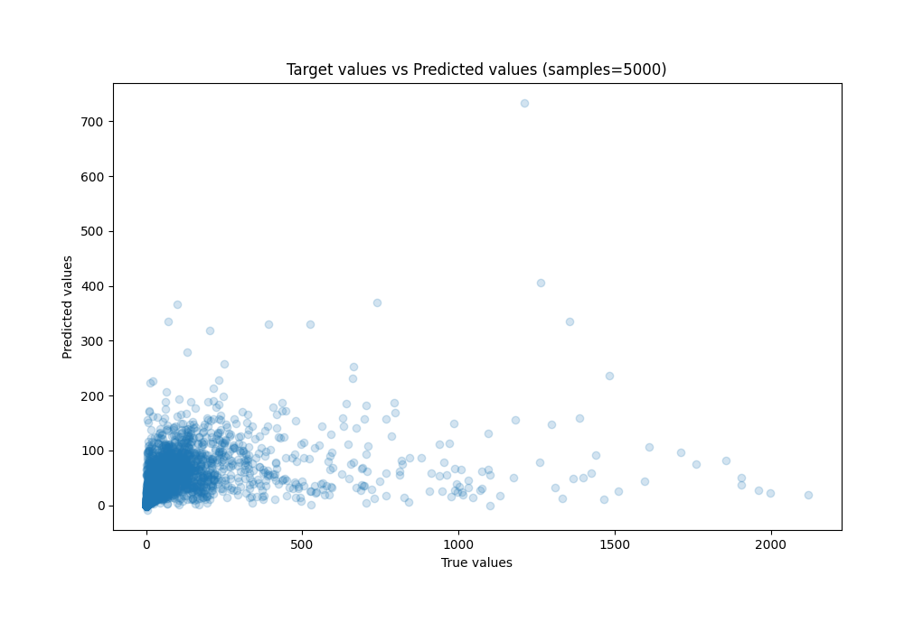
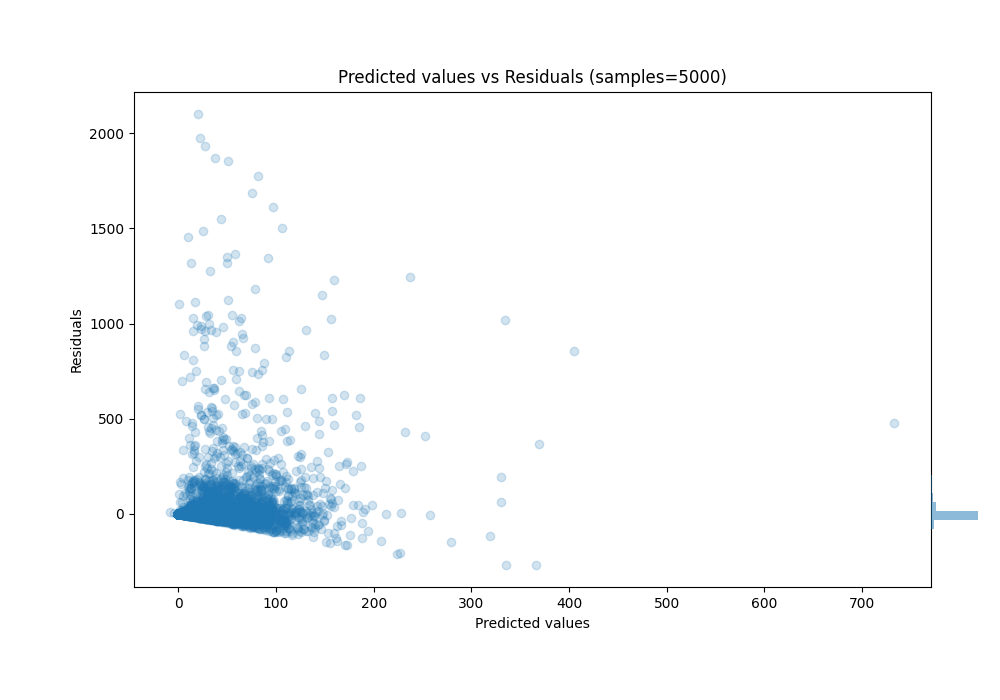

# Summary of 26_CatBoost_GoldenFeatures_RandomFeature

[<< Go back](../README.md)

## CatBoost
- **n_jobs**: -1
- **learning_rate**: 0.025
- **depth**: 9
- **rsm**: 0.9
- **loss_function**: MAPE
- **eval_metric**: MAE
- **explain_level**: 1

## Validation
 - **validation_type**: kfold
 - **k_folds**: 5
 - **shuffle**: True
 - **random_seed**: 42

## Optimized metric
mae

## Training time

1496.8 seconds

### Metric details:
| Metric   |           Score |
|:---------|----------------:|
| MAE      |    45.9652      |
| MSE      | 25939.3         |
| RMSE     |   161.057       |
| R2       |     0.110944    |
| MAPE     |     1.70864e+10 |

## Learning curves

## Permutation-based Importance

## True vs Predicted

## Predicted vs Residuals

[<< Go back](../README.md)
