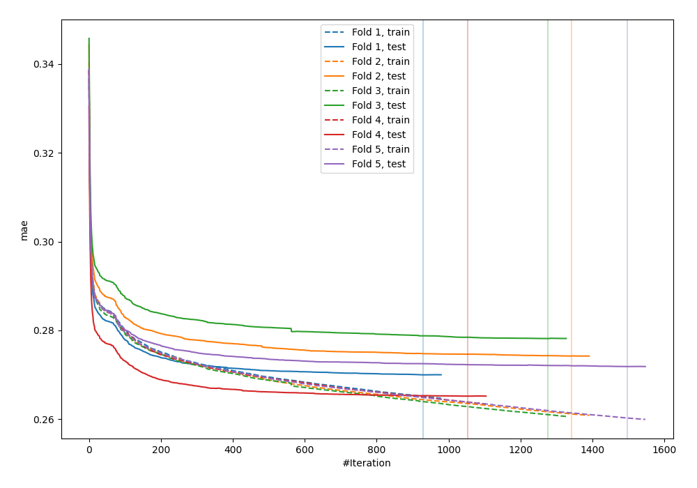
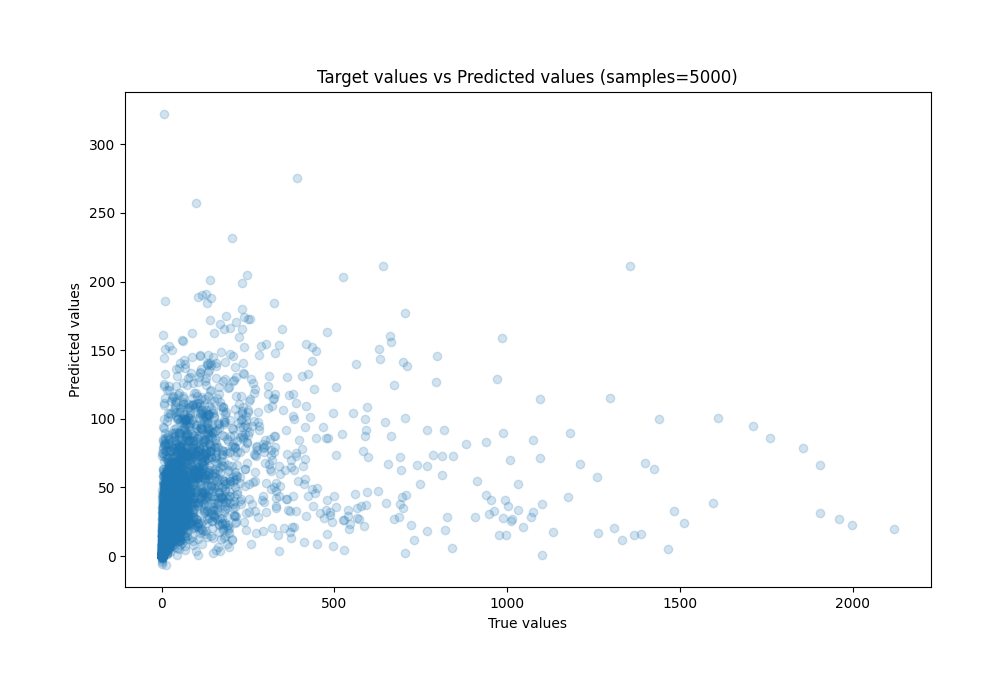
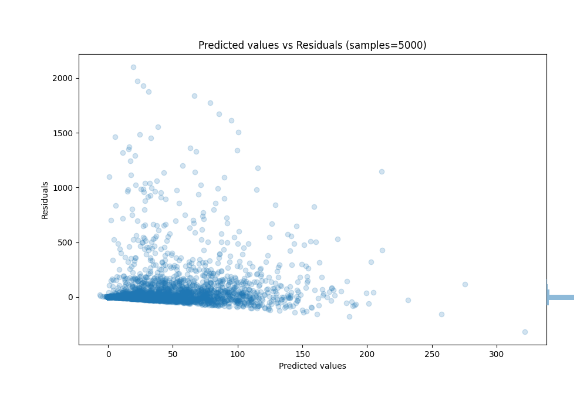

# Summary of 30_CatBoost_KMeansFeatures

[<< Go back](../README.md)

## CatBoost
- **n_jobs**: -1
- **learning_rate**: 0.2
- **depth**: 7
- **rsm**: 1.0
- **loss_function**: MAPE
- **eval_metric**: MAE
- **explain_level**: 0

## Validation
 - **validation_type**: kfold
 - **k_folds**: 5
 - **shuffle**: True
 - **random_seed**: 42

## Optimized metric
mae

## Training time

252.0 seconds

### Metric details:
| Metric   |           Score |
|:---------|----------------:|
| MAE      |    46.4371      |
| MSE      | 26721.3         |
| RMSE     |   163.466       |
| R2       |     0.0841427   |
| MAPE     |     1.33135e+10 |

## Learning curves

## True vs Predicted

## Predicted vs Residuals

[<< Go back](../README.md)
