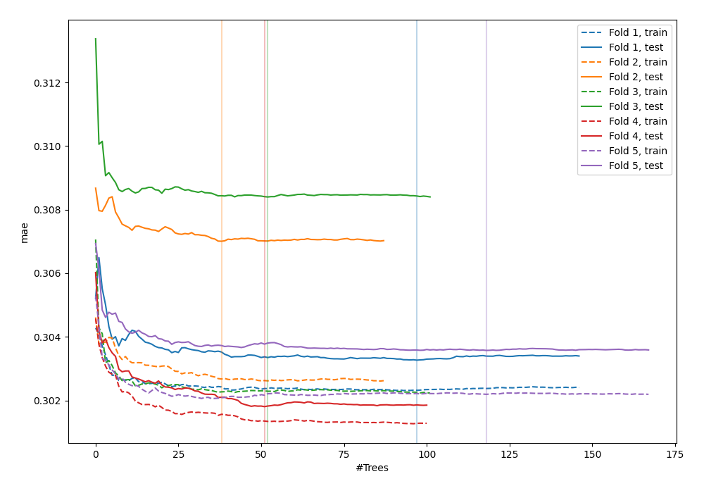
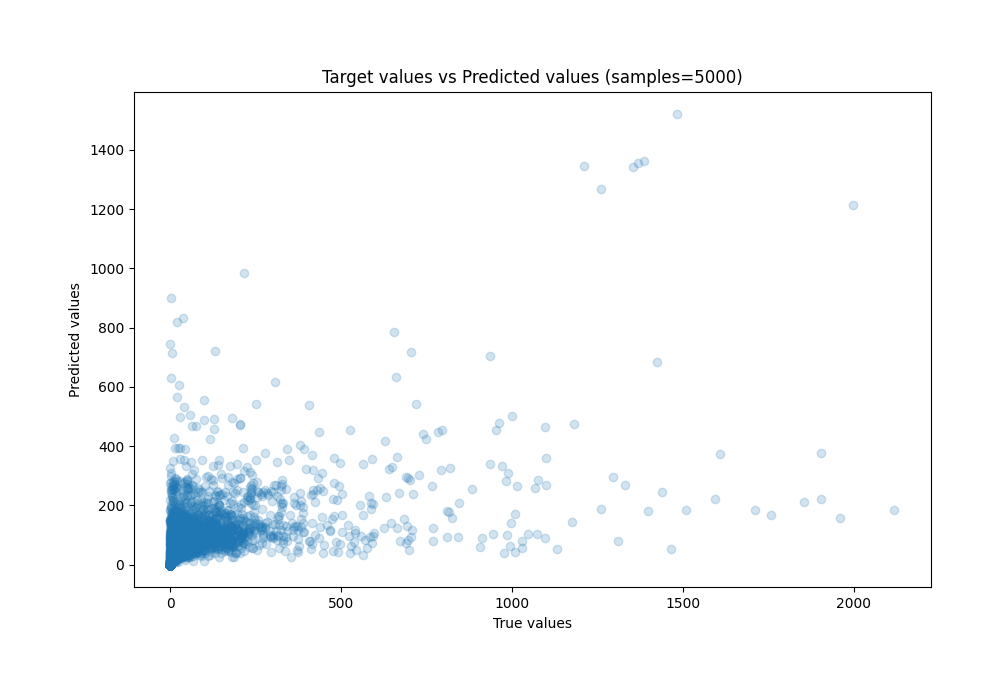
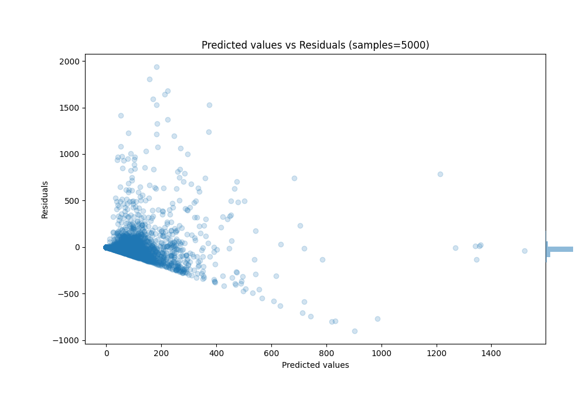

# Summary of 39_RandomForest_Stacked

[<< Go back](../README.md)

## Random Forest
- **n_jobs**: -1
- **criterion**: squared_error
- **max_features**: 0.8
- **min_samples_split**: 40
- **max_depth**: 6
- **eval_metric_name**: mae
- **explain_level**: 0

## Validation
 - **validation_type**: kfold
 - **k_folds**: 5
 - **shuffle**: True
 - **random_seed**: 42

## Optimized metric
mae

## Training time

653.5 seconds

### Metric details:
| Metric   |           Score |
|:---------|----------------:|
| MAE      |    52.0632      |
| MSE      | 19905.2         |
| RMSE     |   141.086       |
| R2       |     0.317759    |
| MAPE     |     2.44021e+14 |

## Learning curves

## True vs Predicted

## Predicted vs Residuals

[<< Go back](../README.md)
