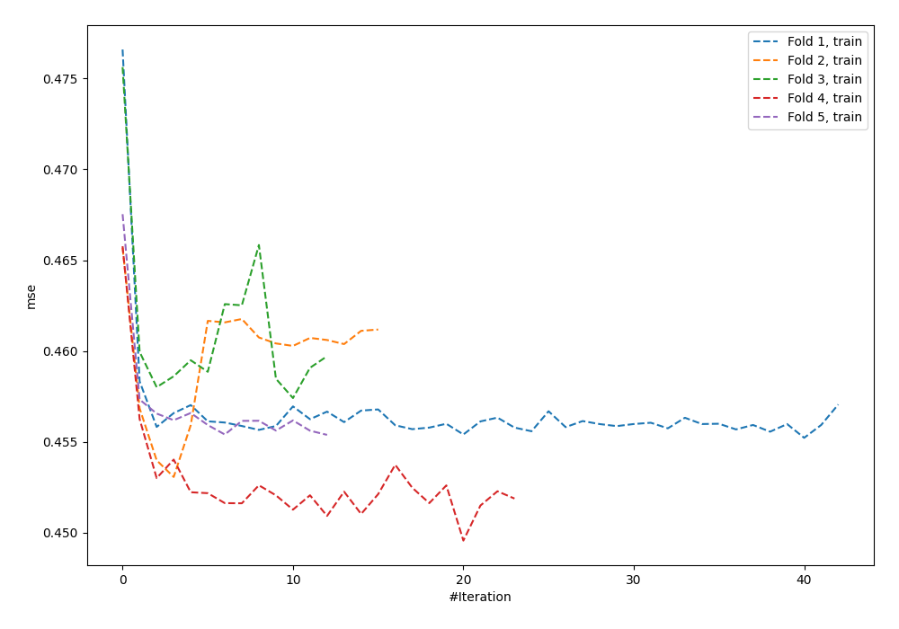
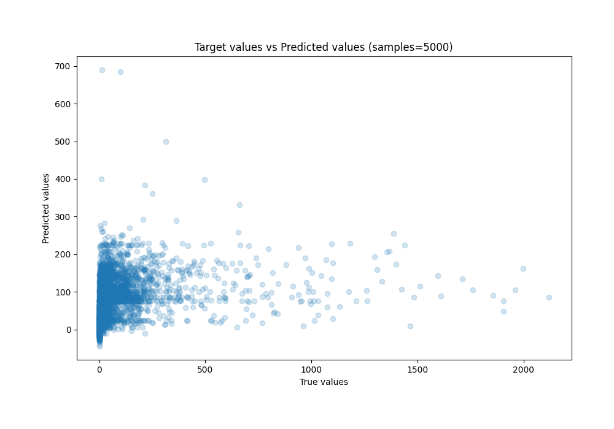
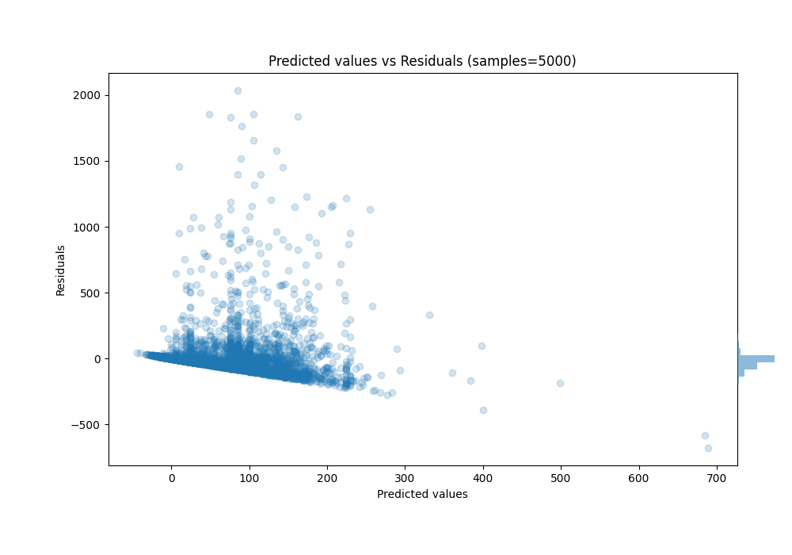

# Summary of 50_NeuralNetwork

[<< Go back](../README.md)

## Neural Network
- **n_jobs**: -1
- **dense_1_size**: 16
- **dense_2_size**: 16
- **learning_rate**: 0.08
- **explain_level**: 0

## Validation
 - **validation_type**: kfold
 - **k_folds**: 5
 - **shuffle**: True
 - **random_seed**: 42

## Optimized metric
mae

## Training time

92.1 seconds

### Metric details:
| Metric   |           Score |
|:---------|----------------:|
| MAE      |    67.8694      |
| MSE      | 26227.5         |
| RMSE     |   161.949       |
| R2       |     0.101066    |
| MAPE     |     2.23418e+16 |

## Learning curves

## True vs Predicted

## Predicted vs Residuals

[<< Go back](../README.md)
