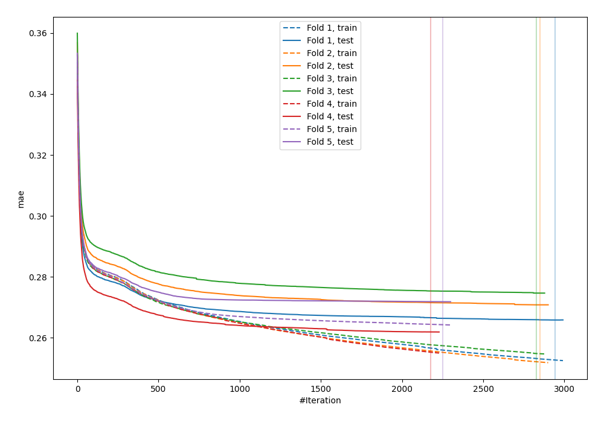

# Summary of 52_CatBoost

[<< Go back](../README.md)

## CatBoost
- **n_jobs**: -1
- **learning_rate**: 0.05
- **depth**: 9
- **rsm**: 0.9
- **loss_function**: MAPE
- **eval_metric**: MAE
- **explain_level**: 0

## Validation
 - **validation_type**: kfold
 - **k_folds**: 5
 - **shuffle**: True
 - **random_seed**: 42

## Optimized metric
mae

## Training time

618.8 seconds

### Metric details:
| Metric   |           Score |
|:---------|----------------:|
| MAE      |    45.9503      |
| MSE      | 26065.4         |
| RMSE     |   161.448       |
| R2       |     0.106623    |
| MAPE     |     8.59769e+10 |

## Learning curves

## True vs Predicted

## Predicted vs Residuals

[<< Go back](../README.md)
