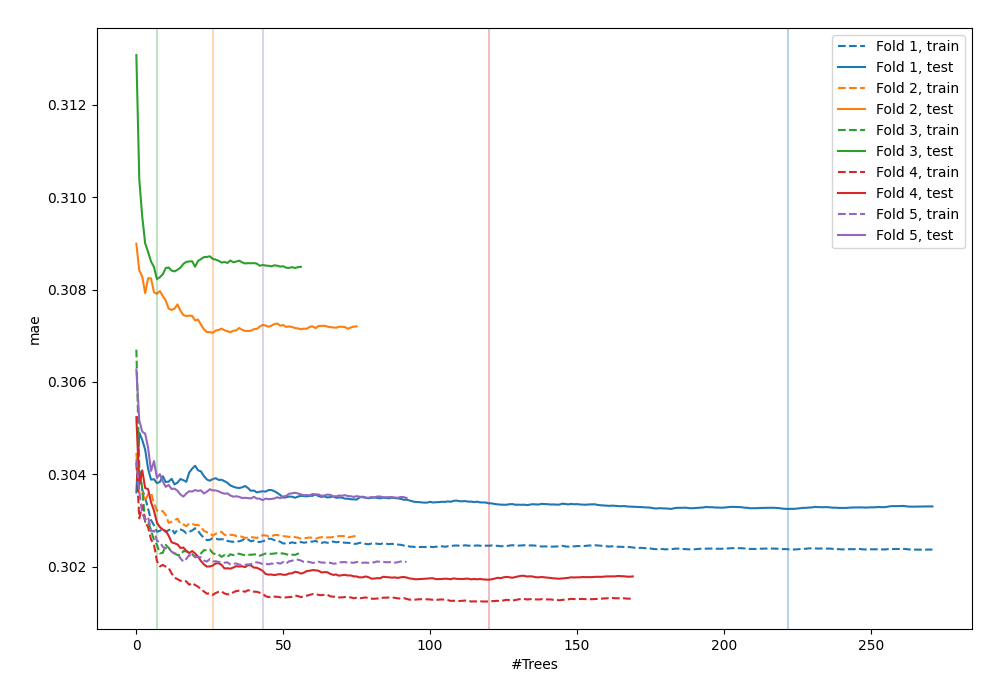
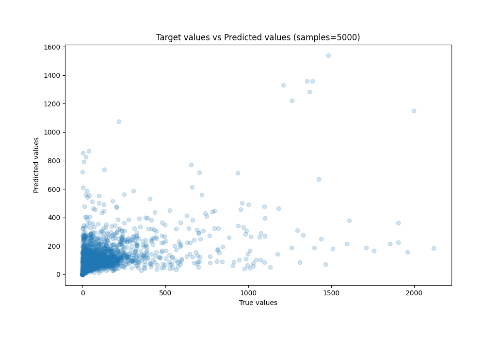
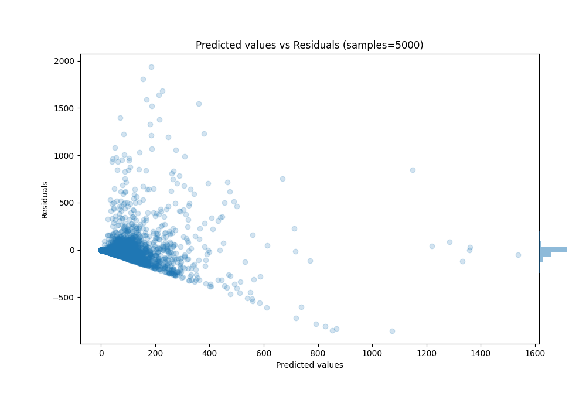

# Summary of 69_RandomForest_SelectedFeatures_Stacked

[<< Go back](../README.md)

## Random Forest
- **n_jobs**: -1
- **criterion**: squared_error
- **max_features**: 0.8
- **min_samples_split**: 30
- **max_depth**: 6
- **eval_metric_name**: mae
- **explain_level**: 0

## Validation
 - **validation_type**: kfold
 - **k_folds**: 5
 - **shuffle**: True
 - **random_seed**: 42

## Optimized metric
mae

## Training time

572.3 seconds

### Metric details:
| Metric   |           Score |
|:---------|----------------:|
| MAE      |    52.0511      |
| MSE      | 19913.9         |
| RMSE     |   141.116       |
| R2       |     0.317463    |
| MAPE     |     2.45867e+14 |

## Learning curves

## True vs Predicted

## Predicted vs Residuals

[<< Go back](../README.md)
