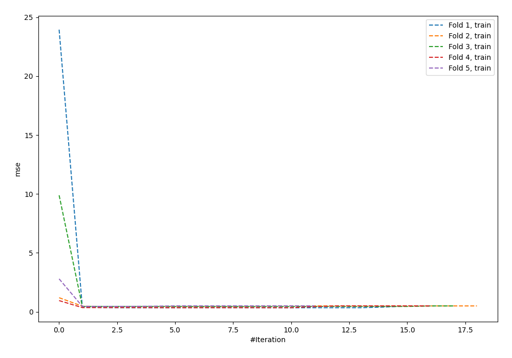

# Summary of 72_NeuralNetwork_Stacked

[<< Go back](../README.md)

## Neural Network
- **n_jobs**: -1
- **dense_1_size**: 32
- **dense_2_size**: 8
- **learning_rate**: 0.01
- **explain_level**: 0

## Validation
 - **validation_type**: kfold
 - **k_folds**: 5
 - **shuffle**: True
 - **random_seed**: 42

## Optimized metric
mae

## Training time

89.0 seconds

### Metric details:
| Metric   |           Score |
|:---------|----------------:|
| MAE      |    60.9211      |
| MSE      | 24129.1         |
| RMSE     |   155.335       |
| R2       |     0.172989    |
| MAPE     |     2.55021e+15 |

## Learning curves

## True vs Predicted

## Predicted vs Residuals

[<< Go back](../README.md)
