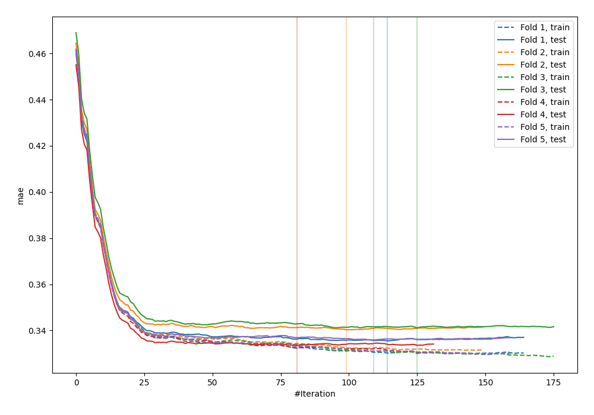
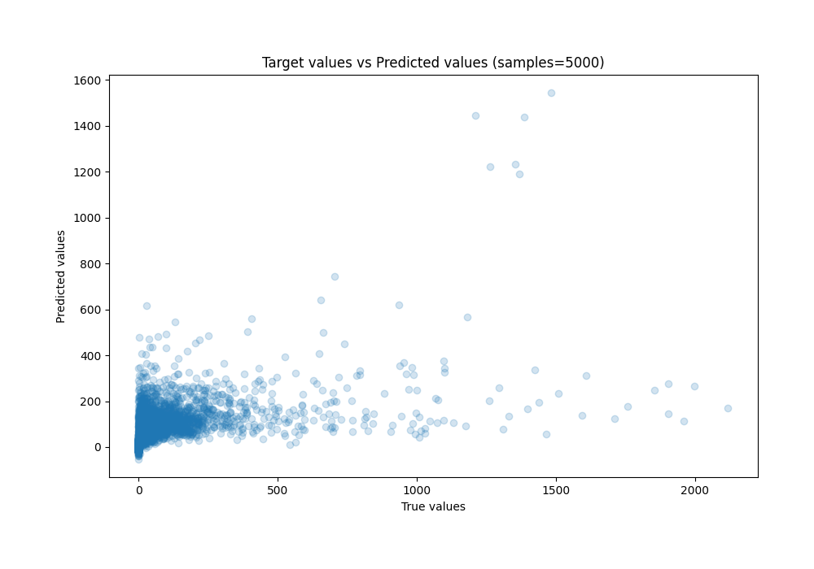
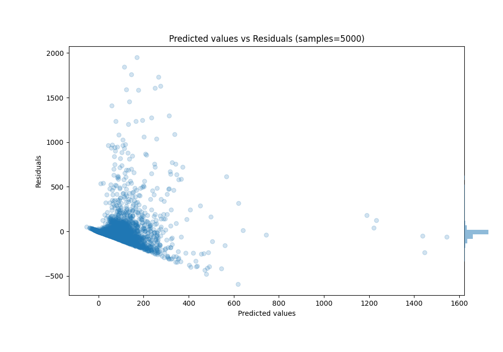

# Summary of 7_Xgboost

[<< Go back](../README.md)

## Extreme Gradient Boosting (Xgboost)
- **n_jobs**: -1
- **objective**: reg:squarederror
- **eta**: 0.15
- **max_depth**: 6
- **min_child_weight**: 25
- **subsample**: 0.5
- **colsample_bytree**: 0.5
- **eval_metric**: mae
- **explain_level**: 0

## Validation
 - **validation_type**: kfold
 - **k_folds**: 5
 - **shuffle**: True
 - **random_seed**: 42

## Optimized metric
mae

## Training time

16.9 seconds

### Metric details:
| Metric   |           Score |
|:---------|----------------:|
| MAE      |    57.6039      |
| MSE      | 21147.2         |
| RMSE     |   145.421       |
| R2       |     0.27519     |
| MAPE     |     7.88046e+15 |

## Learning curves

## True vs Predicted

## Predicted vs Residuals

[<< Go back](../README.md)
