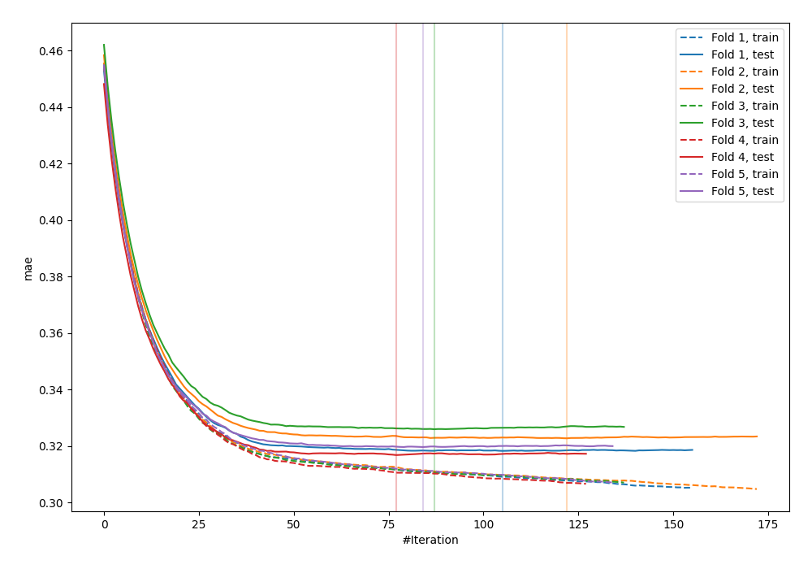
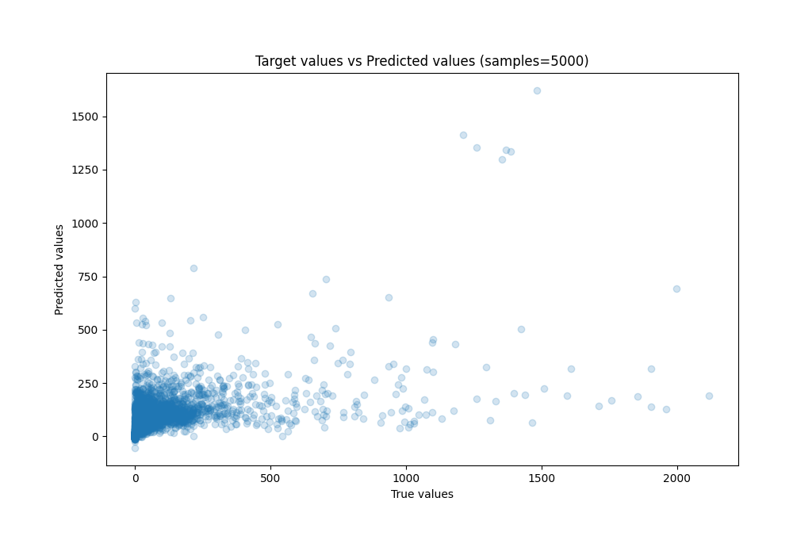
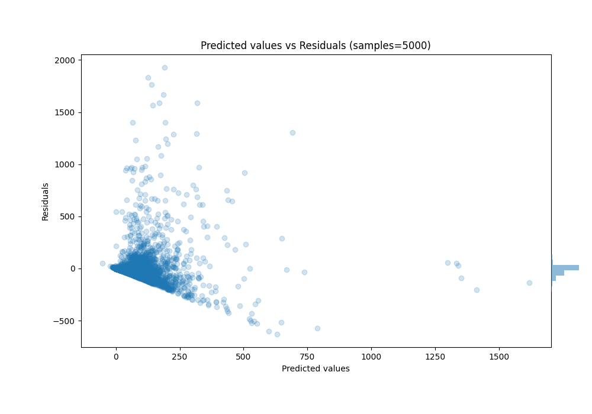

# Summary of 85_Xgboost

[<< Go back](../README.md)

## Extreme Gradient Boosting (Xgboost)
- **n_jobs**: -1
- **objective**: reg:squarederror
- **eta**: 0.1
- **max_depth**: 8
- **min_child_weight**: 25
- **subsample**: 0.6
- **colsample_bytree**: 1.0
- **eval_metric**: mae
- **explain_level**: 0

## Validation
 - **validation_type**: kfold
 - **k_folds**: 5
 - **shuffle**: True
 - **random_seed**: 42

## Optimized metric
mae

## Training time

22.2 seconds

### Metric details:
| Metric   |           Score |
|:---------|----------------:|
| MAE      |    54.7848      |
| MSE      | 20683.7         |
| RMSE     |   143.818       |
| R2       |     0.291077    |
| MAPE     |     2.77604e+15 |

## Learning curves

## True vs Predicted

## Predicted vs Residuals

[<< Go back](../README.md)
