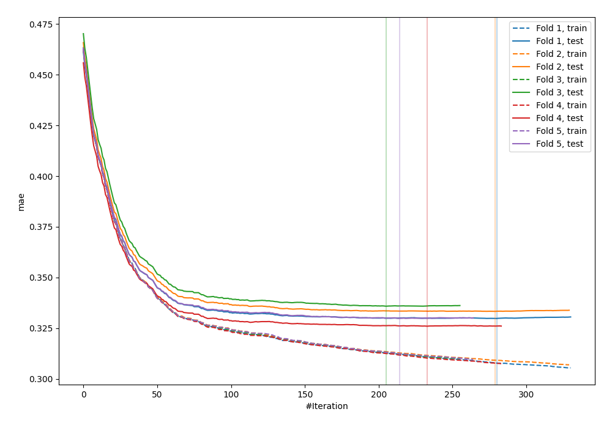
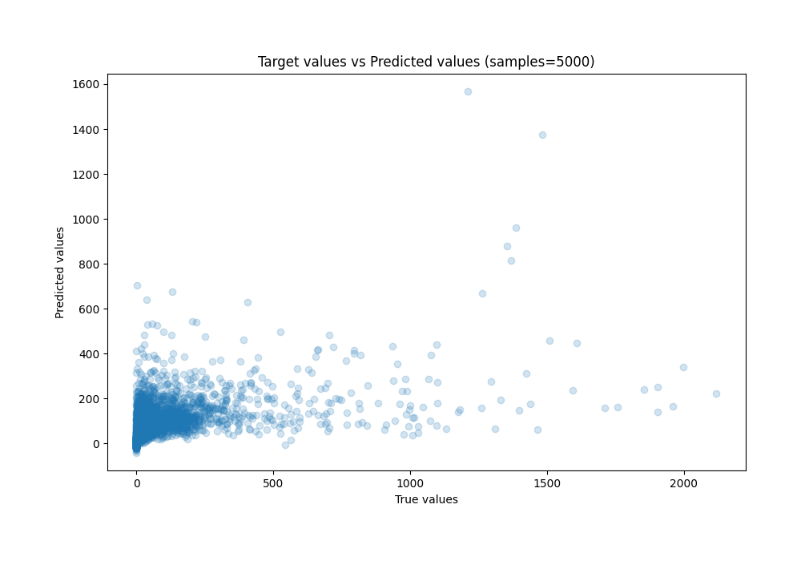
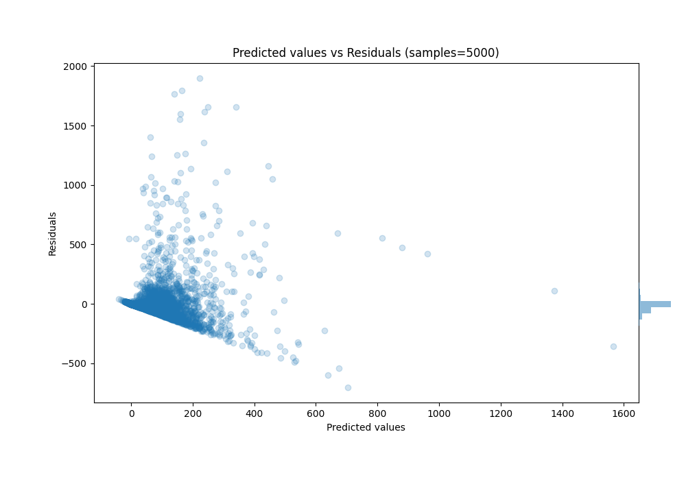

# Summary of 8_Xgboost_SelectedFeatures

[<< Go back](../README.md)

## Extreme Gradient Boosting (Xgboost)
- **n_jobs**: -1
- **objective**: reg:squarederror
- **eta**: 0.05
- **max_depth**: 9
- **min_child_weight**: 10
- **subsample**: 0.8
- **colsample_bytree**: 0.6
- **eval_metric**: mae
- **explain_level**: 0

## Validation
 - **validation_type**: kfold
 - **k_folds**: 5
 - **shuffle**: True
 - **random_seed**: 42

## Optimized metric
mae

## Training time

39.7 seconds

### Metric details:
| Metric   |           Score |
|:---------|----------------:|
| MAE      |    56.5371      |
| MSE      | 21268.8         |
| RMSE     |   145.838       |
| R2       |     0.271024    |
| MAPE     |     6.23239e+15 |

## Learning curves

## True vs Predicted

## Predicted vs Residuals

[<< Go back](../README.md)
