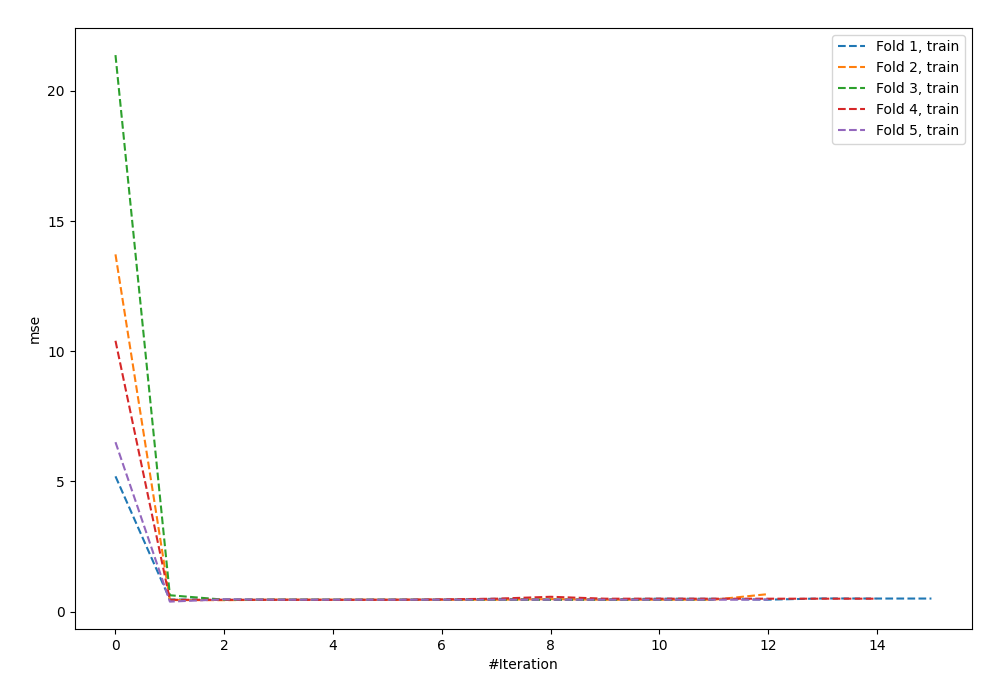
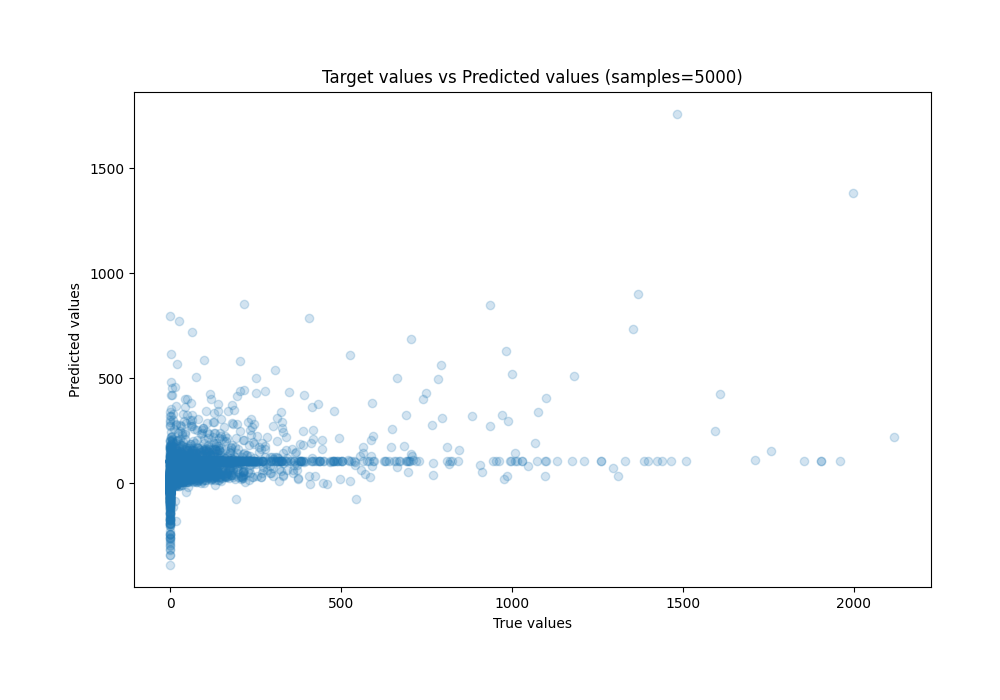
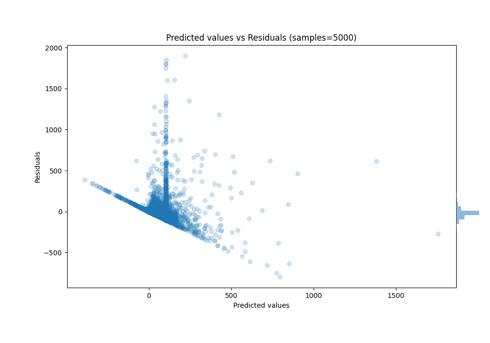

# Summary of 90_NeuralNetwork_SelectedFeatures_Stacked

[<< Go back](../README.md)

## Neural Network
- **n_jobs**: -1
- **dense_1_size**: 64
- **dense_2_size**: 16
- **learning_rate**: 0.01
- **explain_level**: 0

## Validation
 - **validation_type**: kfold
 - **k_folds**: 5
 - **shuffle**: True
 - **random_seed**: 42

## Optimized metric
mae

## Training time

117.7 seconds

### Metric details:
| Metric   |           Score |
|:---------|----------------:|
| MAE      |    67.201       |
| MSE      | 24987.6         |
| RMSE     |   158.075       |
| R2       |     0.143562    |
| MAPE     |     1.69973e+16 |

## Learning curves

## True vs Predicted

## Predicted vs Residuals

[<< Go back](../README.md)
