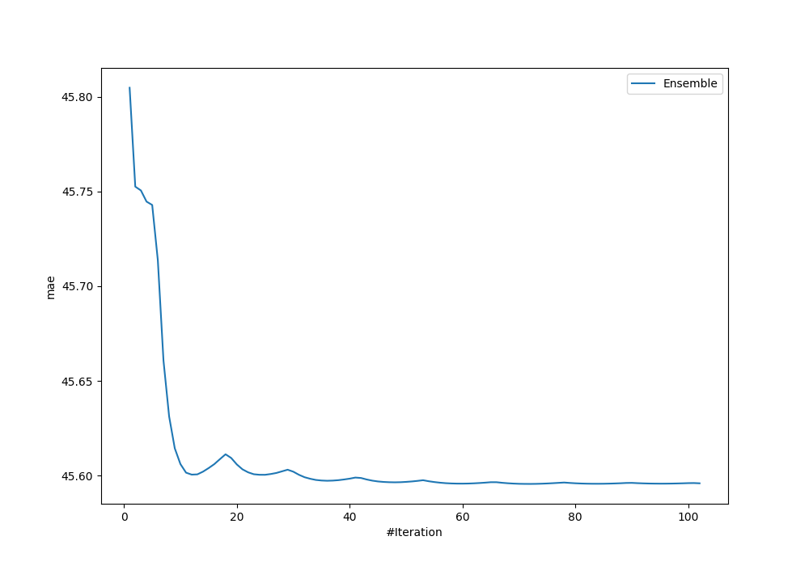
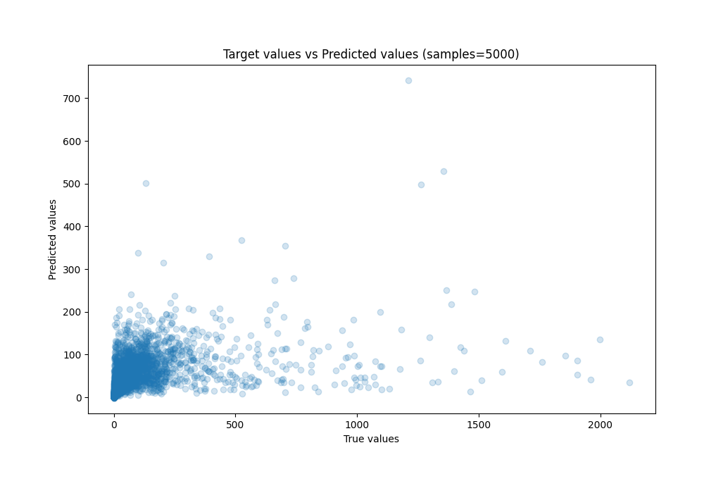
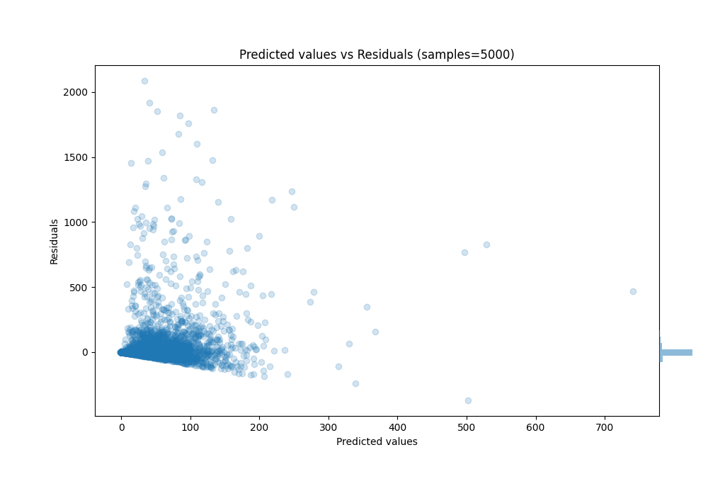

# Summary of Ensemble

[<< Go back](../README.md)

## Ensemble structure
| Model                      |   Weight |
|:---------------------------|---------:|
| 22_LightGBM                |        1 |
| 26_CatBoost_GoldenFeatures |        6 |
| 51_CatBoost_GoldenFeatures |        3 |
| 53_CatBoost                |        2 |
| 54_LightGBM                |        1 |
| 74_CatBoost_GoldenFeatures |       16 |
| 75_CatBoost_GoldenFeatures |        7 |
| 77_CatBoost                |       32 |
| 81_LightGBM                |        4 |

### Metric details:
| Metric   |           Score |
|:---------|----------------:|
| MAE      |    45.5956      |
| MSE      | 24875           |
| RMSE     |   157.718       |
| R2       |     0.147422    |
| MAPE     |     1.36496e+14 |

## Learning curves

## True vs Predicted

## Predicted vs Residuals

[<< Go back](../README.md)
