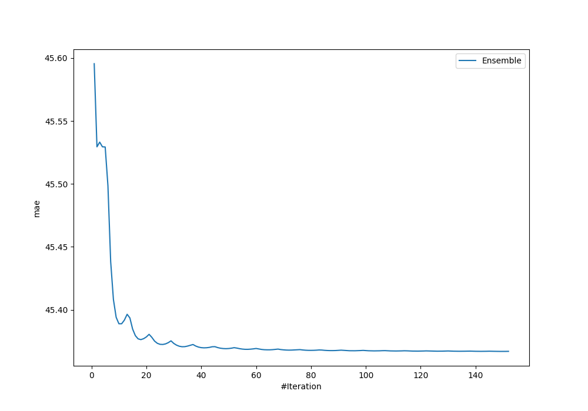
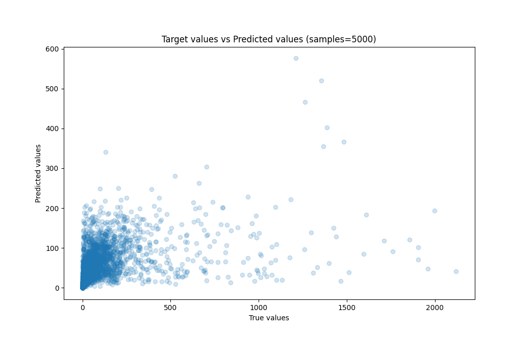
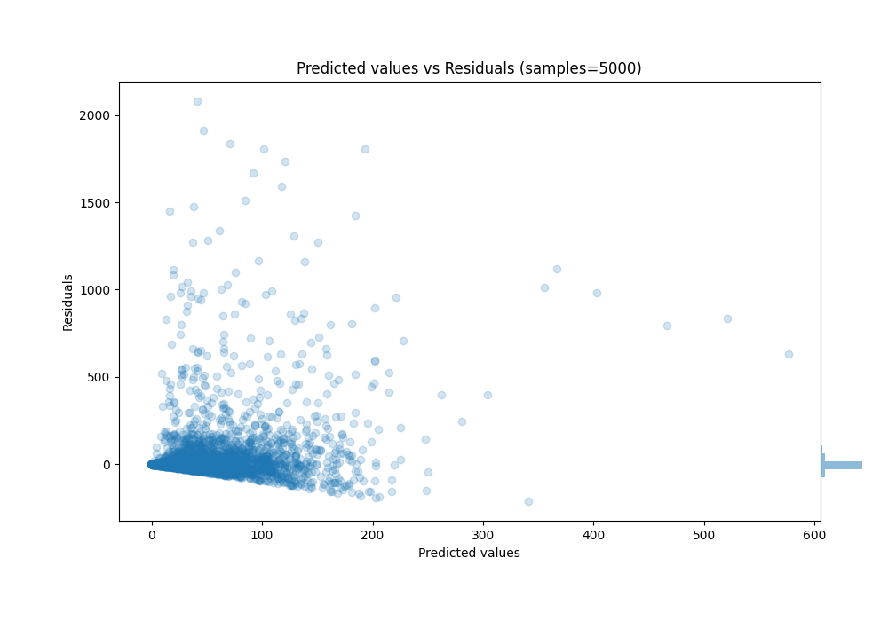

# Summary of Ensemble_Stacked

[<< Go back](../README.md)

## Ensemble structure
| Model                              |   Weight |
|:-----------------------------------|---------:|
| 21_LightGBM_Stacked                |        2 |
| 51_CatBoost_GoldenFeatures_Stacked |      103 |
| 54_LightGBM_Stacked                |        7 |
| 77_CatBoost                        |       25 |
| 79_LightGBM_Stacked                |        5 |
| 82_LightGBM_Stacked                |        5 |
| Ensemble                           |        3 |

### Metric details:
| Metric   |           Score |
|:---------|----------------:|
| MAE      |    45.3669      |
| MSE      | 24278.7         |
| RMSE     |   155.816       |
| R2       |     0.167861    |
| MAPE     |     7.39719e+13 |

## Learning curves

## True vs Predicted

## Predicted vs Residuals

[<< Go back](../README.md)
