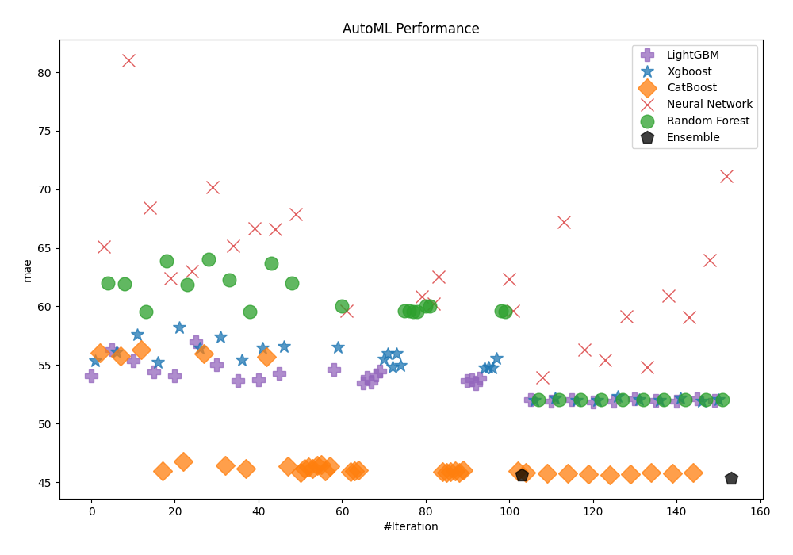
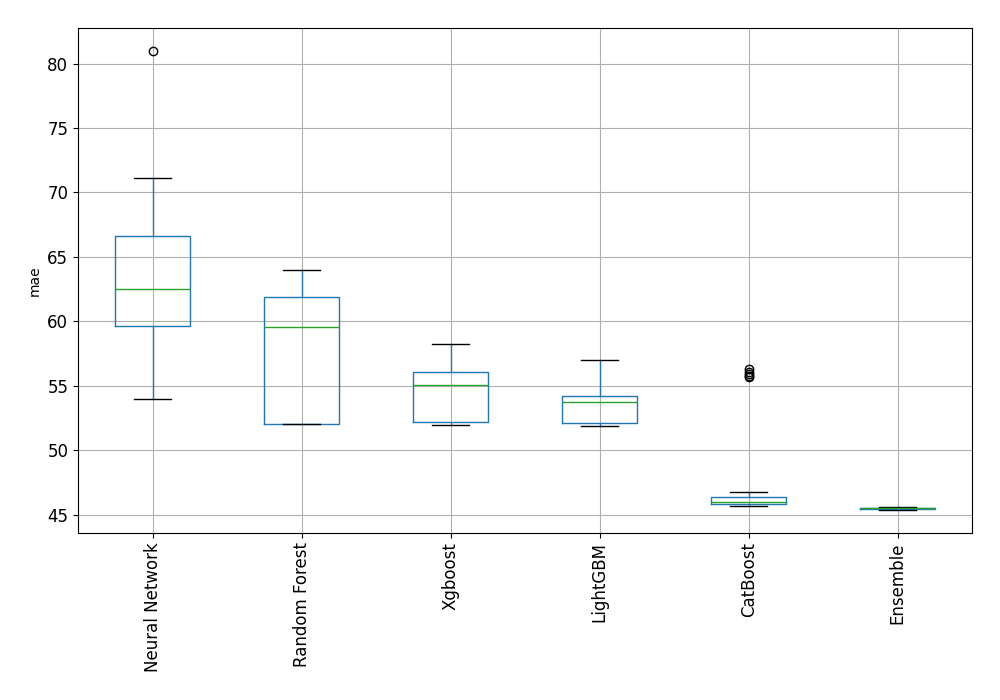
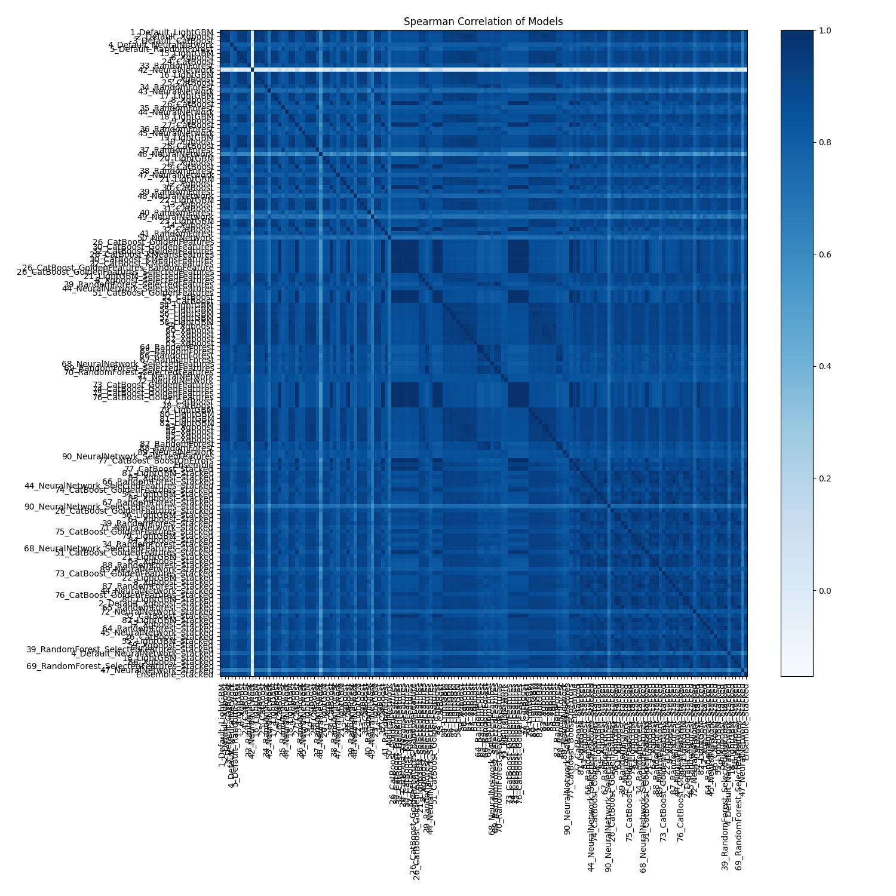

# AutoML Leaderboard

| Best model   | name                                                                                                 | model_type     | metric_type   |   metric_value |   train_time |
|:-------------|:-----------------------------------------------------------------------------------------------------|:---------------|:--------------|---------------:|-------------:|
|              | [1_Default_LightGBM](1_Default_LightGBM/README.md)                                                   | LightGBM       | mae           |        54.0873 |        33.65 |
|              | [2_Default_Xgboost](2_Default_Xgboost/README.md)                                                     | Xgboost        | mae           |        55.335  |        42.1  |
|              | [3_Default_CatBoost](3_Default_CatBoost/README.md)                                                   | CatBoost       | mae           |        56.0231 |        61.62 |
|              | [4_Default_NeuralNetwork](4_Default_NeuralNetwork/README.md)                                         | Neural Network | mae           |        65.1366 |       214.6  |
|              | [5_Default_RandomForest](5_Default_RandomForest/README.md)                                           | Random Forest  | mae           |        62.0093 |        82.12 |
|              | [15_LightGBM](15_LightGBM/README.md)                                                                 | LightGBM       | mae           |        56.3184 |        13.57 |
|              | [6_Xgboost](6_Xgboost/README.md)                                                                     | Xgboost        | mae           |        56.0786 |        23.74 |
|              | [24_CatBoost](24_CatBoost/README.md)                                                                 | CatBoost       | mae           |        55.7709 |        67.4  |
|              | [33_RandomForest](33_RandomForest/README.md)                                                         | Random Forest  | mae           |        61.8957 |        76.6  |
|              | [42_NeuralNetwork](42_NeuralNetwork/README.md)                                                       | Neural Network | mae           |        80.9935 |        59.77 |
|              | [16_LightGBM](16_LightGBM/README.md)                                                                 | LightGBM       | mae           |        55.3557 |        26.01 |
|              | [7_Xgboost](7_Xgboost/README.md)                                                                     | Xgboost        | mae           |        57.6039 |        17.85 |
|              | [25_CatBoost](25_CatBoost/README.md)                                                                 | CatBoost       | mae           |        56.3277 |        42.77 |
|              | [34_RandomForest](34_RandomForest/README.md)                                                         | Random Forest  | mae           |        59.5879 |        54.3  |
|              | [43_NeuralNetwork](43_NeuralNetwork/README.md)                                                       | Neural Network | mae           |        68.425  |       412.83 |
|              | [17_LightGBM](17_LightGBM/README.md)                                                                 | LightGBM       | mae           |        54.4139 |        42.9  |
|              | [8_Xgboost](8_Xgboost/README.md)                                                                     | Xgboost        | mae           |        55.2048 |        38.84 |
|              | [26_CatBoost](26_CatBoost/README.md)                                                                 | CatBoost       | mae           |        45.9815 |       978.66 |
|              | [35_RandomForest](35_RandomForest/README.md)                                                         | Random Forest  | mae           |        63.9158 |        43.28 |
|              | [44_NeuralNetwork](44_NeuralNetwork/README.md)                                                       | Neural Network | mae           |        62.4225 |       121.42 |
|              | [18_LightGBM](18_LightGBM/README.md)                                                                 | LightGBM       | mae           |        54.0723 |        39.12 |
|              | [9_Xgboost](9_Xgboost/README.md)                                                                     | Xgboost        | mae           |        58.2277 |        48.44 |
|              | [27_CatBoost](27_CatBoost/README.md)                                                                 | CatBoost       | mae           |        46.7583 |       955.17 |
|              | [36_RandomForest](36_RandomForest/README.md)                                                         | Random Forest  | mae           |        61.8916 |        57.96 |
|              | [45_NeuralNetwork](45_NeuralNetwork/README.md)                                                       | Neural Network | mae           |        63.0298 |        64.22 |
|              | [19_LightGBM](19_LightGBM/README.md)                                                                 | LightGBM       | mae           |        56.9986 |         9.59 |
|              | [10_Xgboost](10_Xgboost/README.md)                                                                   | Xgboost        | mae           |        56.4568 |        48.35 |
|              | [28_CatBoost](28_CatBoost/README.md)                                                                 | CatBoost       | mae           |        55.9388 |       247.67 |
|              | [37_RandomForest](37_RandomForest/README.md)                                                         | Random Forest  | mae           |        64.0004 |        68.18 |
|              | [46_NeuralNetwork](46_NeuralNetwork/README.md)                                                       | Neural Network | mae           |        70.1868 |        94.25 |
|              | [20_LightGBM](20_LightGBM/README.md)                                                                 | LightGBM       | mae           |        55.0145 |        21.95 |
|              | [11_Xgboost](11_Xgboost/README.md)                                                                   | Xgboost        | mae           |        57.4055 |        32.12 |
|              | [29_CatBoost](29_CatBoost/README.md)                                                                 | CatBoost       | mae           |        46.404  |       857.72 |
|              | [38_RandomForest](38_RandomForest/README.md)                                                         | Random Forest  | mae           |        62.275  |        54.55 |
|              | [47_NeuralNetwork](47_NeuralNetwork/README.md)                                                       | Neural Network | mae           |        65.1996 |       387.37 |
|              | [21_LightGBM](21_LightGBM/README.md)                                                                 | LightGBM       | mae           |        53.6902 |        13.32 |
|              | [12_Xgboost](12_Xgboost/README.md)                                                                   | Xgboost        | mae           |        55.4083 |        17.41 |
|              | [30_CatBoost](30_CatBoost/README.md)                                                                 | CatBoost       | mae           |        46.1645 |       198.46 |
|              | [39_RandomForest](39_RandomForest/README.md)                                                         | Random Forest  | mae           |        59.5854 |       117.27 |
|              | [48_NeuralNetwork](48_NeuralNetwork/README.md)                                                       | Neural Network | mae           |        66.6596 |       135.51 |
|              | [22_LightGBM](22_LightGBM/README.md)                                                                 | LightGBM       | mae           |        53.7467 |        17.84 |
|              | [13_Xgboost](13_Xgboost/README.md)                                                                   | Xgboost        | mae           |        56.4522 |        19.39 |
|              | [31_CatBoost](31_CatBoost/README.md)                                                                 | CatBoost       | mae           |        55.6699 |        55.3  |
|              | [40_RandomForest](40_RandomForest/README.md)                                                         | Random Forest  | mae           |        63.6743 |        48.3  |
|              | [49_NeuralNetwork](49_NeuralNetwork/README.md)                                                       | Neural Network | mae           |        66.6134 |       136.83 |
|              | [23_LightGBM](23_LightGBM/README.md)                                                                 | LightGBM       | mae           |        54.2613 |        11.1  |
|              | [14_Xgboost](14_Xgboost/README.md)                                                                   | Xgboost        | mae           |        56.56   |        53.93 |
|              | [32_CatBoost](32_CatBoost/README.md)                                                                 | CatBoost       | mae           |        46.3414 |      1456.08 |
|              | [41_RandomForest](41_RandomForest/README.md)                                                         | Random Forest  | mae           |        61.974  |        54.38 |
|              | [50_NeuralNetwork](50_NeuralNetwork/README.md)                                                       | Neural Network | mae           |        67.8694 |        92.94 |
|              | [26_CatBoost_GoldenFeatures](26_CatBoost_GoldenFeatures/README.md)                                   | CatBoost       | mae           |        45.8362 |      1300.62 |
|              | [30_CatBoost_GoldenFeatures](30_CatBoost_GoldenFeatures/README.md)                                   | CatBoost       | mae           |        46.1568 |       215.02 |
|              | [32_CatBoost_GoldenFeatures](32_CatBoost_GoldenFeatures/README.md)                                   | CatBoost       | mae           |        46.3085 |      1504.81 |
|              | [26_CatBoost_KMeansFeatures](26_CatBoost_KMeansFeatures/README.md)                                   | CatBoost       | mae           |        46.1446 |      1574.59 |
|              | [30_CatBoost_KMeansFeatures](30_CatBoost_KMeansFeatures/README.md)                                   | CatBoost       | mae           |        46.4371 |       252.97 |
|              | [32_CatBoost_KMeansFeatures](32_CatBoost_KMeansFeatures/README.md)                                   | CatBoost       | mae           |        46.4762 |      1744.54 |
|              | [26_CatBoost_GoldenFeatures_RandomFeature](26_CatBoost_GoldenFeatures_RandomFeature/README.md)       | CatBoost       | mae           |        45.9652 |      1498.04 |
|              | [26_CatBoost_GoldenFeatures_SelectedFeatures](26_CatBoost_GoldenFeatures_SelectedFeatures/README.md) | CatBoost       | mae           |        46.3663 |       977.98 |
|              | [21_LightGBM_SelectedFeatures](21_LightGBM_SelectedFeatures/README.md)                               | LightGBM       | mae           |        54.6437 |        11.41 |
|              | [8_Xgboost_SelectedFeatures](8_Xgboost_SelectedFeatures/README.md)                                   | Xgboost        | mae           |        56.5371 |        40.51 |
|              | [39_RandomForest_SelectedFeatures](39_RandomForest_SelectedFeatures/README.md)                       | Random Forest  | mae           |        60.0067 |        68.08 |
|              | [44_NeuralNetwork_SelectedFeatures](44_NeuralNetwork_SelectedFeatures/README.md)                     | Neural Network | mae           |        59.632  |       154.09 |
|              | [51_CatBoost_GoldenFeatures](51_CatBoost_GoldenFeatures/README.md)                                   | CatBoost       | mae           |        45.8951 |       661.48 |
|              | [52_CatBoost](52_CatBoost/README.md)                                                                 | CatBoost       | mae           |        45.9503 |       619.76 |
|              | [53_CatBoost](53_CatBoost/README.md)                                                                 | CatBoost       | mae           |        46.0182 |       974.63 |
|              | [54_LightGBM](54_LightGBM/README.md)                                                                 | LightGBM       | mae           |        53.4802 |        21.79 |
|              | [55_LightGBM](55_LightGBM/README.md)                                                                 | LightGBM       | mae           |        53.9632 |         9.98 |
|              | [56_LightGBM](56_LightGBM/README.md)                                                                 | LightGBM       | mae           |        53.5667 |        28.05 |
|              | [57_LightGBM](57_LightGBM/README.md)                                                                 | LightGBM       | mae           |        54.148  |        10.95 |
|              | [58_LightGBM](58_LightGBM/README.md)                                                                 | LightGBM       | mae           |        54.4801 |        18.13 |
|              | [59_Xgboost](59_Xgboost/README.md)                                                                   | Xgboost        | mae           |        55.4793 |        57.7  |
|              | [60_Xgboost](60_Xgboost/README.md)                                                                   | Xgboost        | mae           |        55.9828 |        63.54 |
|              | [61_Xgboost](61_Xgboost/README.md)                                                                   | Xgboost        | mae           |        54.8325 |        42.97 |
|              | [62_Xgboost](62_Xgboost/README.md)                                                                   | Xgboost        | mae           |        55.9468 |        23.72 |
|              | [63_Xgboost](63_Xgboost/README.md)                                                                   | Xgboost        | mae           |        54.9753 |        18.04 |
|              | [64_RandomForest](64_RandomForest/README.md)                                                         | Random Forest  | mae           |        59.653  |       100.91 |
|              | [65_RandomForest](65_RandomForest/README.md)                                                         | Random Forest  | mae           |        59.6279 |       102.12 |
|              | [66_RandomForest](66_RandomForest/README.md)                                                         | Random Forest  | mae           |        59.5579 |        55    |
|              | [67_RandomForest](67_RandomForest/README.md)                                                         | Random Forest  | mae           |        59.5786 |        63.23 |
|              | [68_NeuralNetwork_SelectedFeatures](68_NeuralNetwork_SelectedFeatures/README.md)                     | Neural Network | mae           |        60.8443 |       219.94 |
|              | [69_RandomForest_SelectedFeatures](69_RandomForest_SelectedFeatures/README.md)                       | Random Forest  | mae           |        60.0067 |        67.39 |
|              | [70_RandomForest_SelectedFeatures](70_RandomForest_SelectedFeatures/README.md)                       | Random Forest  | mae           |        60.013  |        59.22 |
|              | [71_NeuralNetwork](71_NeuralNetwork/README.md)                                                       | Neural Network | mae           |        60.2112 |       429.43 |
|              | [72_NeuralNetwork](72_NeuralNetwork/README.md)                                                       | Neural Network | mae           |        62.5168 |       290.64 |
|              | [73_CatBoost_GoldenFeatures](73_CatBoost_GoldenFeatures/README.md)                                   | CatBoost       | mae           |        45.8986 |      1274.57 |
|              | [74_CatBoost_GoldenFeatures](74_CatBoost_GoldenFeatures/README.md)                                   | CatBoost       | mae           |        45.8327 |      1051.78 |
|              | [75_CatBoost_GoldenFeatures](75_CatBoost_GoldenFeatures/README.md)                                   | CatBoost       | mae           |        45.877  |       665.96 |
|              | [76_CatBoost_GoldenFeatures](76_CatBoost_GoldenFeatures/README.md)                                   | CatBoost       | mae           |        45.9226 |       550.02 |
|              | [77_CatBoost](77_CatBoost/README.md)                                                                 | CatBoost       | mae           |        45.8048 |       611.2  |
|              | [78_CatBoost](78_CatBoost/README.md)                                                                 | CatBoost       | mae           |        46.0058 |       465.32 |
|              | [79_LightGBM](79_LightGBM/README.md)                                                                 | LightGBM       | mae           |        53.6823 |        24.18 |
|              | [80_LightGBM](80_LightGBM/README.md)                                                                 | LightGBM       | mae           |        53.7521 |        34.42 |
|              | [81_LightGBM](81_LightGBM/README.md)                                                                 | LightGBM       | mae           |        53.3652 |        30.35 |
|              | [82_LightGBM](82_LightGBM/README.md)                                                                 | LightGBM       | mae           |        53.8628 |        13.58 |
|              | [83_Xgboost](83_Xgboost/README.md)                                                                   | Xgboost        | mae           |        54.7401 |        65.53 |
|              | [84_Xgboost](84_Xgboost/README.md)                                                                   | Xgboost        | mae           |        54.848  |        33.74 |
|              | [85_Xgboost](85_Xgboost/README.md)                                                                   | Xgboost        | mae           |        54.7848 |        22.93 |
|              | [86_Xgboost](86_Xgboost/README.md)                                                                   | Xgboost        | mae           |        55.5357 |        32.46 |
|              | [87_RandomForest](87_RandomForest/README.md)                                                         | Random Forest  | mae           |        59.6046 |        55.67 |
|              | [88_RandomForest](88_RandomForest/README.md)                                                         | Random Forest  | mae           |        59.5893 |        56.99 |
|              | [89_NeuralNetwork](89_NeuralNetwork/README.md)                                                       | Neural Network | mae           |        62.3577 |       470.99 |
|              | [90_NeuralNetwork_SelectedFeatures](90_NeuralNetwork_SelectedFeatures/README.md)                     | Neural Network | mae           |        59.6405 |       793.97 |
|              | [77_CatBoost_BoostOnErrors](77_CatBoost_BoostOnErrors/README.md)                                     | CatBoost       | mae           |        45.9597 |       578.19 |
|              | [Ensemble](Ensemble/README.md)                                                                       | Ensemble       | mae           |        45.5956 |        79.13 |
|              | [77_CatBoost_Stacked](77_CatBoost_Stacked/README.md)                                                 | CatBoost       | mae           |        45.8135 |       151.27 |
|              | [81_LightGBM_Stacked](81_LightGBM_Stacked/README.md)                                                 | LightGBM       | mae           |        52.0542 |        26.94 |
|              | [83_Xgboost_Stacked](83_Xgboost_Stacked/README.md)                                                   | Xgboost        | mae           |        51.9668 |        48.48 |
|              | [66_RandomForest_Stacked](66_RandomForest_Stacked/README.md)                                         | Random Forest  | mae           |        52.0381 |       355.42 |
|              | [44_NeuralNetwork_SelectedFeatures_Stacked](44_NeuralNetwork_SelectedFeatures_Stacked/README.md)     | Neural Network | mae           |        53.9621 |        71.81 |
|              | [74_CatBoost_GoldenFeatures_Stacked](74_CatBoost_GoldenFeatures_Stacked/README.md)                   | CatBoost       | mae           |        45.7163 |       283.6  |
|              | [54_LightGBM_Stacked](54_LightGBM_Stacked/README.md)                                                 | LightGBM       | mae           |        51.8784 |        28.21 |
|              | [85_Xgboost_Stacked](85_Xgboost_Stacked/README.md)                                                   | Xgboost        | mae           |        52.1575 |        34.25 |
|              | [67_RandomForest_Stacked](67_RandomForest_Stacked/README.md)                                         | Random Forest  | mae           |        52.0381 |       515.4  |
|              | [90_NeuralNetwork_SelectedFeatures_Stacked](90_NeuralNetwork_SelectedFeatures_Stacked/README.md)     | Neural Network | mae           |        67.201  |       118.46 |
|              | [26_CatBoost_GoldenFeatures_Stacked](26_CatBoost_GoldenFeatures_Stacked/README.md)                   | CatBoost       | mae           |        45.7495 |       294.39 |
|              | [56_LightGBM_Stacked](56_LightGBM_Stacked/README.md)                                                 | LightGBM       | mae           |        52.013  |        24.57 |
|              | [61_Xgboost_Stacked](61_Xgboost_Stacked/README.md)                                                   | Xgboost        | mae           |        51.9989 |        38.41 |
|              | [39_RandomForest_Stacked](39_RandomForest_Stacked/README.md)                                         | Random Forest  | mae           |        52.0632 |       654.33 |
|              | [71_NeuralNetwork_Stacked](71_NeuralNetwork_Stacked/README.md)                                       | Neural Network | mae           |        56.3286 |        96.93 |
|              | [75_CatBoost_GoldenFeatures_Stacked](75_CatBoost_GoldenFeatures_Stacked/README.md)                   | CatBoost       | mae           |        45.7075 |       174.35 |
|              | [79_LightGBM_Stacked](79_LightGBM_Stacked/README.md)                                                 | LightGBM       | mae           |        51.8458 |        26.83 |
|              | [84_Xgboost_Stacked](84_Xgboost_Stacked/README.md)                                                   | Xgboost        | mae           |        52.0009 |        33.96 |
|              | [34_RandomForest_Stacked](34_RandomForest_Stacked/README.md)                                         | Random Forest  | mae           |        52.0405 |       462.22 |
|              | [68_NeuralNetwork_SelectedFeatures_Stacked](68_NeuralNetwork_SelectedFeatures_Stacked/README.md)     | Neural Network | mae           |        55.4351 |       110.69 |
|              | [51_CatBoost_GoldenFeatures_Stacked](51_CatBoost_GoldenFeatures_Stacked/README.md)                   | CatBoost       | mae           |        45.6439 |       175.43 |
|              | [21_LightGBM_Stacked](21_LightGBM_Stacked/README.md)                                                 | LightGBM       | mae           |        51.9042 |        21.69 |
|              | [63_Xgboost_Stacked](63_Xgboost_Stacked/README.md)                                                   | Xgboost        | mae           |        52.294  |        28.72 |
|              | [88_RandomForest_Stacked](88_RandomForest_Stacked/README.md)                                         | Random Forest  | mae           |        52.0367 |       449.71 |
|              | [89_NeuralNetwork_Stacked](89_NeuralNetwork_Stacked/README.md)                                       | Neural Network | mae           |        59.1401 |       163.3  |
|              | [73_CatBoost_GoldenFeatures_Stacked](73_CatBoost_GoldenFeatures_Stacked/README.md)                   | CatBoost       | mae           |        45.7129 |       287.48 |
|              | [22_LightGBM_Stacked](22_LightGBM_Stacked/README.md)                                                 | LightGBM       | mae           |        52.0996 |        19.72 |
|              | [8_Xgboost_Stacked](8_Xgboost_Stacked/README.md)                                                     | Xgboost        | mae           |        52.0704 |        56.51 |
|              | [87_RandomForest_Stacked](87_RandomForest_Stacked/README.md)                                         | Random Forest  | mae           |        52.032  |       396.66 |
|              | [44_NeuralNetwork_Stacked](44_NeuralNetwork_Stacked/README.md)                                       | Neural Network | mae           |        54.8098 |        72.77 |
|              | [76_CatBoost_GoldenFeatures_Stacked](76_CatBoost_GoldenFeatures_Stacked/README.md)                   | CatBoost       | mae           |        45.8167 |       153.85 |
|              | [80_LightGBM_Stacked](80_LightGBM_Stacked/README.md)                                                 | LightGBM       | mae           |        51.9627 |        24.09 |
|              | [2_Default_Xgboost_Stacked](2_Default_Xgboost_Stacked/README.md)                                     | Xgboost        | mae           |        51.964  |        37.8  |
|              | [65_RandomForest_Stacked](65_RandomForest_Stacked/README.md)                                         | Random Forest  | mae           |        52.0573 |       743.42 |
|              | [72_NeuralNetwork_Stacked](72_NeuralNetwork_Stacked/README.md)                                       | Neural Network | mae           |        60.9211 |        89.86 |
|              | [52_CatBoost_Stacked](52_CatBoost_Stacked/README.md)                                                 | CatBoost       | mae           |        45.7697 |       151.15 |
|              | [82_LightGBM_Stacked](82_LightGBM_Stacked/README.md)                                                 | LightGBM       | mae           |        51.8771 |        21.33 |
|              | [12_Xgboost_Stacked](12_Xgboost_Stacked/README.md)                                                   | Xgboost        | mae           |        52.2043 |        29.65 |
|              | [64_RandomForest_Stacked](64_RandomForest_Stacked/README.md)                                         | Random Forest  | mae           |        52.0565 |       972.08 |
|              | [45_NeuralNetwork_Stacked](45_NeuralNetwork_Stacked/README.md)                                       | Neural Network | mae           |        59.1177 |        63.94 |
|              | [26_CatBoost_Stacked](26_CatBoost_Stacked/README.md)                                                 | CatBoost       | mae           |        45.8375 |       238.97 |
|              | [55_LightGBM_Stacked](55_LightGBM_Stacked/README.md)                                                 | LightGBM       | mae           |        52.0964 |        18.89 |
|              | [59_Xgboost_Stacked](59_Xgboost_Stacked/README.md)                                                   | Xgboost        | mae           |        51.9144 |        52.2  |
|              | [39_RandomForest_SelectedFeatures_Stacked](39_RandomForest_SelectedFeatures_Stacked/README.md)       | Random Forest  | mae           |        52.0507 |       562.58 |
|              | [4_Default_NeuralNetwork_Stacked](4_Default_NeuralNetwork_Stacked/README.md)                         | Neural Network | mae           |        63.9925 |        79.87 |
|              | [18_LightGBM_Stacked](18_LightGBM_Stacked/README.md)                                                 | LightGBM       | mae           |        51.9708 |        24.41 |
|              | [86_Xgboost_Stacked](86_Xgboost_Stacked/README.md)                                                   | Xgboost        | mae           |        52.0496 |        45.76 |
|              | [69_RandomForest_SelectedFeatures_Stacked](69_RandomForest_SelectedFeatures_Stacked/README.md)       | Random Forest  | mae           |        52.0511 |       573.17 |
|              | [47_NeuralNetwork_Stacked](47_NeuralNetwork_Stacked/README.md)                                       | Neural Network | mae           |        71.1341 |       135.29 |
| **the best** | [Ensemble_Stacked](Ensemble_Stacked/README.md)                                                       | Ensemble       | mae           |        45.3669 |       166.78 |

### AutoML Performance

### AutoML Performance Boxplot

### Spearman Correlation of Models

