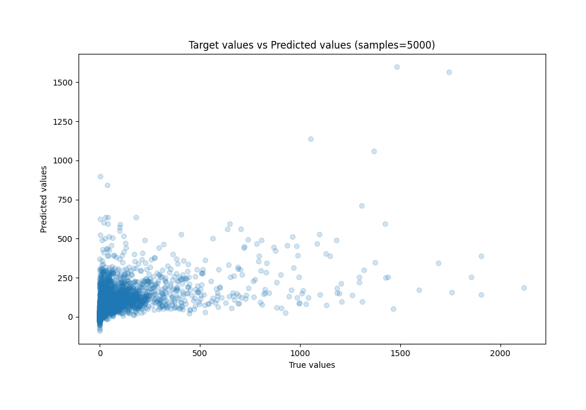
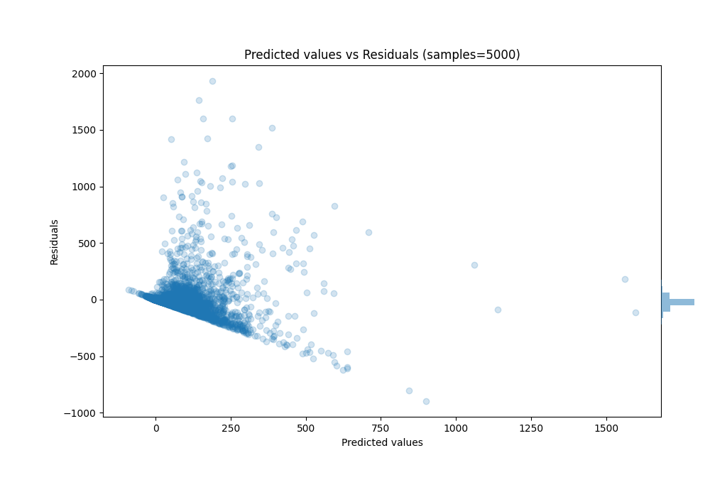

# Summary of 14_LightGBM

[<< Go back](../README.md)

## LightGBM
- **n_jobs**: -1
- **objective**: regression
- **num_leaves**: 95
- **learning_rate**: 0.1
- **feature_fraction**: 0.5
- **bagging_fraction**: 0.8
- **min_data_in_leaf**: 50
- **metric**: custom
- **custom_eval_metric_name**: r2
- **explain_level**: 0

## Validation
 - **validation_type**: kfold
 - **k_folds**: 10
 - **shuffle**: True

## Optimized metric
r2

## Training time

53.4 seconds

### Metric details:
| Metric   |           Score |
|:---------|----------------:|
| MAE      |    61.4023      |
| MSE      | 22759.4         |
| RMSE     |   150.862       |
| R2       |     0.290345    |
| MAPE     |     1.54068e+16 |

## Learning curves

## True vs Predicted

## Predicted vs Residuals

[<< Go back](../README.md)
