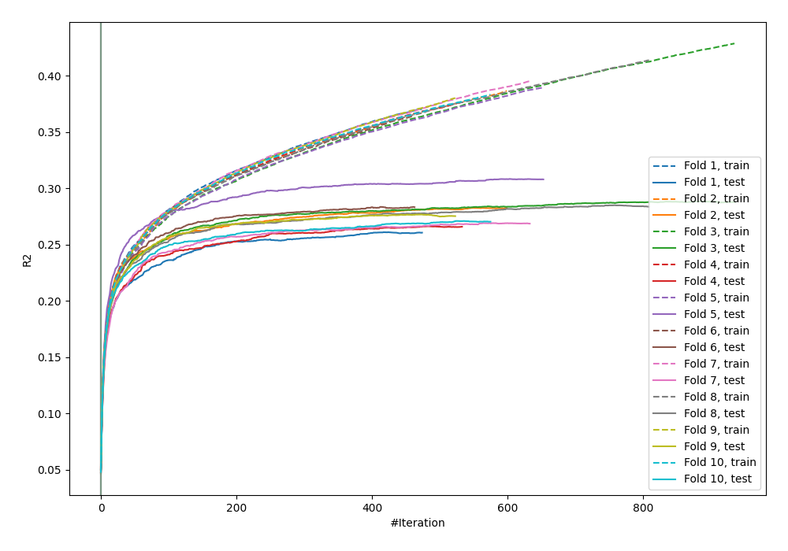
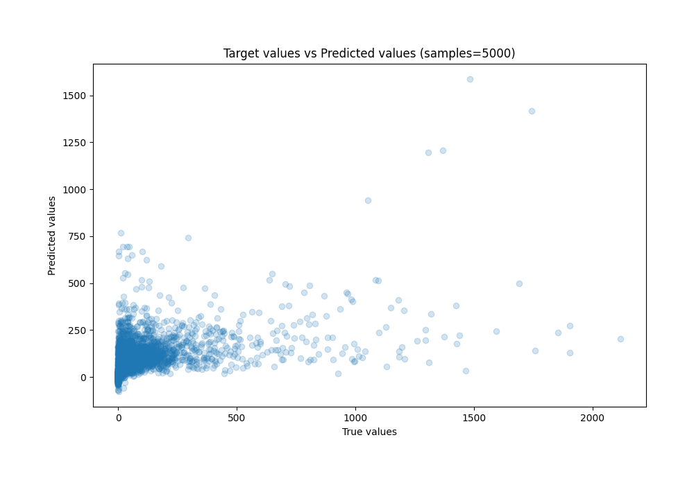
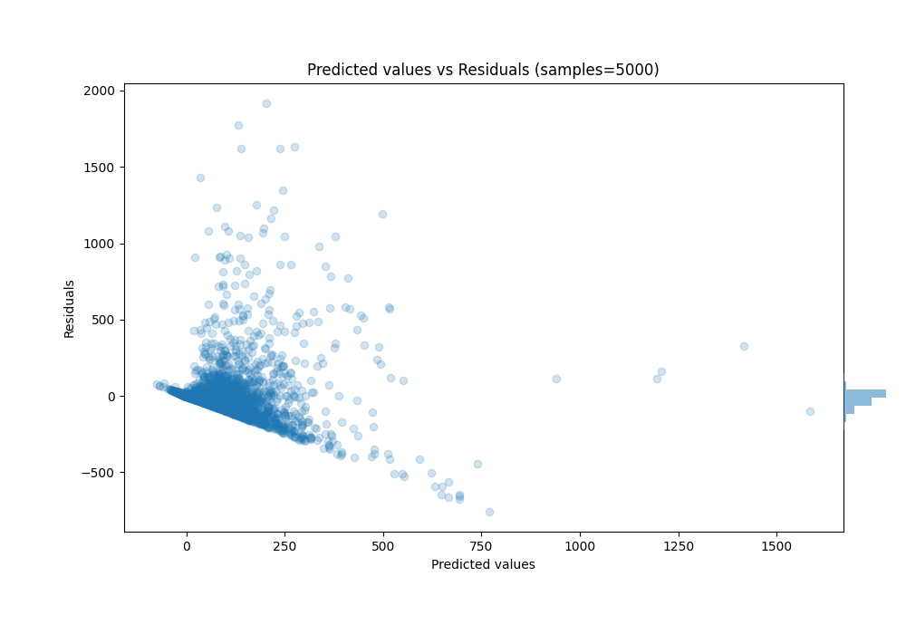

# Summary of 24_CatBoost

[<< Go back](../README.md)

## CatBoost
- **n_jobs**: -1
- **learning_rate**: 0.2
- **depth**: 6
- **rsm**: 0.8
- **loss_function**: RMSE
- **eval_metric**: R2
- **explain_level**: 0

## Validation
 - **validation_type**: kfold
 - **k_folds**: 10
 - **shuffle**: True

## Optimized metric
r2

## Training time

61.9 seconds

### Metric details:
| Metric   |           Score |
|:---------|----------------:|
| MAE      |    61.3511      |
| MSE      | 23108.6         |
| RMSE     |   152.015       |
| R2       |     0.279456    |
| MAPE     |     1.22266e+16 |

## Learning curves

## True vs Predicted

## Predicted vs Residuals

[<< Go back](../README.md)
