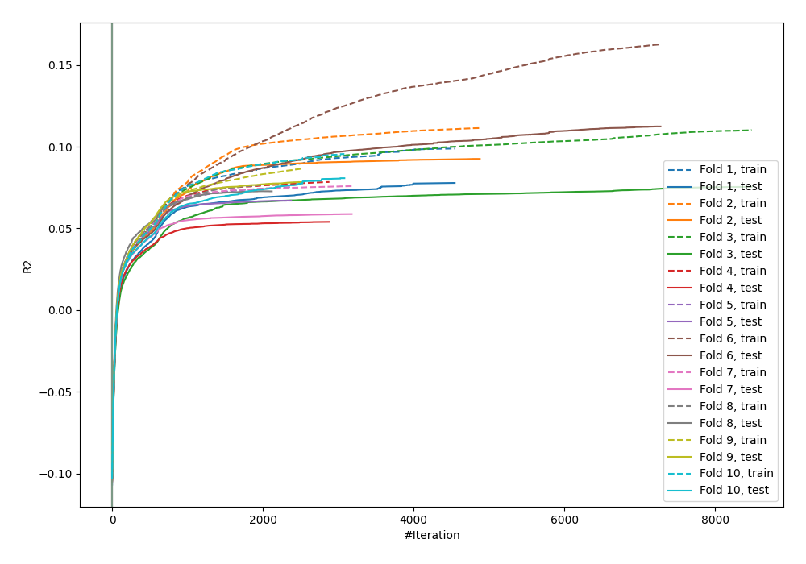
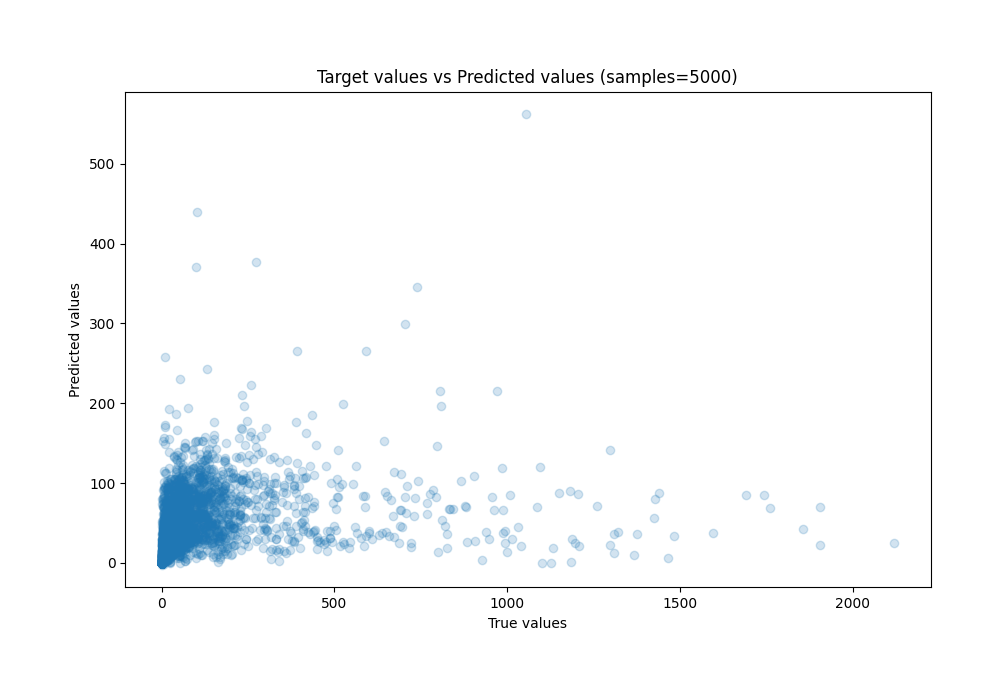
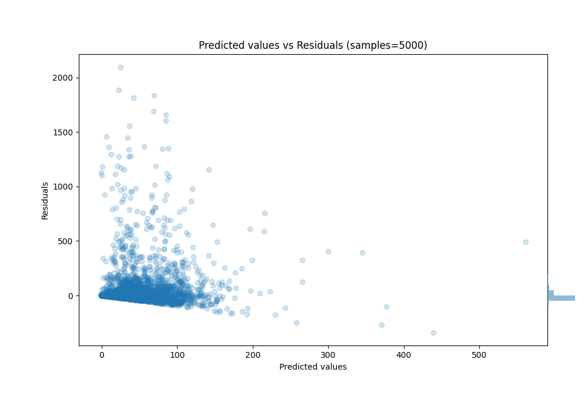

# Summary of 25_CatBoost

[<< Go back](../README.md)

## CatBoost
- **n_jobs**: -1
- **learning_rate**: 0.025
- **depth**: 9
- **rsm**: 0.9
- **loss_function**: MAPE
- **eval_metric**: R2
- **explain_level**: 0

## Validation
 - **validation_type**: kfold
 - **k_folds**: 10
 - **shuffle**: True

## Optimized metric
r2

## Training time

1088.6 seconds

### Metric details:
| Metric   |           Score |
|:---------|----------------:|
| MAE      |    50.626       |
| MSE      | 29606.2         |
| RMSE     |   172.065       |
| R2       |     0.0768543   |
| MAPE     |     9.00549e+11 |

## Learning curves

## True vs Predicted

## Predicted vs Residuals

[<< Go back](../README.md)
