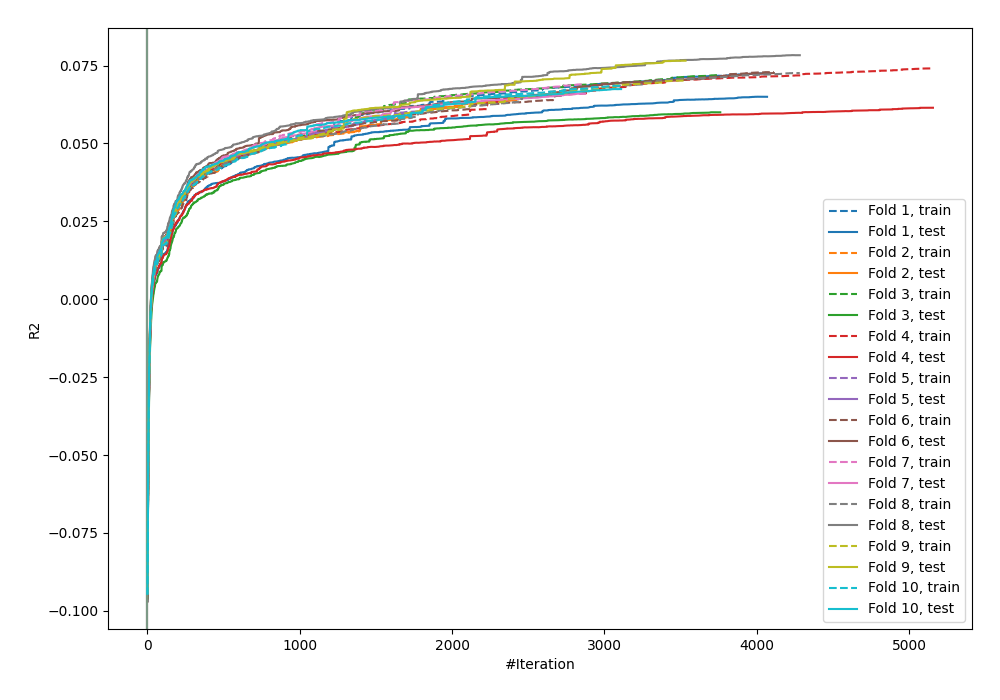
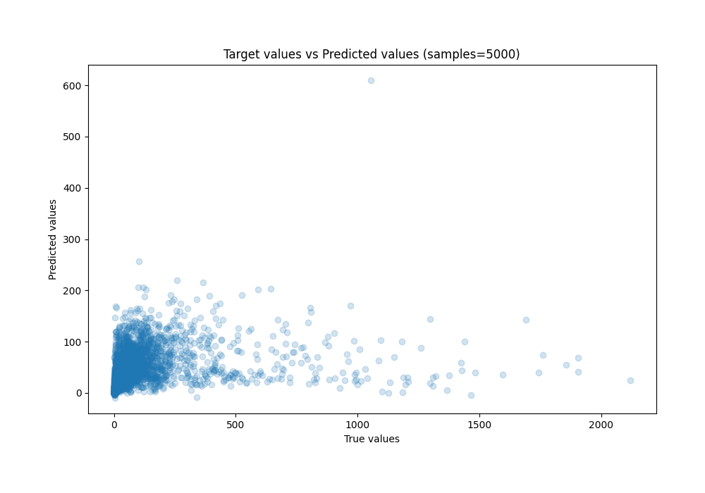
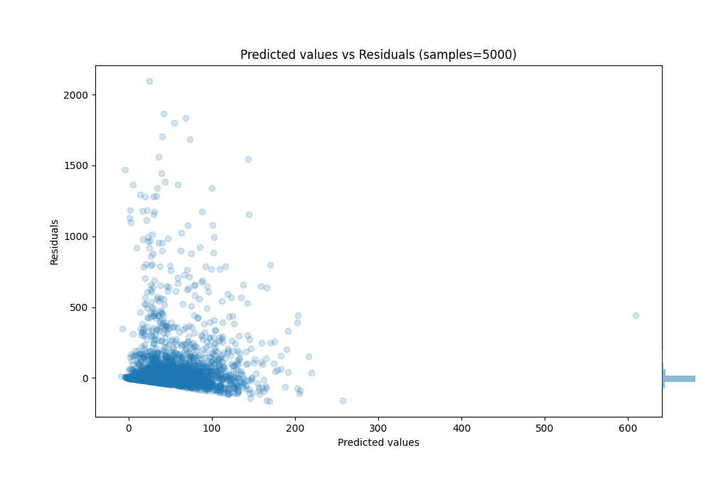

# Summary of 26_CatBoost

[<< Go back](../README.md)

## CatBoost
- **n_jobs**: -1
- **learning_rate**: 0.1
- **depth**: 4
- **rsm**: 0.9
- **loss_function**: MAPE
- **eval_metric**: R2
- **explain_level**: 0

## Validation
 - **validation_type**: kfold
 - **k_folds**: 10
 - **shuffle**: True

## Optimized metric
r2

## Training time

554.6 seconds

### Metric details:
| Metric   |           Score |
|:---------|----------------:|
| MAE      |    50.7148      |
| MSE      | 29910.3         |
| RMSE     |   172.946       |
| R2       |     0.0673731   |
| MAPE     |     3.23138e+09 |

## Learning curves

## True vs Predicted

## Predicted vs Residuals

[<< Go back](../README.md)
