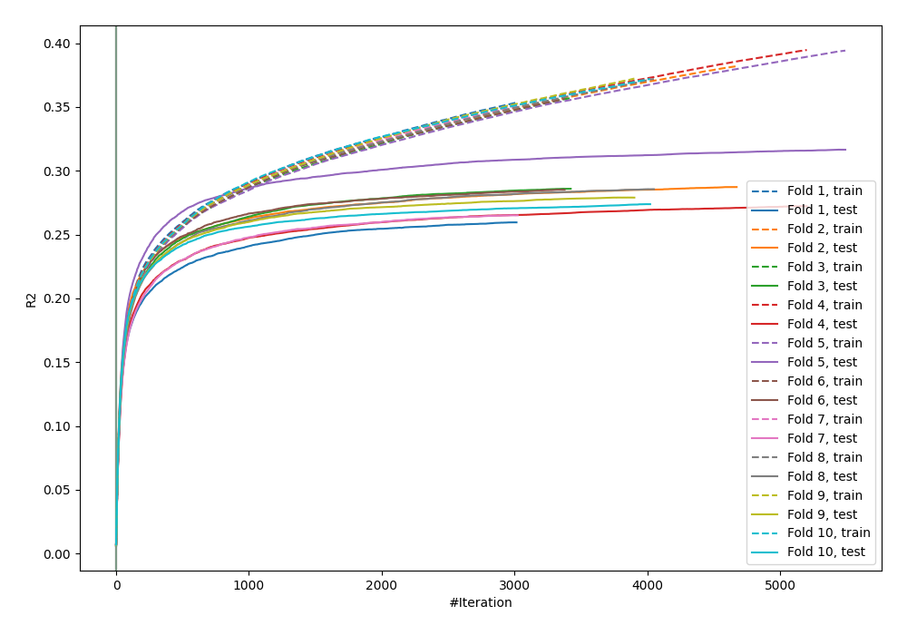
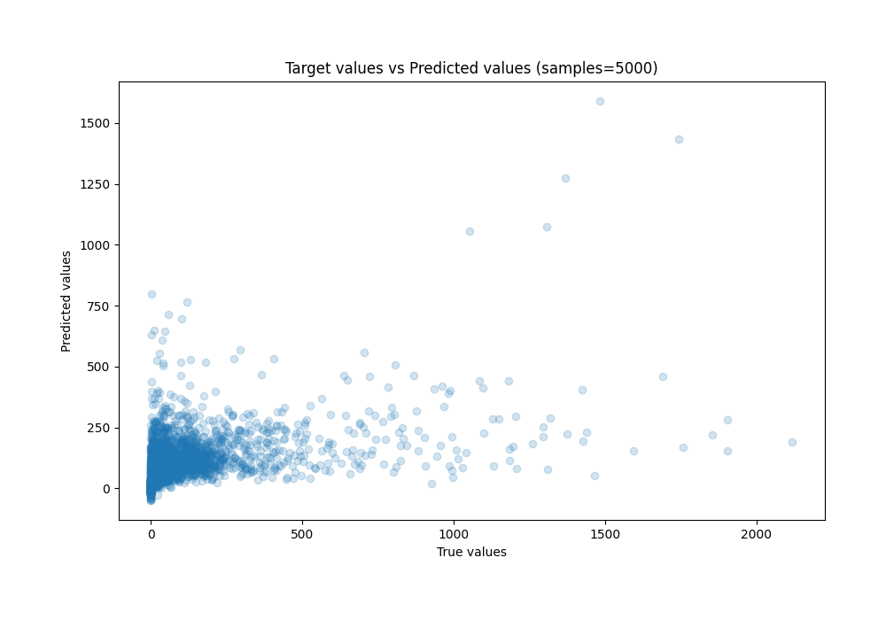
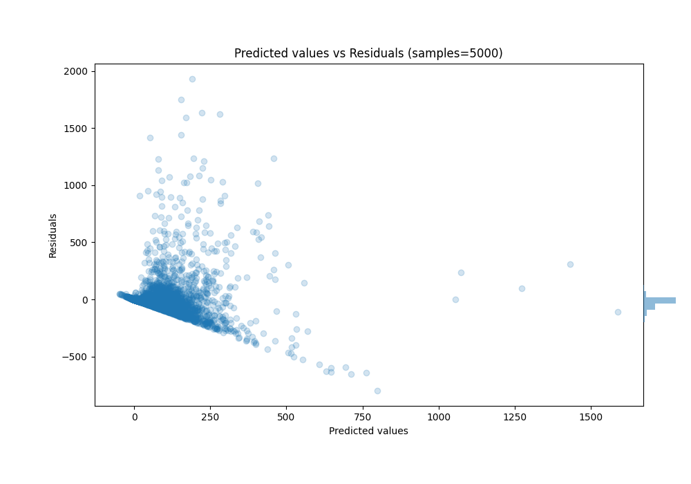

# Summary of 27_CatBoost

[<< Go back](../README.md)

## CatBoost
- **n_jobs**: -1
- **learning_rate**: 0.025
- **depth**: 6
- **rsm**: 0.9
- **loss_function**: RMSE
- **eval_metric**: R2
- **explain_level**: 0

## Validation
 - **validation_type**: kfold
 - **k_folds**: 10
 - **shuffle**: True

## Optimized metric
r2

## Training time

365.7 seconds

### Metric details:
| Metric   |           Score |
|:---------|----------------:|
| MAE      |    60.8159      |
| MSE      | 23056.5         |
| RMSE     |   151.844       |
| R2       |     0.281081    |
| MAPE     |     9.89825e+15 |

## Learning curves

## True vs Predicted

## Predicted vs Residuals

[<< Go back](../README.md)
