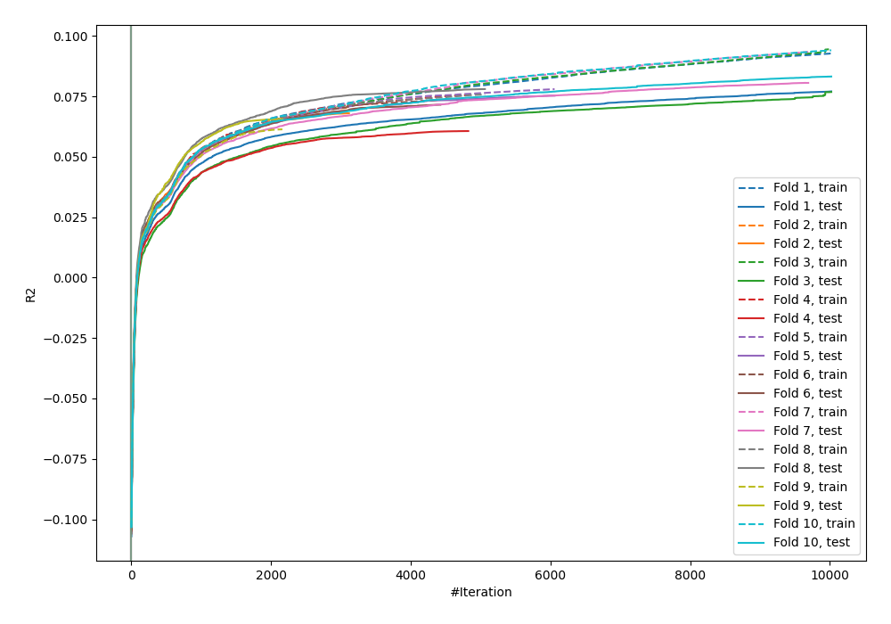
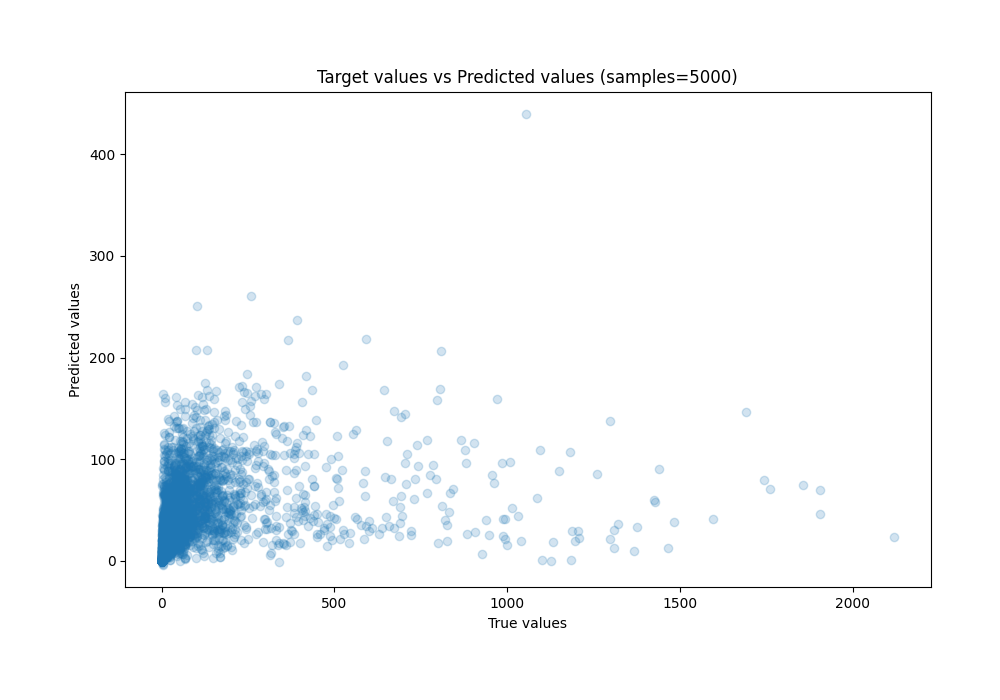
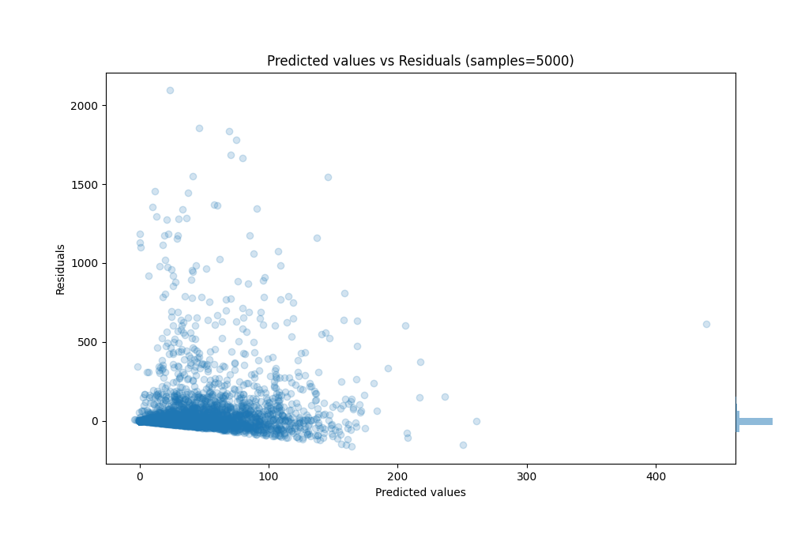

# Summary of 31_CatBoost

[<< Go back](../README.md)

## CatBoost
- **n_jobs**: -1
- **learning_rate**: 0.025
- **depth**: 6
- **rsm**: 1.0
- **loss_function**: MAPE
- **eval_metric**: R2
- **explain_level**: 0

## Validation
 - **validation_type**: kfold
 - **k_folds**: 10
 - **shuffle**: True

## Optimized metric
r2

## Training time

1048.9 seconds

### Metric details:
| Metric   |           Score |
|:---------|----------------:|
| MAE      |    50.443       |
| MSE      | 29705.2         |
| RMSE     |   172.352       |
| R2       |     0.0737692   |
| MAPE     |     8.82487e+10 |

## Learning curves

## True vs Predicted

## Predicted vs Residuals

[<< Go back](../README.md)
