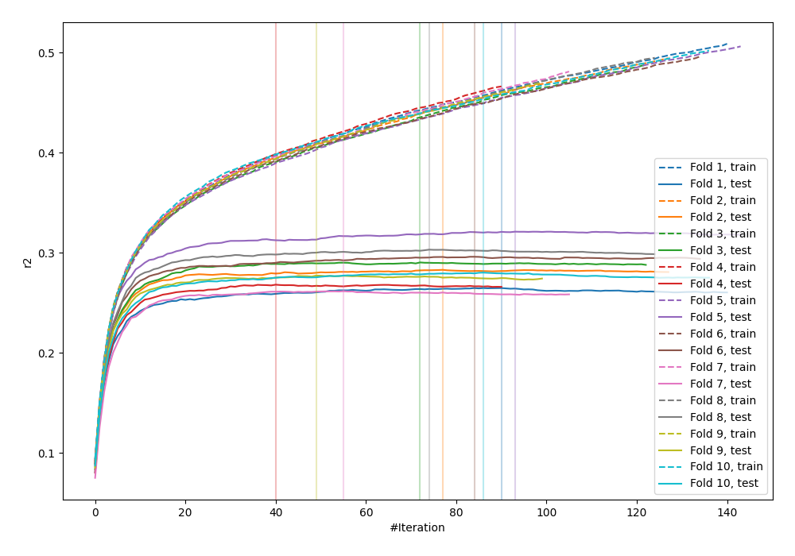
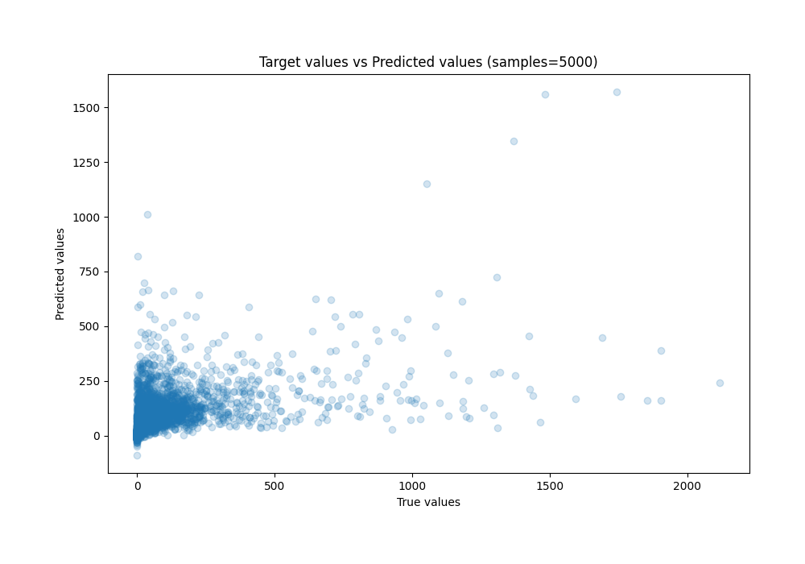
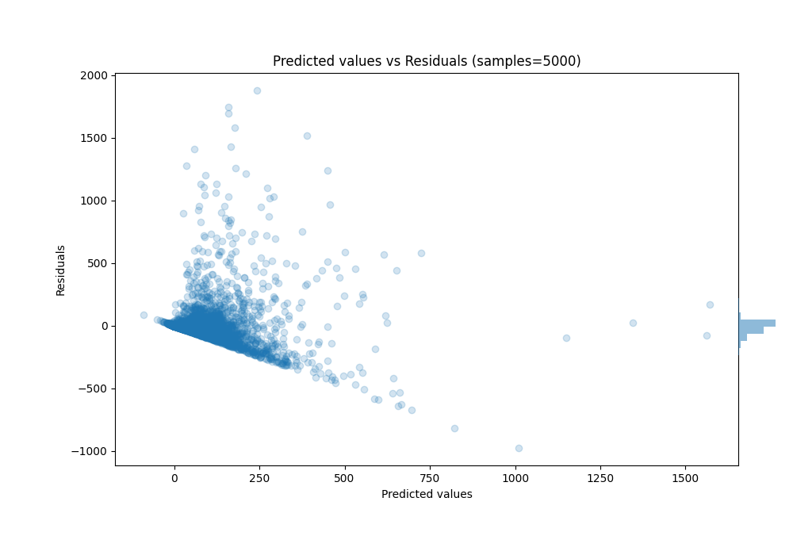

# Summary of 46_LightGBM

[<< Go back](../README.md)

## LightGBM
- **n_jobs**: -1
- **objective**: regression
- **num_leaves**: 127
- **learning_rate**: 0.2
- **feature_fraction**: 1.0
- **bagging_fraction**: 1.0
- **min_data_in_leaf**: 50
- **metric**: custom
- **custom_eval_metric_name**: r2
- **explain_level**: 0

## Validation
 - **validation_type**: kfold
 - **k_folds**: 10
 - **shuffle**: True

## Optimized metric
r2

## Training time

22.2 seconds

### Metric details:
| Metric   |           Score |
|:---------|----------------:|
| MAE      |    59.5078      |
| MSE      | 22942.1         |
| RMSE     |   151.466       |
| R2       |     0.284648    |
| MAPE     |     5.78869e+15 |

## Learning curves

## True vs Predicted

## Predicted vs Residuals

[<< Go back](../README.md)
