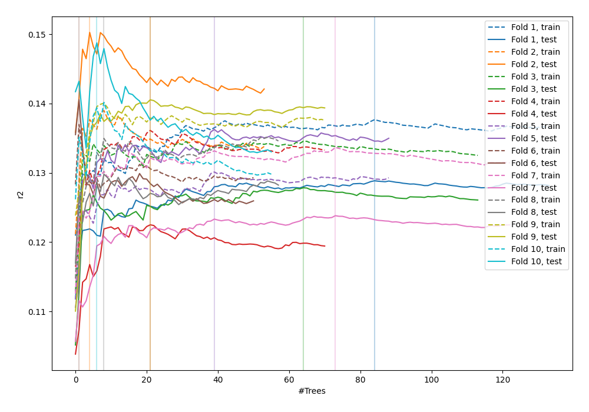

# Summary of 4_Default_RandomForest

[<< Go back](../README.md)

## Random Forest
- **n_jobs**: -1
- **criterion**: squared_error
- **max_features**: 0.9
- **min_samples_split**: 30
- **max_depth**: 4
- **eval_metric_name**: r2
- **explain_level**: 0

## Validation
 - **validation_type**: kfold
 - **k_folds**: 10
 - **shuffle**: True

## Optimized metric
r2

## Training time

67.2 seconds

### Metric details:
| Metric   |           Score |
|:---------|----------------:|
| MAE      |    68.5075      |
| MSE      | 27748.2         |
| RMSE     |   166.578       |
| R2       |     0.13479     |
| MAPE     |     3.06331e+13 |

## Learning curves

## True vs Predicted

## Predicted vs Residuals

[<< Go back](../README.md)
