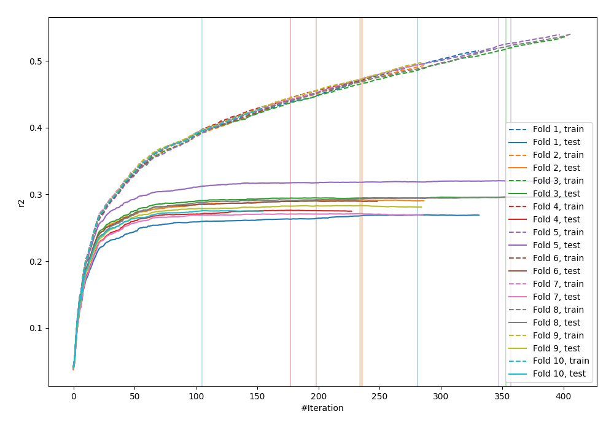
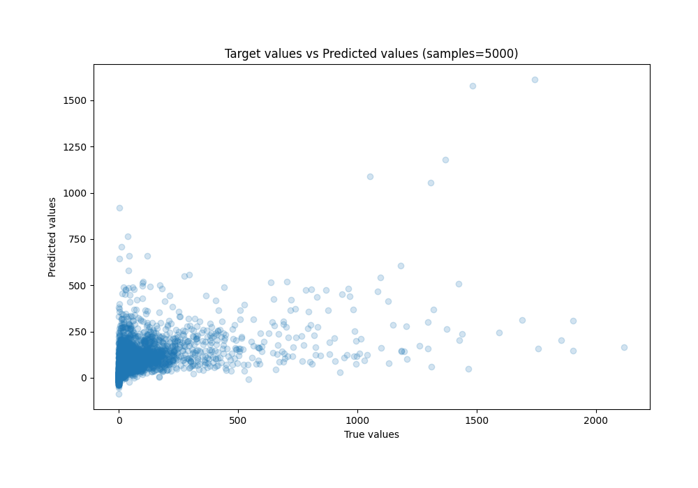
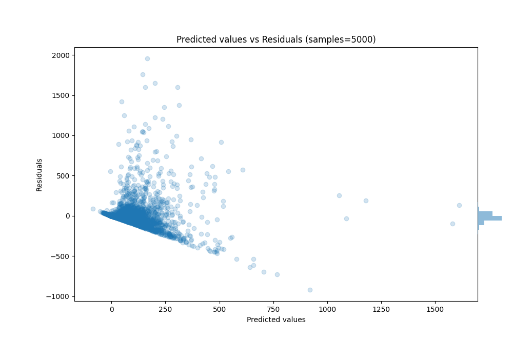

# Summary of 52_Xgboost

[<< Go back](../README.md)

## Extreme Gradient Boosting (Xgboost)
- **n_jobs**: -1
- **objective**: reg:squarederror
- **eta**: 0.1
- **max_depth**: 8
- **min_child_weight**: 5
- **subsample**: 1.0
- **colsample_bytree**: 0.5
- **eval_metric**: r2
- **explain_level**: 0

## Validation
 - **validation_type**: kfold
 - **k_folds**: 10
 - **shuffle**: True

## Optimized metric
r2

## Training time

42.5 seconds

### Metric details:
| Metric   |           Score |
|:---------|----------------:|
| MAE      |    61.0421      |
| MSE      | 22863.4         |
| RMSE     |   151.207       |
| R2       |     0.2871      |
| MAPE     |     1.39493e+16 |

## Learning curves

## True vs Predicted

## Predicted vs Residuals

[<< Go back](../README.md)
