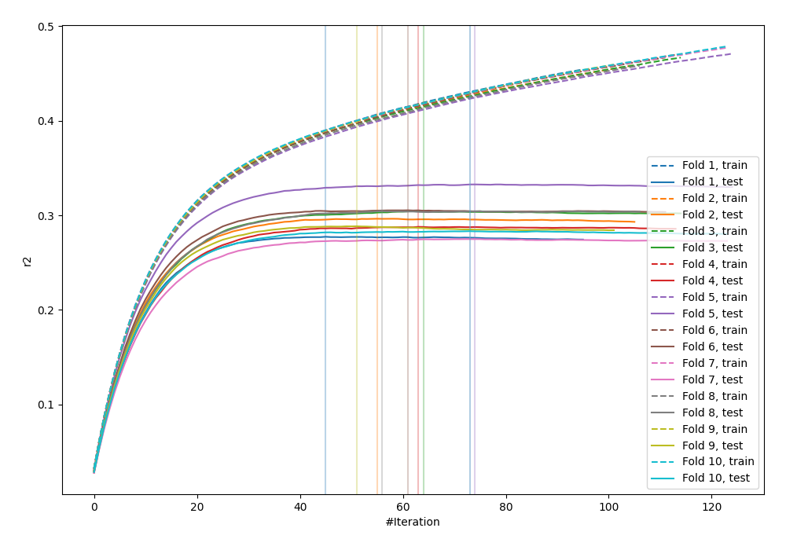
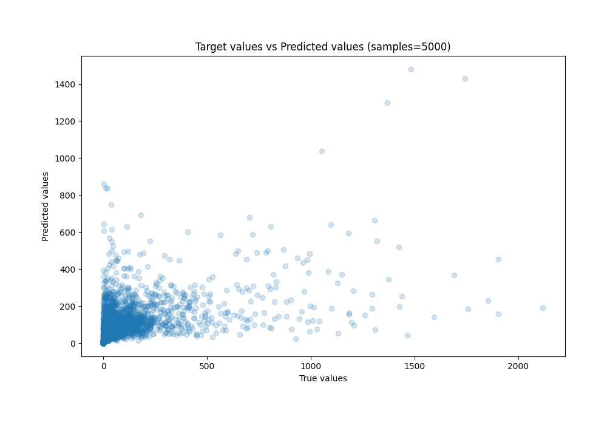
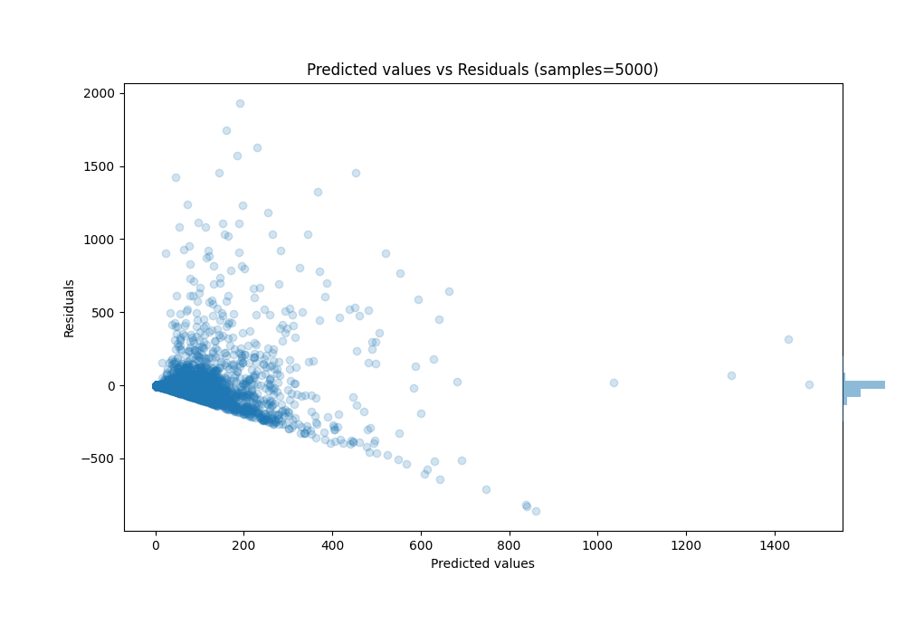

# Summary of 65_LightGBM_Stacked

[<< Go back](../README.md)

## LightGBM
- **n_jobs**: -1
- **objective**: regression
- **num_leaves**: 95
- **learning_rate**: 0.05
- **feature_fraction**: 0.9
- **bagging_fraction**: 0.8
- **min_data_in_leaf**: 15
- **metric**: custom
- **custom_eval_metric_name**: r2
- **explain_level**: 0

## Validation
 - **validation_type**: kfold
 - **k_folds**: 10
 - **shuffle**: True

## Optimized metric
r2

## Training time

30.5 seconds

### Metric details:
| Metric   |           Score |
|:---------|----------------:|
| MAE      |    58.173       |
| MSE      | 22592.3         |
| RMSE     |   150.307       |
| R2       |     0.295554    |
| MAPE     |     6.48107e+15 |

## Learning curves

## True vs Predicted

## Predicted vs Residuals

[<< Go back](../README.md)
