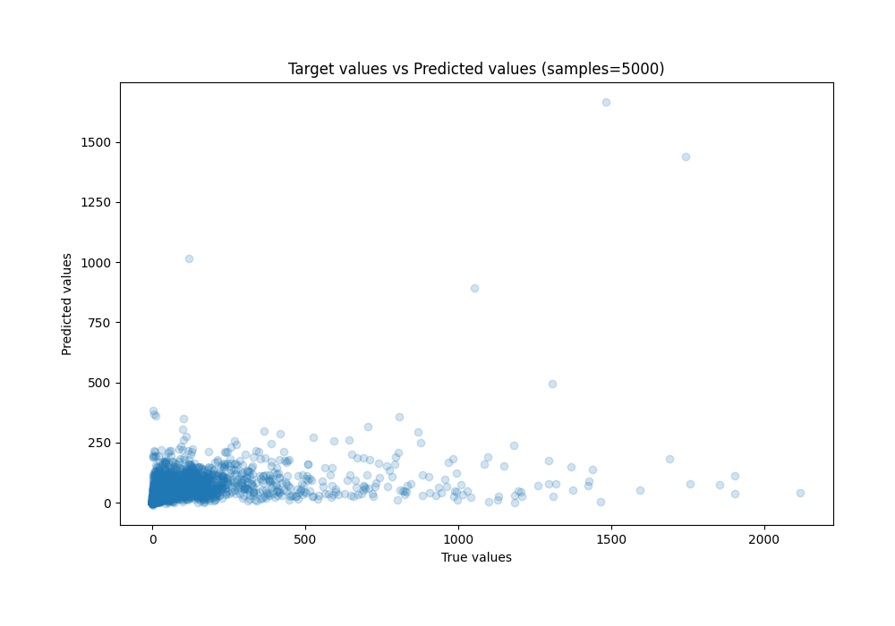

# Summary of 70_CatBoost

[<< Go back](../README.md)

## CatBoost
- **n_jobs**: -1
- **learning_rate**: 0.1
- **depth**: 8
- **rsm**: 1.0
- **loss_function**: MAE
- **eval_metric**: R2
- **explain_level**: 0

## Validation
 - **validation_type**: kfold
 - **k_folds**: 10
 - **shuffle**: True

## Optimized metric
r2

## Training time

315.3 seconds

### Metric details:
| Metric   |           Score |
|:---------|----------------:|
| MAE      |    49.4629      |
| MSE      | 27137.3         |
| RMSE     |   164.734       |
| R2       |     0.153838    |
| MAPE     |     7.35239e+13 |

## Learning curves

## True vs Predicted

## Predicted vs Residuals

[<< Go back](../README.md)
