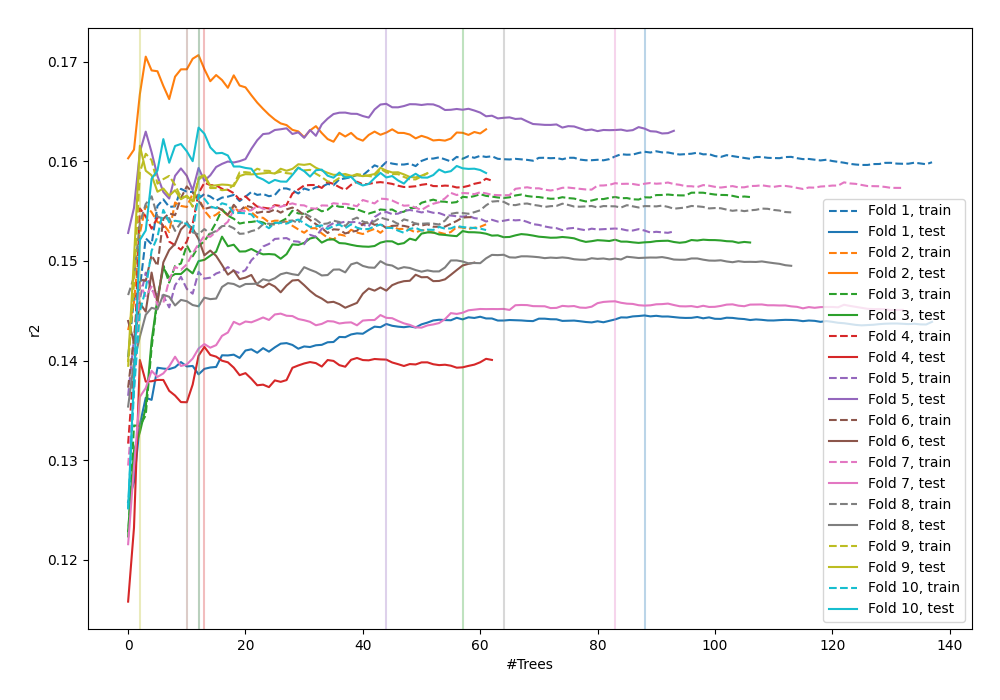
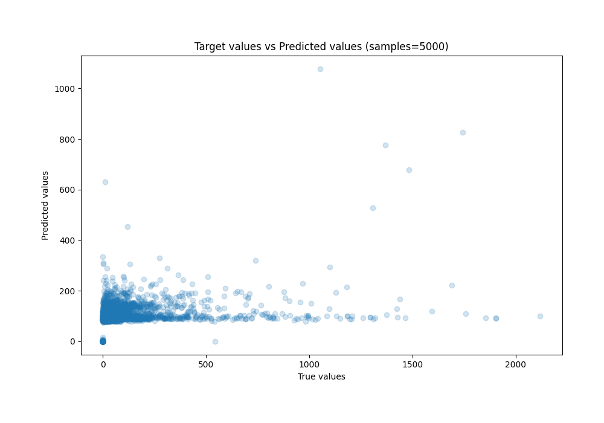
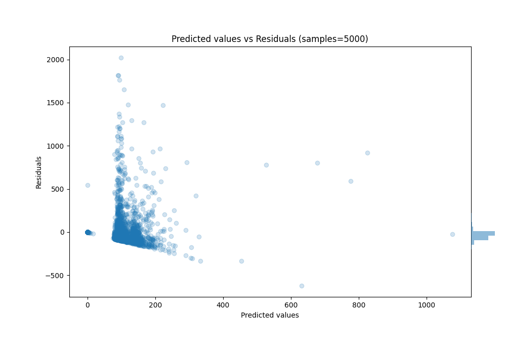

# Summary of 73_RandomForest

[<< Go back](../README.md)

## Random Forest
- **n_jobs**: -1
- **criterion**: squared_error
- **max_features**: 0.8
- **min_samples_split**: 50
- **max_depth**: 5
- **eval_metric_name**: r2
- **explain_level**: 0

## Validation
 - **validation_type**: kfold
 - **k_folds**: 10
 - **shuffle**: True

## Optimized metric
r2

## Training time

76.7 seconds

### Metric details:
| Metric   |           Score |
|:---------|----------------:|
| MAE      |    67.3171      |
| MSE      | 27100.6         |
| RMSE     |   164.623       |
| R2       |     0.15498     |
| MAPE     |     1.08414e+14 |

## Learning curves

## True vs Predicted

## Predicted vs Residuals

[<< Go back](../README.md)
