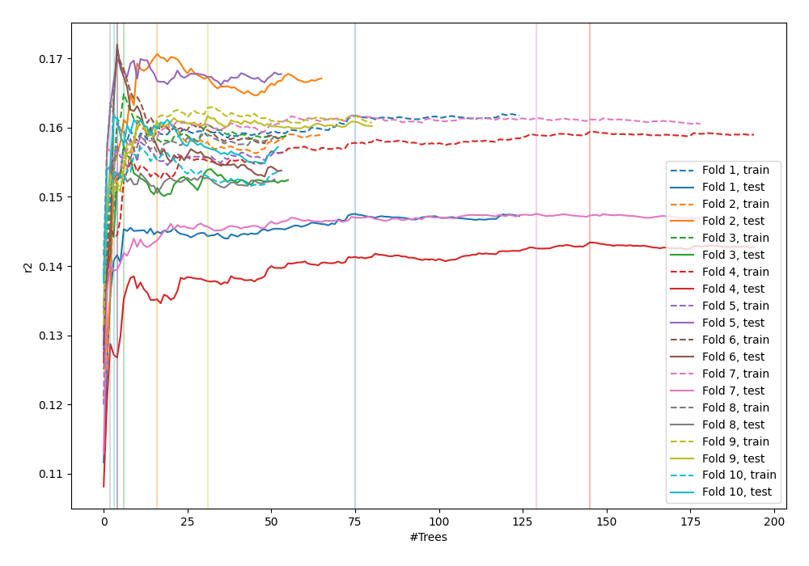
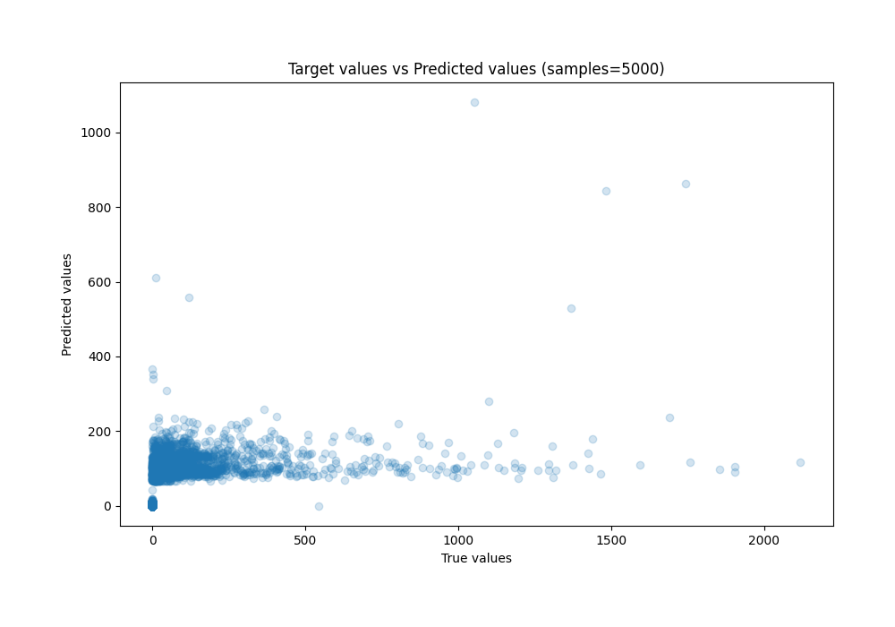
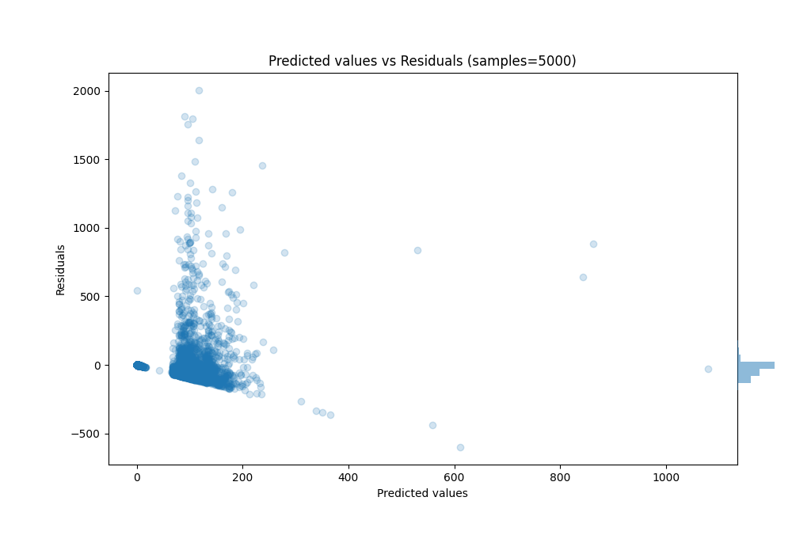

# Summary of 75_RandomForest

[<< Go back](../README.md)

## Random Forest
- **n_jobs**: -1
- **criterion**: squared_error
- **max_features**: 0.5
- **min_samples_split**: 30
- **max_depth**: 5
- **eval_metric_name**: r2
- **explain_level**: 0

## Validation
 - **validation_type**: kfold
 - **k_folds**: 10
 - **shuffle**: True

## Optimized metric
r2

## Training time

63.0 seconds

### Metric details:
| Metric   |           Score |
|:---------|----------------:|
| MAE      |    67.4557      |
| MSE      | 26984.4         |
| RMSE     |   164.269       |
| R2       |     0.158603    |
| MAPE     |     3.39964e+15 |

## Learning curves

## True vs Predicted

## Predicted vs Residuals

[<< Go back](../README.md)
