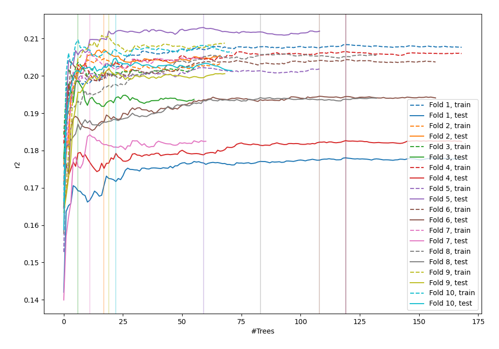
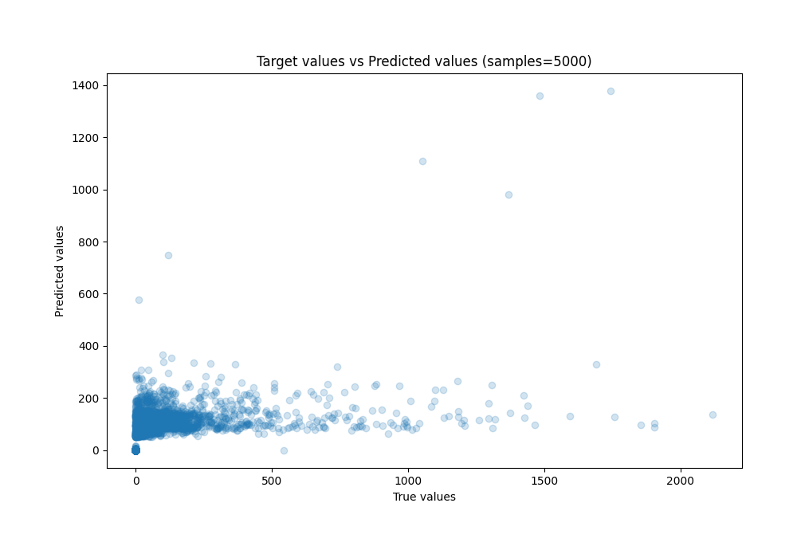
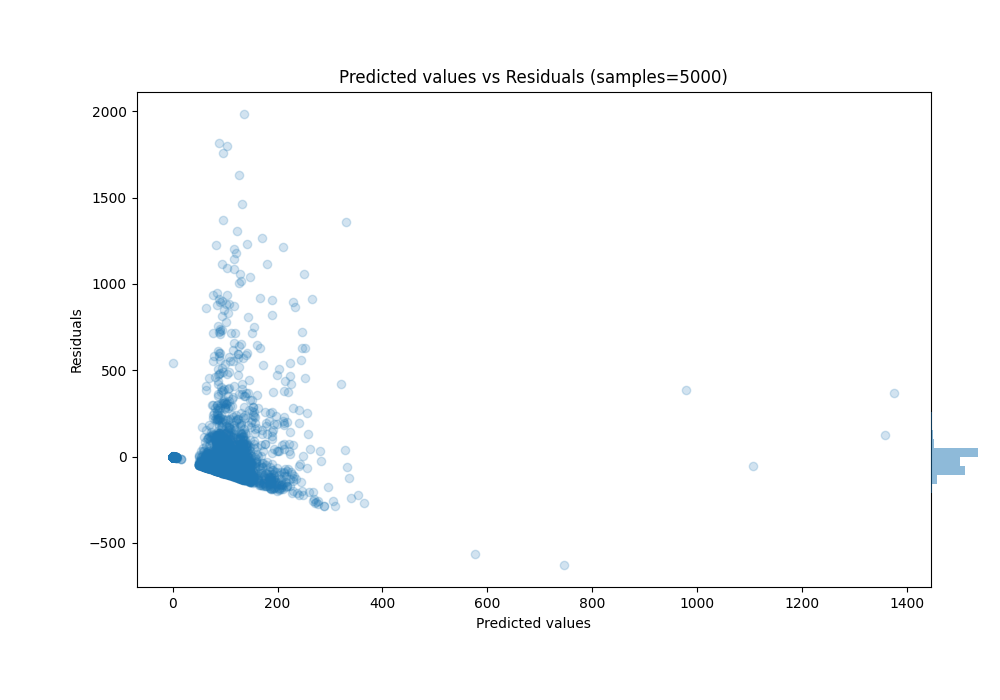

# Summary of 78_RandomForest

[<< Go back](../README.md)

## Random Forest
- **n_jobs**: -1
- **criterion**: squared_error
- **max_features**: 0.5
- **min_samples_split**: 20
- **max_depth**: 7
- **eval_metric_name**: r2
- **explain_level**: 0

## Validation
 - **validation_type**: kfold
 - **k_folds**: 10
 - **shuffle**: True

## Optimized metric
r2

## Training time

83.9 seconds

### Metric details:
| Metric   |           Score |
|:---------|----------------:|
| MAE      |    64.8294      |
| MSE      | 25788.9         |
| RMSE     |   160.589       |
| R2       |     0.195881    |
| MAPE     |     5.53483e+14 |

## Learning curves

## True vs Predicted

## Predicted vs Residuals

[<< Go back](../README.md)
