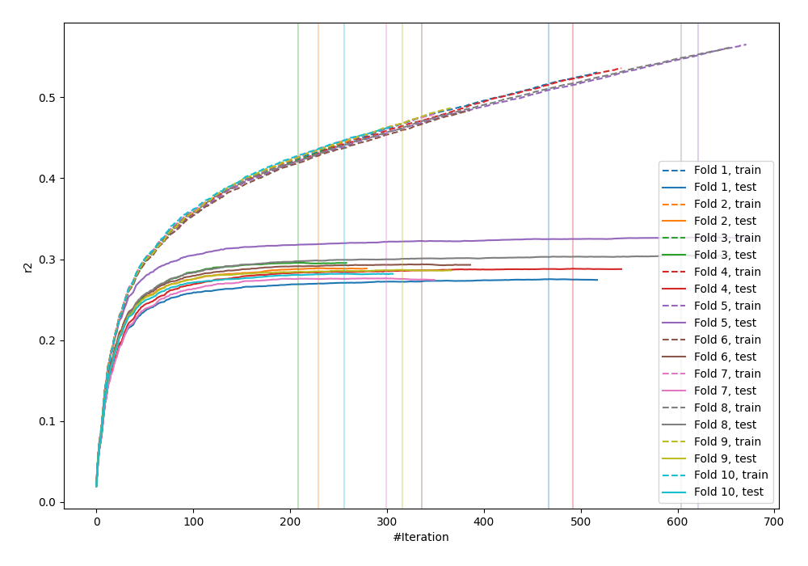
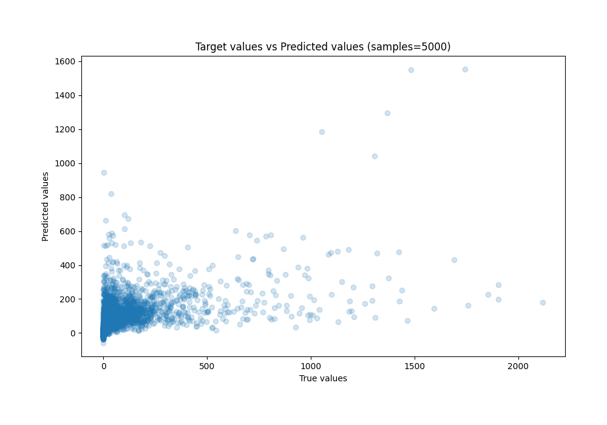
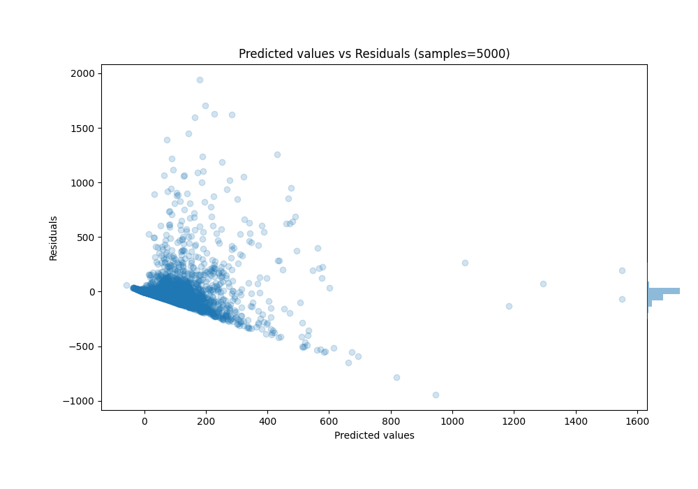

# Summary of 7_Xgboost

[<< Go back](../README.md)

## Extreme Gradient Boosting (Xgboost)
- **n_jobs**: -1
- **objective**: reg:squarederror
- **eta**: 0.05
- **max_depth**: 9
- **min_child_weight**: 10
- **subsample**: 0.8
- **colsample_bytree**: 0.6
- **eval_metric**: r2
- **explain_level**: 0

## Validation
 - **validation_type**: kfold
 - **k_folds**: 10
 - **shuffle**: True

## Optimized metric
r2

## Training time

63.9 seconds

### Metric details:
| Metric   |          Score |
|:---------|---------------:|
| MAE      |    60.3448     |
| MSE      | 22707.6        |
| RMSE     |   150.691      |
| R2       |     0.291958   |
| MAPE     |     1.2187e+16 |

## Learning curves

## True vs Predicted

## Predicted vs Residuals

[<< Go back](../README.md)
