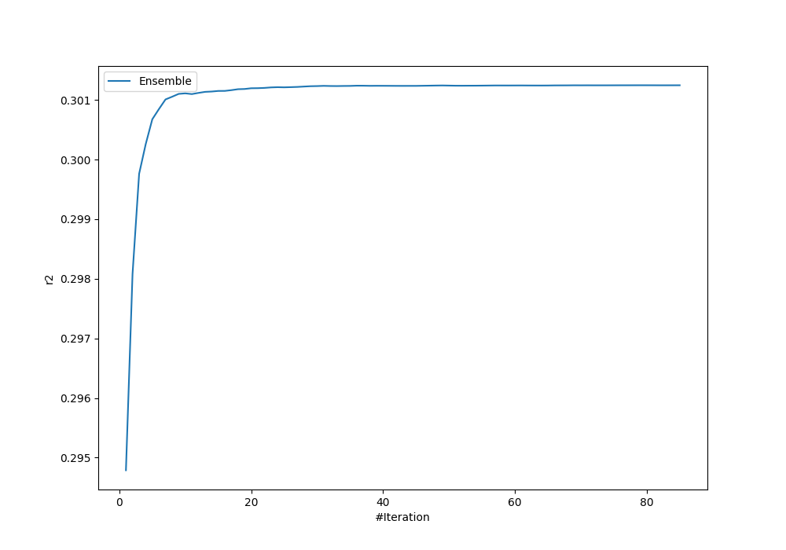
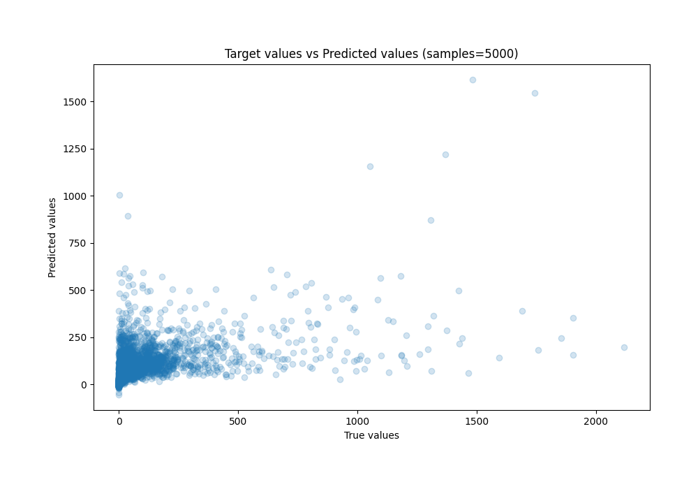
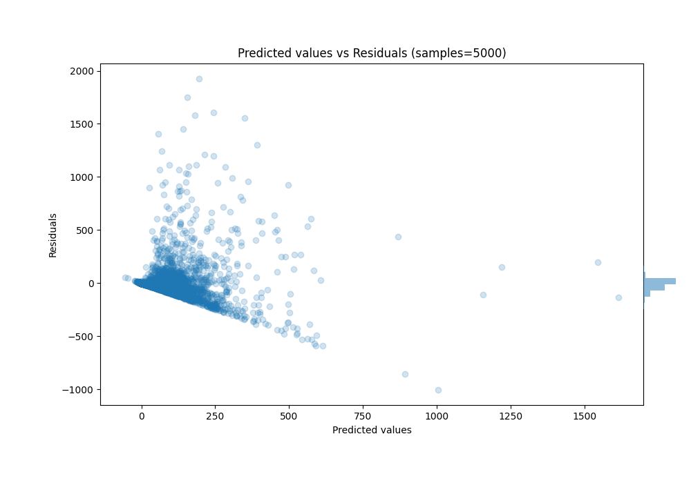

# Summary of Ensemble

[<< Go back](../README.md)

## Ensemble structure
| Model                      |   Weight |
|:---------------------------|---------:|
| 14_LightGBM                |        2 |
| 14_LightGBM_GoldenFeatures |        7 |
| 17_LightGBM                |        5 |
| 17_LightGBM_GoldenFeatures |        1 |
| 18_LightGBM                |        2 |
| 20_LightGBM                |        3 |
| 30_CatBoost                |        2 |
| 43_LightGBM                |        7 |
| 45_LightGBM                |        3 |
| 46_LightGBM                |        2 |
| 52_Xgboost                 |        1 |
| 60_LightGBM                |        8 |
| 61_Xgboost                 |        6 |
| 62_Xgboost                 |        2 |
| 63_LightGBM                |        8 |
| 64_LightGBM                |        8 |
| 68_Xgboost_GoldenFeatures  |        3 |
| 7_Xgboost                  |        2 |
| 7_Xgboost_GoldenFeatures   |        7 |

### Metric details:
| Metric   |           Score |
|:---------|----------------:|
| MAE      |    58.6706      |
| MSE      | 22409.7         |
| RMSE     |   149.699       |
| R2       |     0.301248    |
| MAPE     |     6.12202e+15 |

## Learning curves

## True vs Predicted

## Predicted vs Residuals

[<< Go back](../README.md)
