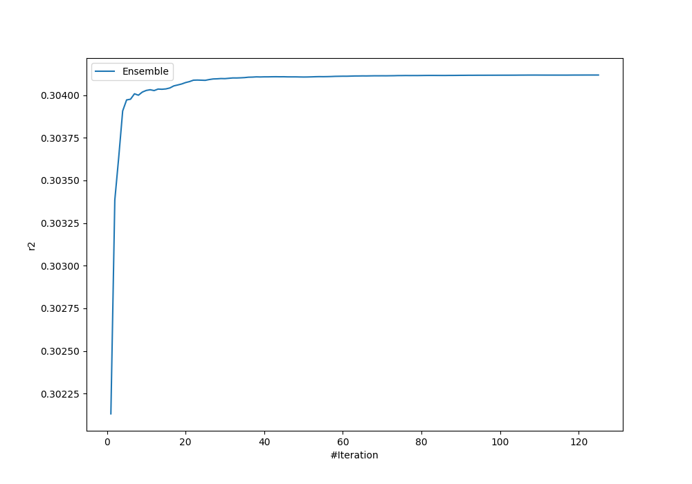
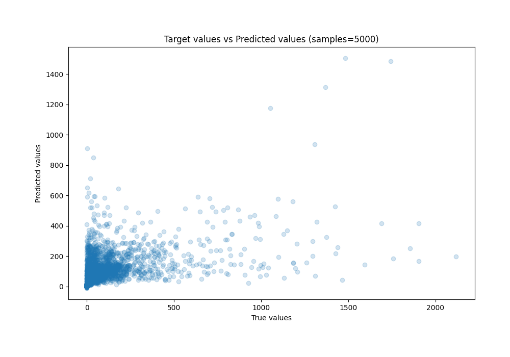
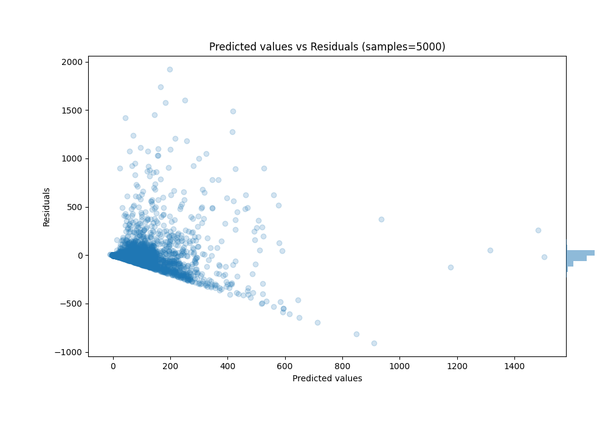

# Summary of Ensemble_Stacked

[<< Go back](../README.md)

## Ensemble structure
| Model                      |   Weight |
|:---------------------------|---------:|
| 14_LightGBM_GoldenFeatures |        6 |
| 18_LightGBM                |        4 |
| 20_LightGBM_Stacked        |        4 |
| 24_CatBoost_Stacked        |       12 |
| 30_CatBoost_Stacked        |       16 |
| 43_LightGBM                |        1 |
| 43_LightGBM_Stacked        |       18 |
| 45_LightGBM_Stacked        |        1 |
| 46_LightGBM                |        1 |
| 52_Xgboost                 |        2 |
| 55_RandomForest_Stacked    |       35 |
| 60_LightGBM                |        1 |
| 61_Xgboost                 |        1 |
| 62_Xgboost_Stacked         |        4 |
| 64_LightGBM                |        3 |
| 74_RandomForest_Stacked    |       11 |
| 7_Xgboost_GoldenFeatures   |        1 |
| Ensemble                   |        2 |

### Metric details:
| Metric   |          Score |
|:---------|---------------:|
| MAE      |    57.3536     |
| MSE      | 22317.6        |
| RMSE     |   149.391      |
| R2       |     0.304118   |
| MAPE     |     2.2247e+15 |

## Learning curves

## True vs Predicted

## Predicted vs Residuals

[<< Go back](../README.md)
