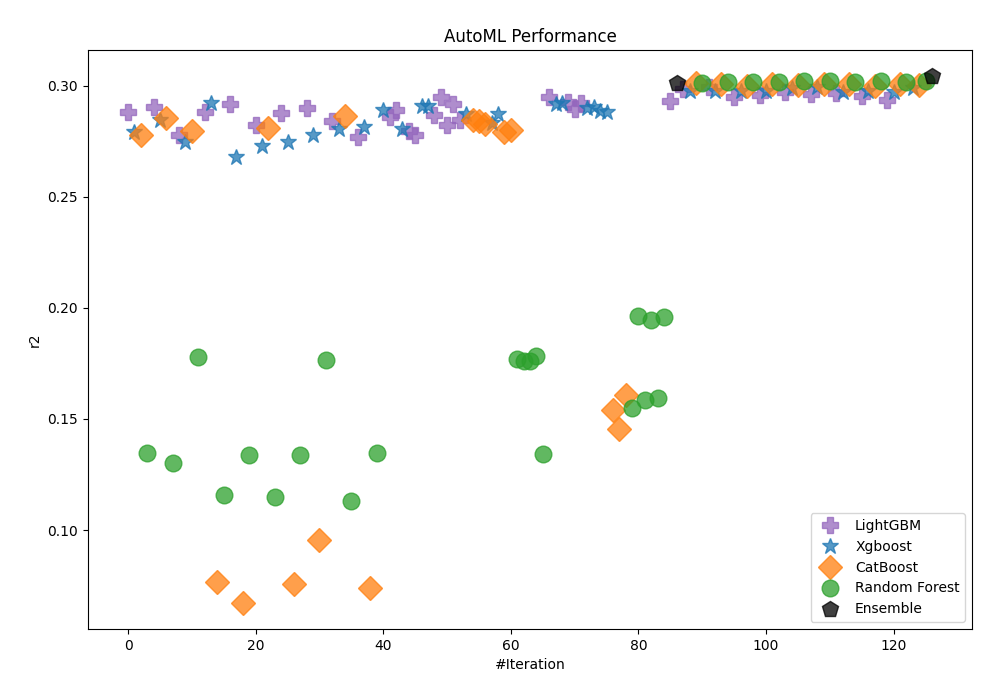
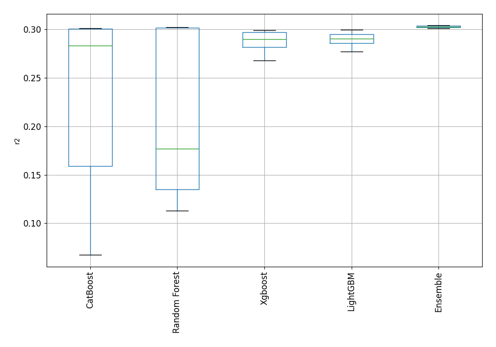
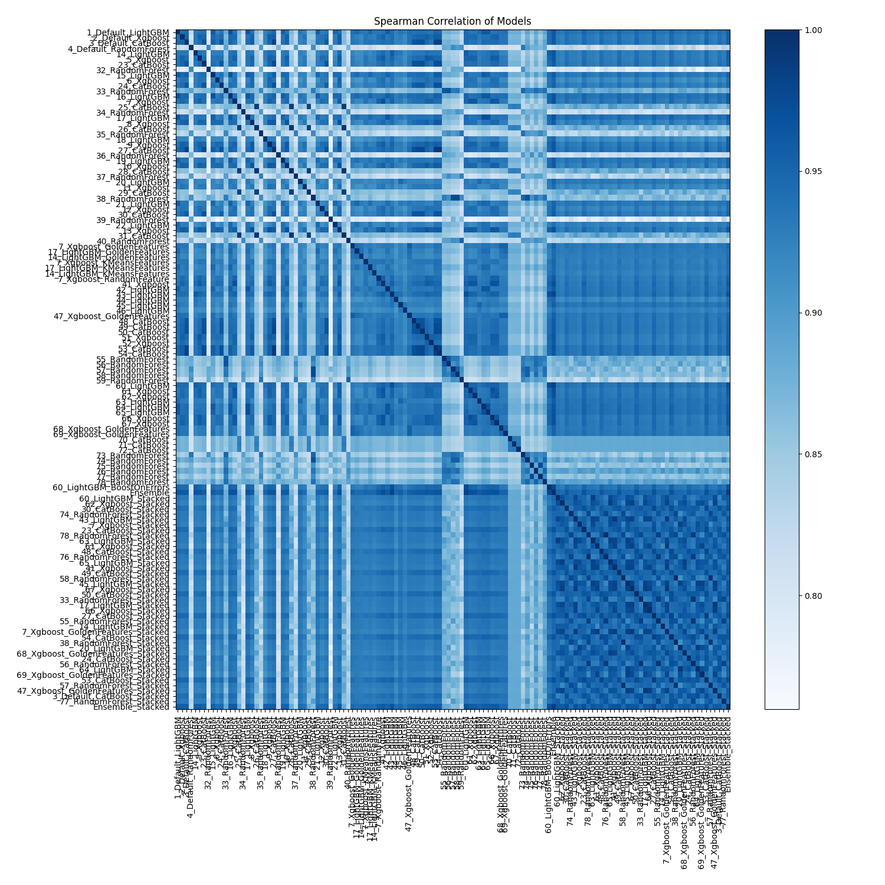

# AutoML Leaderboard

| Best model   | name                                                                             | model_type    | metric_type   |   metric_value |   train_time |
|:-------------|:---------------------------------------------------------------------------------|:--------------|:--------------|---------------:|-------------:|
|              | [1_Default_LightGBM](1_Default_LightGBM/README.md)                               | LightGBM      | r2            |      0.288291  |        59.55 |
|              | [2_Default_Xgboost](2_Default_Xgboost/README.md)                                 | Xgboost       | r2            |      0.279021  |        57    |
|              | [3_Default_CatBoost](3_Default_CatBoost/README.md)                               | CatBoost      | r2            |      0.277897  |        70.37 |
|              | [4_Default_RandomForest](4_Default_RandomForest/README.md)                       | Random Forest | r2            |      0.13479   |        67.8  |
|              | [14_LightGBM](14_LightGBM/README.md)                                             | LightGBM      | r2            |      0.290345  |        54.08 |
|              | [5_Xgboost](5_Xgboost/README.md)                                                 | Xgboost       | r2            |      0.284735  |        45.35 |
|              | [23_CatBoost](23_CatBoost/README.md)                                             | CatBoost      | r2            |      0.285424  |       117.15 |
|              | [32_RandomForest](32_RandomForest/README.md)                                     | Random Forest | r2            |      0.130198  |        62.05 |
|              | [15_LightGBM](15_LightGBM/README.md)                                             | LightGBM      | r2            |      0.277576  |        62.93 |
|              | [6_Xgboost](6_Xgboost/README.md)                                                 | Xgboost       | r2            |      0.274427  |        39.8  |
|              | [24_CatBoost](24_CatBoost/README.md)                                             | CatBoost      | r2            |      0.279456  |        62.63 |
|              | [33_RandomForest](33_RandomForest/README.md)                                     | Random Forest | r2            |      0.177754  |        85.09 |
|              | [16_LightGBM](16_LightGBM/README.md)                                             | LightGBM      | r2            |      0.288296  |        89.38 |
|              | [7_Xgboost](7_Xgboost/README.md)                                                 | Xgboost       | r2            |      0.291958  |        64.59 |
|              | [25_CatBoost](25_CatBoost/README.md)                                             | CatBoost      | r2            |      0.0768543 |      1089.38 |
|              | [34_RandomForest](34_RandomForest/README.md)                                     | Random Forest | r2            |      0.115639  |        51.48 |
|              | [17_LightGBM](17_LightGBM/README.md)                                             | LightGBM      | r2            |      0.291765  |        73.46 |
|              | [8_Xgboost](8_Xgboost/README.md)                                                 | Xgboost       | r2            |      0.267864  |        91.97 |
|              | [26_CatBoost](26_CatBoost/README.md)                                             | CatBoost      | r2            |      0.0673731 |       555.29 |
|              | [35_RandomForest](35_RandomForest/README.md)                                     | Random Forest | r2            |      0.133905  |        59.98 |
|              | [18_LightGBM](18_LightGBM/README.md)                                             | LightGBM      | r2            |      0.282155  |        34.63 |
|              | [9_Xgboost](9_Xgboost/README.md)                                                 | Xgboost       | r2            |      0.272781  |       100.98 |
|              | [27_CatBoost](27_CatBoost/README.md)                                             | CatBoost      | r2            |      0.281081  |       366.58 |
|              | [36_RandomForest](36_RandomForest/README.md)                                     | Random Forest | r2            |      0.114847  |        65.35 |
|              | [19_LightGBM](19_LightGBM/README.md)                                             | LightGBM      | r2            |      0.287834  |        44.07 |
|              | [10_Xgboost](10_Xgboost/README.md)                                               | Xgboost       | r2            |      0.274825  |        71.37 |
|              | [28_CatBoost](28_CatBoost/README.md)                                             | CatBoost      | r2            |      0.0756817 |       630.19 |
|              | [37_RandomForest](37_RandomForest/README.md)                                     | Random Forest | r2            |      0.13389   |        68.97 |
|              | [20_LightGBM](20_LightGBM/README.md)                                             | LightGBM      | r2            |      0.289698  |        41.12 |
|              | [11_Xgboost](11_Xgboost/README.md)                                               | Xgboost       | r2            |      0.277598  |        35.29 |
|              | [29_CatBoost](29_CatBoost/README.md)                                             | CatBoost      | r2            |      0.0957309 |       269.51 |
|              | [38_RandomForest](38_RandomForest/README.md)                                     | Random Forest | r2            |      0.176339  |        99.62 |
|              | [21_LightGBM](21_LightGBM/README.md)                                             | LightGBM      | r2            |      0.283973  |        33.31 |
|              | [12_Xgboost](12_Xgboost/README.md)                                               | Xgboost       | r2            |      0.280393  |        37.45 |
|              | [30_CatBoost](30_CatBoost/README.md)                                             | CatBoost      | r2            |      0.286516  |       102.66 |
|              | [39_RandomForest](39_RandomForest/README.md)                                     | Random Forest | r2            |      0.113147  |        56.75 |
|              | [22_LightGBM](22_LightGBM/README.md)                                             | LightGBM      | r2            |      0.276999  |        22.01 |
|              | [13_Xgboost](13_Xgboost/README.md)                                               | Xgboost       | r2            |      0.28139   |       101.4  |
|              | [31_CatBoost](31_CatBoost/README.md)                                             | CatBoost      | r2            |      0.0737692 |      1049.66 |
|              | [40_RandomForest](40_RandomForest/README.md)                                     | Random Forest | r2            |      0.134904  |        62.67 |
|              | [7_Xgboost_GoldenFeatures](7_Xgboost_GoldenFeatures/README.md)                   | Xgboost       | r2            |      0.28914   |        78.94 |
|              | [17_LightGBM_GoldenFeatures](17_LightGBM_GoldenFeatures/README.md)               | LightGBM      | r2            |      0.285705  |        57.88 |
|              | [14_LightGBM_GoldenFeatures](14_LightGBM_GoldenFeatures/README.md)               | LightGBM      | r2            |      0.28891   |        39.87 |
|              | [7_Xgboost_KMeansFeatures](7_Xgboost_KMeansFeatures/README.md)                   | Xgboost       | r2            |      0.280272  |        83.33 |
|              | [17_LightGBM_KMeansFeatures](17_LightGBM_KMeansFeatures/README.md)               | LightGBM      | r2            |      0.279672  |        64.73 |
|              | [14_LightGBM_KMeansFeatures](14_LightGBM_KMeansFeatures/README.md)               | LightGBM      | r2            |      0.277568  |        45.69 |
|              | [7_Xgboost_RandomFeature](7_Xgboost_RandomFeature/README.md)                     | Xgboost       | r2            |      0.290898  |       120.33 |
|              | [41_Xgboost](41_Xgboost/README.md)                                               | Xgboost       | r2            |      0.290671  |        76.77 |
|              | [42_LightGBM](42_LightGBM/README.md)                                             | LightGBM      | r2            |      0.286788  |        38.45 |
|              | [43_LightGBM](43_LightGBM/README.md)                                             | LightGBM      | r2            |      0.294705  |        91.68 |
|              | [44_LightGBM](44_LightGBM/README.md)                                             | LightGBM      | r2            |      0.282456  |        28.27 |
|              | [45_LightGBM](45_LightGBM/README.md)                                             | LightGBM      | r2            |      0.291882  |        72.6  |
|              | [46_LightGBM](46_LightGBM/README.md)                                             | LightGBM      | r2            |      0.284648  |        22.89 |
|              | [47_Xgboost_GoldenFeatures](47_Xgboost_GoldenFeatures/README.md)                 | Xgboost       | r2            |      0.287188  |        71.05 |
|              | [48_CatBoost](48_CatBoost/README.md)                                             | CatBoost      | r2            |      0.284423  |       113.45 |
|              | [49_CatBoost](49_CatBoost/README.md)                                             | CatBoost      | r2            |      0.283838  |       106.08 |
|              | [50_CatBoost](50_CatBoost/README.md)                                             | CatBoost      | r2            |      0.282491  |       103.15 |
|              | [51_Xgboost](51_Xgboost/README.md)                                               | Xgboost       | r2            |      0.283271  |        61.37 |
|              | [52_Xgboost](52_Xgboost/README.md)                                               | Xgboost       | r2            |      0.2871    |        43.07 |
|              | [53_CatBoost](53_CatBoost/README.md)                                             | CatBoost      | r2            |      0.279177  |       319.2  |
|              | [54_CatBoost](54_CatBoost/README.md)                                             | CatBoost      | r2            |      0.28014   |       291.22 |
|              | [55_RandomForest](55_RandomForest/README.md)                                     | Random Forest | r2            |      0.176833  |        62.15 |
|              | [56_RandomForest](56_RandomForest/README.md)                                     | Random Forest | r2            |      0.176162  |        79.49 |
|              | [57_RandomForest](57_RandomForest/README.md)                                     | Random Forest | r2            |      0.176     |        97.73 |
|              | [58_RandomForest](58_RandomForest/README.md)                                     | Random Forest | r2            |      0.178235  |        88.84 |
|              | [59_RandomForest](59_RandomForest/README.md)                                     | Random Forest | r2            |      0.134337  |        61.62 |
|              | [60_LightGBM](60_LightGBM/README.md)                                             | LightGBM      | r2            |      0.294788  |        95.74 |
|              | [61_Xgboost](61_Xgboost/README.md)                                               | Xgboost       | r2            |      0.291808  |        73.82 |
|              | [62_Xgboost](62_Xgboost/README.md)                                               | Xgboost       | r2            |      0.292049  |        69.47 |
|              | [63_LightGBM](63_LightGBM/README.md)                                             | LightGBM      | r2            |      0.29269   |        69.2  |
|              | [64_LightGBM](64_LightGBM/README.md)                                             | LightGBM      | r2            |      0.289632  |        69.15 |
|              | [65_LightGBM](65_LightGBM/README.md)                                             | LightGBM      | r2            |      0.29208   |        68.41 |
|              | [66_Xgboost](66_Xgboost/README.md)                                               | Xgboost       | r2            |      0.289689  |        84.49 |
|              | [67_Xgboost](67_Xgboost/README.md)                                               | Xgboost       | r2            |      0.290183  |        77.88 |
|              | [68_Xgboost_GoldenFeatures](68_Xgboost_GoldenFeatures/README.md)                 | Xgboost       | r2            |      0.288594  |        68.93 |
|              | [69_Xgboost_GoldenFeatures](69_Xgboost_GoldenFeatures/README.md)                 | Xgboost       | r2            |      0.287907  |        62.31 |
|              | [70_CatBoost](70_CatBoost/README.md)                                             | CatBoost      | r2            |      0.153838  |       315.96 |
|              | [71_CatBoost](71_CatBoost/README.md)                                             | CatBoost      | r2            |      0.145378  |       413.91 |
|              | [72_CatBoost](72_CatBoost/README.md)                                             | CatBoost      | r2            |      0.160723  |       447.84 |
|              | [73_RandomForest](73_RandomForest/README.md)                                     | Random Forest | r2            |      0.15498   |        77.39 |
|              | [74_RandomForest](74_RandomForest/README.md)                                     | Random Forest | r2            |      0.1964    |        92.42 |
|              | [75_RandomForest](75_RandomForest/README.md)                                     | Random Forest | r2            |      0.158603  |        63.65 |
|              | [76_RandomForest](76_RandomForest/README.md)                                     | Random Forest | r2            |      0.194355  |        89.69 |
|              | [77_RandomForest](77_RandomForest/README.md)                                     | Random Forest | r2            |      0.159617  |        53    |
|              | [78_RandomForest](78_RandomForest/README.md)                                     | Random Forest | r2            |      0.195881  |        84.62 |
|              | [60_LightGBM_BoostOnErrors](60_LightGBM_BoostOnErrors/README.md)                 | LightGBM      | r2            |      0.292848  |        96.75 |
|              | [Ensemble](Ensemble/README.md)                                                   | Ensemble      | r2            |      0.301248  |        44.93 |
|              | [60_LightGBM_Stacked](60_LightGBM_Stacked/README.md)                             | LightGBM      | r2            |      0.29868   |        29.9  |
|              | [62_Xgboost_Stacked](62_Xgboost_Stacked/README.md)                               | Xgboost       | r2            |      0.297593  |        44.89 |
|              | [30_CatBoost_Stacked](30_CatBoost_Stacked/README.md)                             | CatBoost      | r2            |      0.30094   |        44.49 |
|              | [74_RandomForest_Stacked](74_RandomForest_Stacked/README.md)                     | Random Forest | r2            |      0.301371  |       533.24 |
|              | [43_LightGBM_Stacked](43_LightGBM_Stacked/README.md)                             | LightGBM      | r2            |      0.299421  |        28.97 |
|              | [7_Xgboost_Stacked](7_Xgboost_Stacked/README.md)                                 | Xgboost       | r2            |      0.297419  |        43.28 |
|              | [23_CatBoost_Stacked](23_CatBoost_Stacked/README.md)                             | CatBoost      | r2            |      0.300538  |        40.07 |
|              | [78_RandomForest_Stacked](78_RandomForest_Stacked/README.md)                     | Random Forest | r2            |      0.301694  |       413.13 |
|              | [63_LightGBM_Stacked](63_LightGBM_Stacked/README.md)                             | LightGBM      | r2            |      0.294875  |        33    |
|              | [61_Xgboost_Stacked](61_Xgboost_Stacked/README.md)                               | Xgboost       | r2            |      0.297691  |        43.08 |
|              | [48_CatBoost_Stacked](48_CatBoost_Stacked/README.md)                             | CatBoost      | r2            |      0.299915  |        48.78 |
|              | [76_RandomForest_Stacked](76_RandomForest_Stacked/README.md)                     | Random Forest | r2            |      0.301582  |       390.78 |
|              | [65_LightGBM_Stacked](65_LightGBM_Stacked/README.md)                             | LightGBM      | r2            |      0.295554  |        31.17 |
|              | [41_Xgboost_Stacked](41_Xgboost_Stacked/README.md)                               | Xgboost       | r2            |      0.29777   |        40.5  |
|              | [49_CatBoost_Stacked](49_CatBoost_Stacked/README.md)                             | CatBoost      | r2            |      0.300589  |        39.18 |
|              | [58_RandomForest_Stacked](58_RandomForest_Stacked/README.md)                     | Random Forest | r2            |      0.30156   |       515.47 |
|              | [45_LightGBM_Stacked](45_LightGBM_Stacked/README.md)                             | LightGBM      | r2            |      0.29707   |        34.13 |
|              | [67_Xgboost_Stacked](67_Xgboost_Stacked/README.md)                               | Xgboost       | r2            |      0.298969  |        40.25 |
|              | [50_CatBoost_Stacked](50_CatBoost_Stacked/README.md)                             | CatBoost      | r2            |      0.300375  |        43.37 |
|              | [33_RandomForest_Stacked](33_RandomForest_Stacked/README.md)                     | Random Forest | r2            |      0.302066  |       388.1  |
|              | [17_LightGBM_Stacked](17_LightGBM_Stacked/README.md)                             | LightGBM      | r2            |      0.296118  |        34.36 |
|              | [66_Xgboost_Stacked](66_Xgboost_Stacked/README.md)                               | Xgboost       | r2            |      0.299218  |        42.05 |
|              | [27_CatBoost_Stacked](27_CatBoost_Stacked/README.md)                             | CatBoost      | r2            |      0.300854  |        78.2  |
|              | [55_RandomForest_Stacked](55_RandomForest_Stacked/README.md)                     | Random Forest | r2            |      0.302131  |       344.97 |
|              | [14_LightGBM_Stacked](14_LightGBM_Stacked/README.md)                             | LightGBM      | r2            |      0.296645  |        24.86 |
|              | [7_Xgboost_GoldenFeatures_Stacked](7_Xgboost_GoldenFeatures_Stacked/README.md)   | Xgboost       | r2            |      0.297069  |        51.47 |
|              | [54_CatBoost_Stacked](54_CatBoost_Stacked/README.md)                             | CatBoost      | r2            |      0.300649  |        62.03 |
|              | [38_RandomForest_Stacked](38_RandomForest_Stacked/README.md)                     | Random Forest | r2            |      0.301452  |       570.21 |
|              | [20_LightGBM_Stacked](20_LightGBM_Stacked/README.md)                             | LightGBM      | r2            |      0.2952    |        29.2  |
|              | [68_Xgboost_GoldenFeatures_Stacked](68_Xgboost_GoldenFeatures_Stacked/README.md) | Xgboost       | r2            |      0.29749   |        52.53 |
|              | [24_CatBoost_Stacked](24_CatBoost_Stacked/README.md)                             | CatBoost      | r2            |      0.299897  |        29.52 |
|              | [56_RandomForest_Stacked](56_RandomForest_Stacked/README.md)                     | Random Forest | r2            |      0.302112  |       348.87 |
|              | [64_LightGBM_Stacked](64_LightGBM_Stacked/README.md)                             | LightGBM      | r2            |      0.293712  |        31.76 |
|              | [69_Xgboost_GoldenFeatures_Stacked](69_Xgboost_GoldenFeatures_Stacked/README.md) | Xgboost       | r2            |      0.297133  |        53.51 |
|              | [53_CatBoost_Stacked](53_CatBoost_Stacked/README.md)                             | CatBoost      | r2            |      0.300768  |        92.79 |
|              | [57_RandomForest_Stacked](57_RandomForest_Stacked/README.md)                     | Random Forest | r2            |      0.301469  |       650.18 |
|              | [47_Xgboost_GoldenFeatures_Stacked](47_Xgboost_GoldenFeatures_Stacked/README.md) | Xgboost       | r2            |      0.298932  |        48.32 |
|              | [3_Default_CatBoost_Stacked](3_Default_CatBoost_Stacked/README.md)               | CatBoost      | r2            |      0.30033   |        32.32 |
|              | [77_RandomForest_Stacked](77_RandomForest_Stacked/README.md)                     | Random Forest | r2            |      0.301901  |       402.93 |
| **the best** | [Ensemble_Stacked](Ensemble_Stacked/README.md)                                   | Ensemble      | r2            |      0.304118  |       106.56 |

### AutoML Performance

### AutoML Performance Boxplot

### Spearman Correlation of Models

