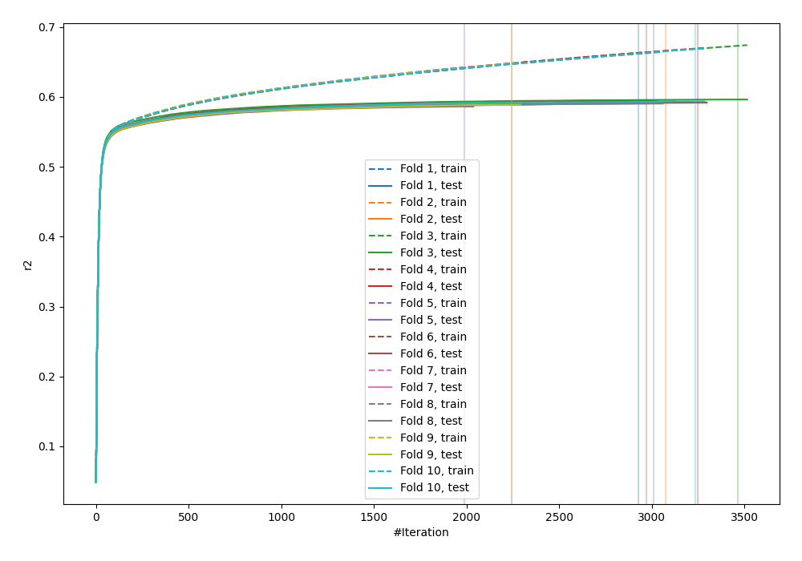
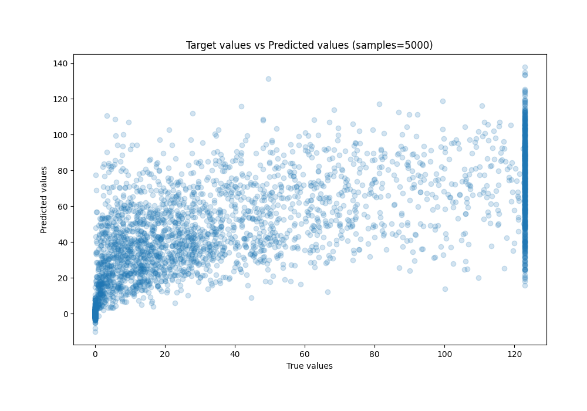
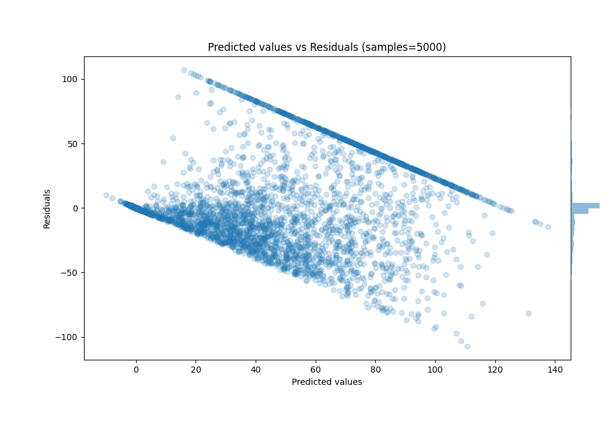

# Summary of 16_LightGBM

[<< Go back](../README.md)

## LightGBM
- **n_jobs**: -1
- **objective**: regression
- **num_leaves**: 31
- **learning_rate**: 0.05
- **feature_fraction**: 0.9
- **bagging_fraction**: 0.9
- **min_data_in_leaf**: 20
- **metric**: custom
- **custom_eval_metric_name**: r2
- **explain_level**: 0

## Validation
 - **validation_type**: kfold
 - **k_folds**: 10
 - **shuffle**: True

## Optimized metric
r2

## Training time

427.7 seconds

### Metric details:
| Metric   |        Score |
|:---------|-------------:|
| MAE      |  17.3809     |
| MSE      | 774.974      |
| RMSE     |  27.8383     |
| R2       |   0.591799   |
| MAPE     |   1.1645e+15 |

## Learning curves

## True vs Predicted

## Predicted vs Residuals

[<< Go back](../README.md)
