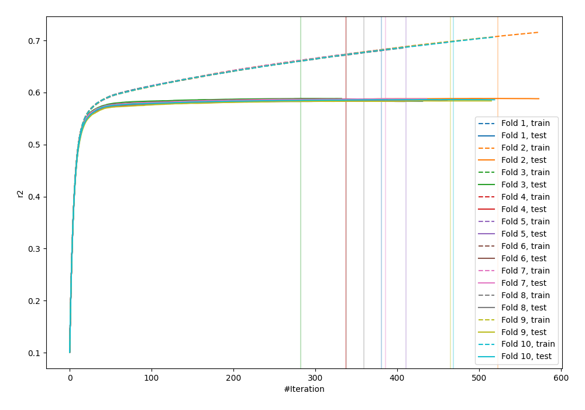
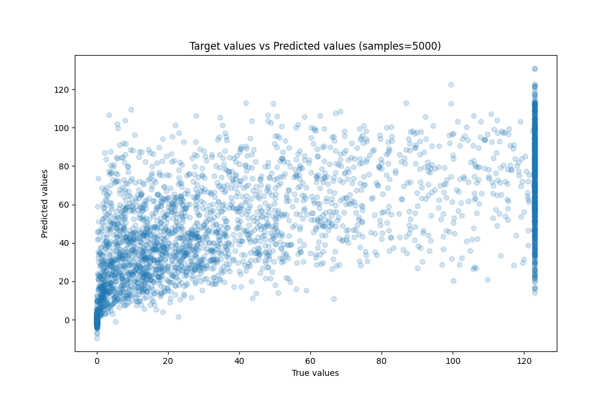
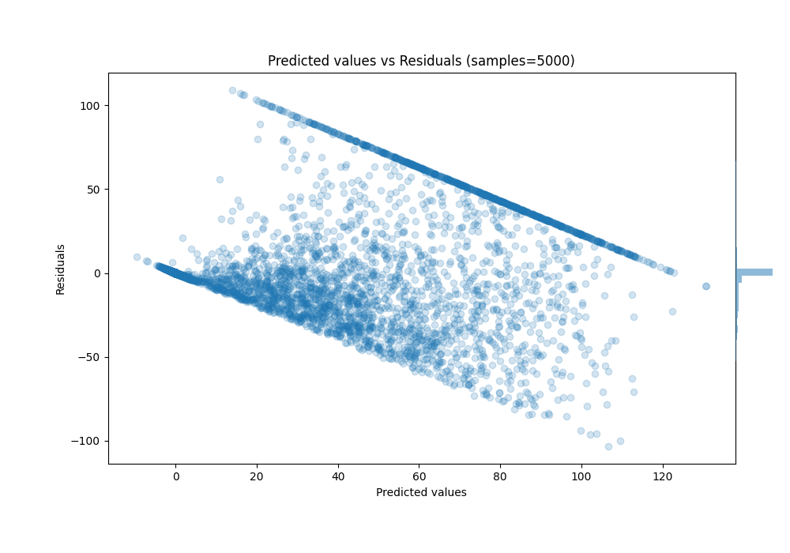

# Summary of 20_LightGBM_KMeansFeatures

[<< Go back](../README.md)

## LightGBM
- **n_jobs**: -1
- **objective**: regression
- **num_leaves**: 127
- **learning_rate**: 0.1
- **feature_fraction**: 1.0
- **bagging_fraction**: 1.0
- **min_data_in_leaf**: 50
- **metric**: custom
- **custom_eval_metric_name**: r2
- **explain_level**: 0

## Validation
 - **validation_type**: kfold
 - **k_folds**: 10
 - **shuffle**: True

## Optimized metric
r2

## Training time

111.6 seconds

### Metric details:
| Metric   |         Score |
|:---------|--------------:|
| MAE      |  17.4293      |
| MSE      | 786.165       |
| RMSE     |  28.0386      |
| R2       |   0.585904    |
| MAPE     |   1.03352e+15 |

## Learning curves

## True vs Predicted

## Predicted vs Residuals

[<< Go back](../README.md)
