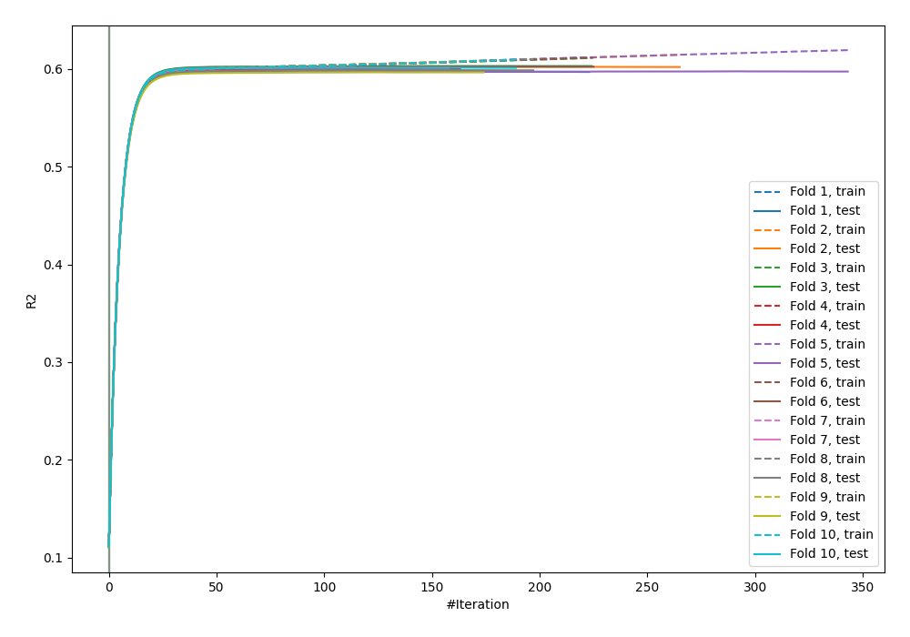
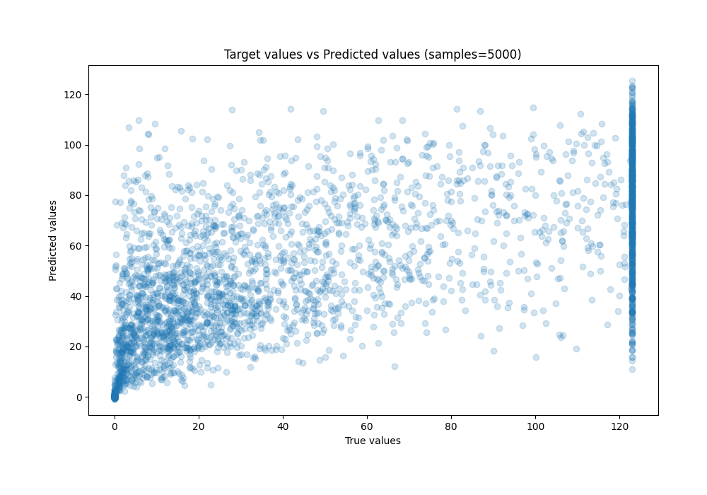
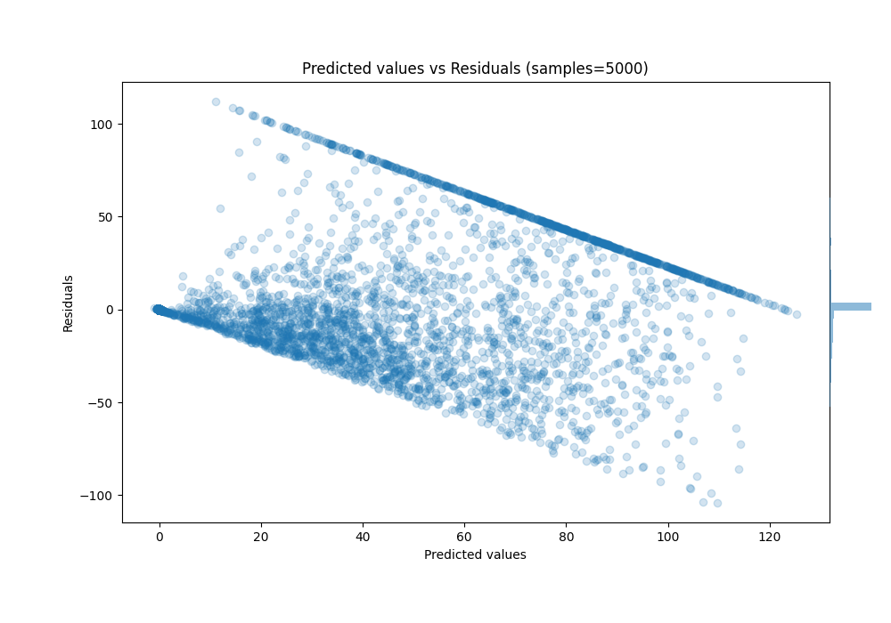

# Summary of 23_CatBoost_Stacked

[<< Go back](../README.md)

## CatBoost
- **n_jobs**: -1
- **learning_rate**: 0.1
- **depth**: 7
- **rsm**: 0.8
- **loss_function**: RMSE
- **eval_metric**: R2
- **explain_level**: 0

## Validation
 - **validation_type**: kfold
 - **k_folds**: 10
 - **shuffle**: True

## Optimized metric
r2

## Training time

95.5 seconds

### Metric details:
| Metric   |         Score |
|:---------|--------------:|
| MAE      |  16.7444      |
| MSE      | 759.246       |
| RMSE     |  27.5544      |
| R2       |   0.600083    |
| MAPE     |   2.26504e+14 |

## Learning curves

## True vs Predicted

## Predicted vs Residuals

[<< Go back](../README.md)
