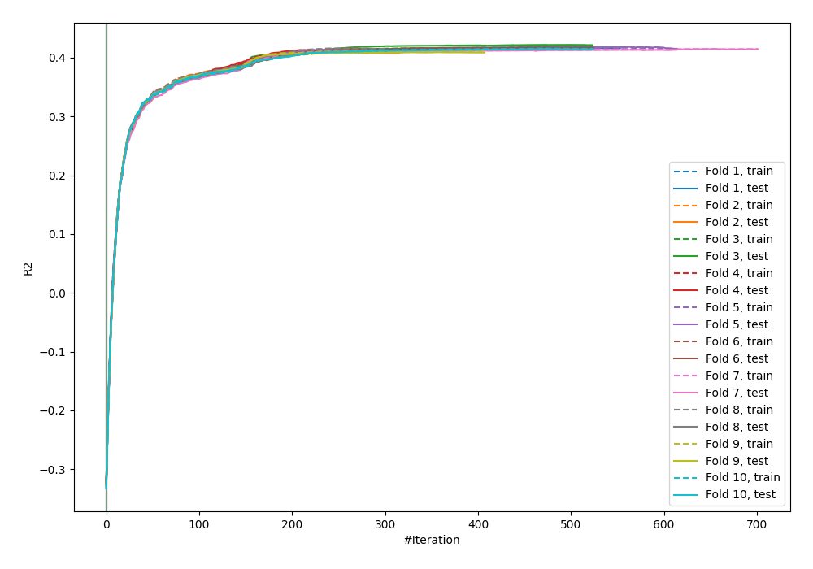
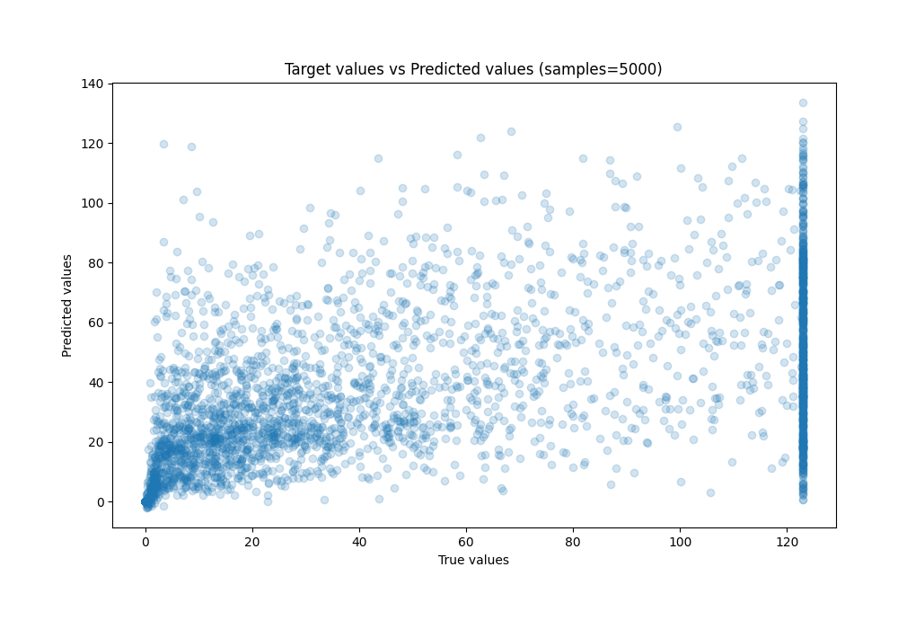
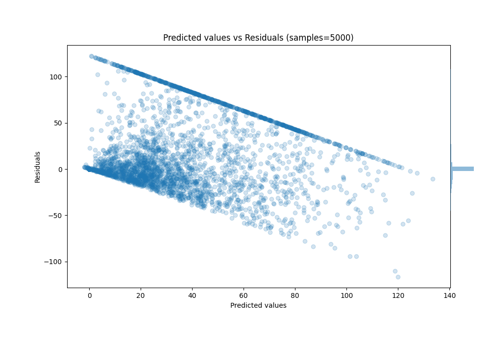

# Summary of 26_CatBoost

[<< Go back](../README.md)

## CatBoost
- **n_jobs**: -1
- **learning_rate**: 0.1
- **depth**: 4
- **rsm**: 0.9
- **loss_function**: MAPE
- **eval_metric**: R2
- **explain_level**: 0

## Validation
 - **validation_type**: kfold
 - **k_folds**: 10
 - **shuffle**: True

## Optimized metric
r2

## Training time

145.4 seconds

### Metric details:
| Metric   |          Score |
|:---------|---------------:|
| MAE      |   18.4582      |
| MSE      | 1111.09        |
| RMSE     |   33.333       |
| R2       |    0.414758    |
| MAPE     |    1.33829e+09 |

## Learning curves

## True vs Predicted

## Predicted vs Residuals

[<< Go back](../README.md)
