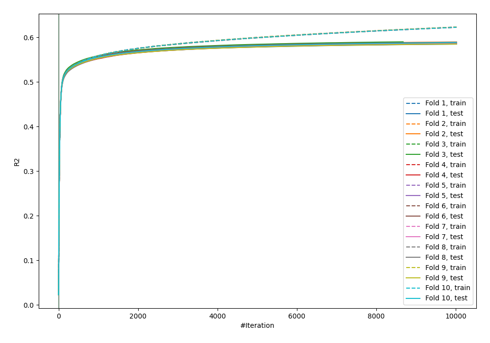
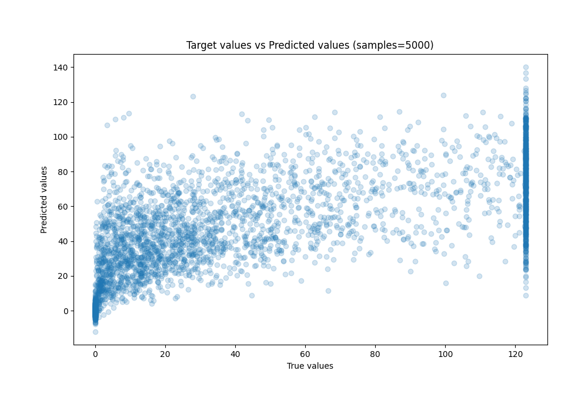
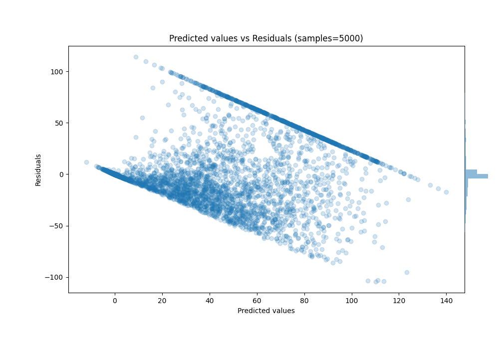

# Summary of 27_CatBoost

[<< Go back](../README.md)

## CatBoost
- **n_jobs**: -1
- **learning_rate**: 0.025
- **depth**: 6
- **rsm**: 0.9
- **loss_function**: RMSE
- **eval_metric**: R2
- **explain_level**: 0

## Validation
 - **validation_type**: kfold
 - **k_folds**: 10
 - **shuffle**: True

## Optimized metric
r2

## Training time

1644.8 seconds

### Metric details:
| Metric   |         Score |
|:---------|--------------:|
| MAE      |  17.6953      |
| MSE      | 783.388       |
| RMSE     |  27.9891      |
| R2       |   0.587367    |
| MAPE     |   1.74547e+15 |

## Learning curves

## True vs Predicted

## Predicted vs Residuals

[<< Go back](../README.md)
