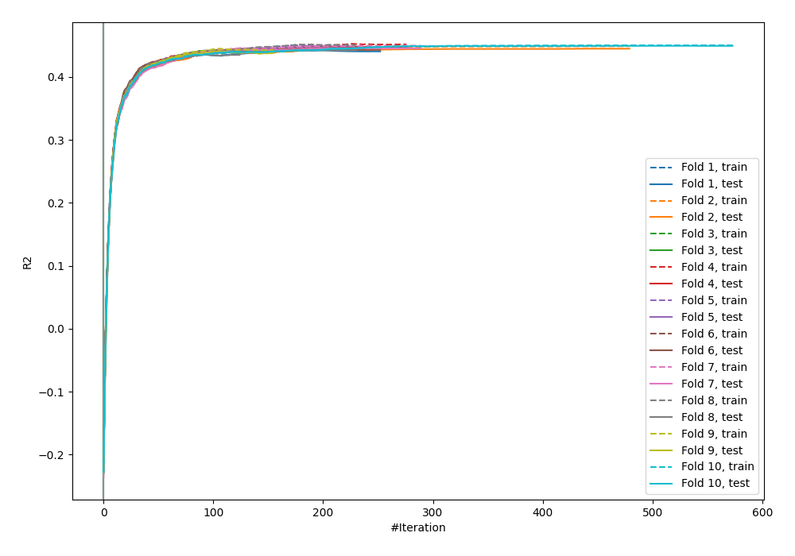
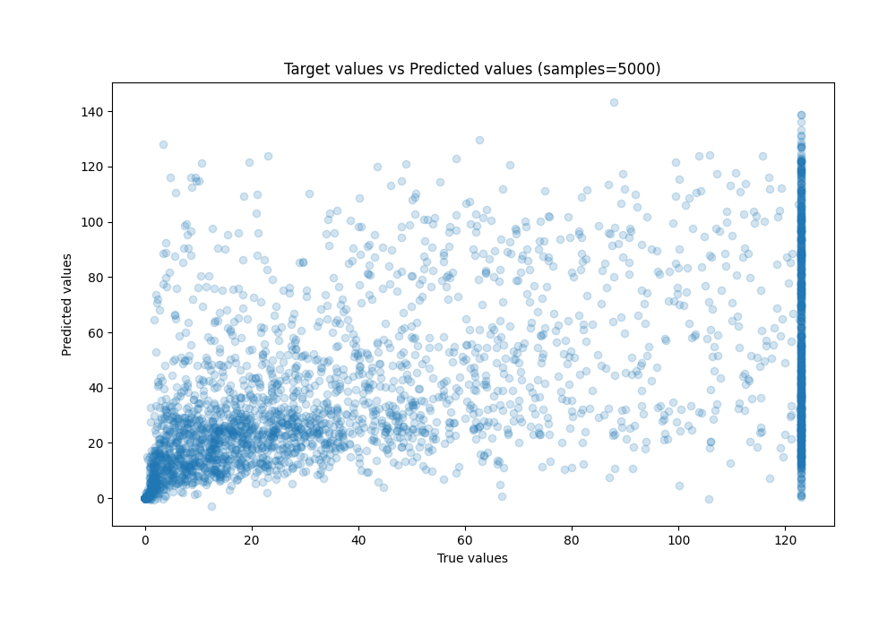
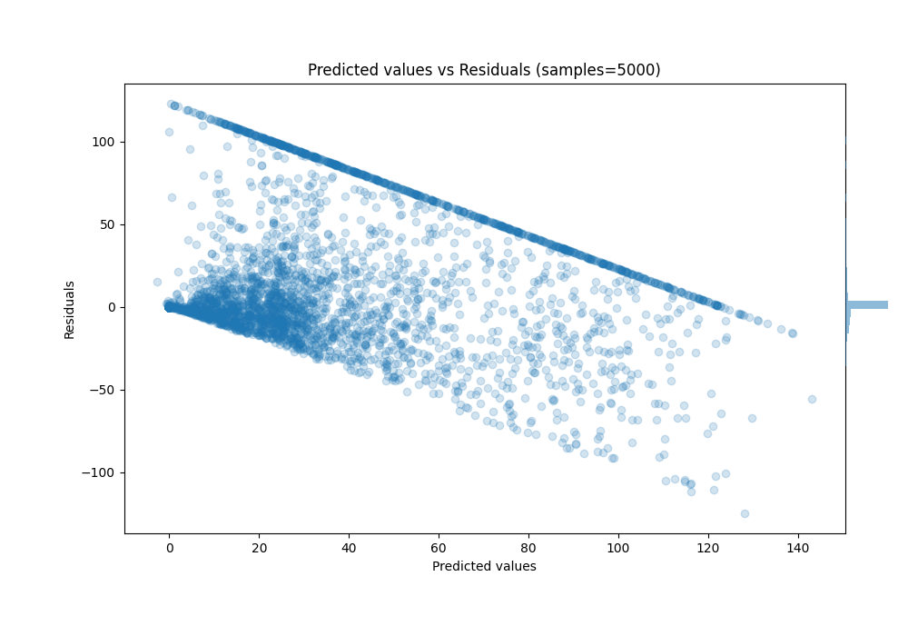

# Summary of 29_CatBoost

[<< Go back](../README.md)

## CatBoost
- **n_jobs**: -1
- **learning_rate**: 0.2
- **depth**: 7
- **rsm**: 1.0
- **loss_function**: MAPE
- **eval_metric**: R2
- **explain_level**: 0

## Validation
 - **validation_type**: kfold
 - **k_folds**: 10
 - **shuffle**: True

## Optimized metric
r2

## Training time

97.5 seconds

### Metric details:
| Metric   |          Score |
|:---------|---------------:|
| MAE      |   17.5109      |
| MSE      | 1053.57        |
| RMSE     |   32.4588      |
| R2       |    0.445053    |
| MAPE     |    4.92897e+09 |

## Learning curves

## True vs Predicted

## Predicted vs Residuals

[<< Go back](../README.md)
