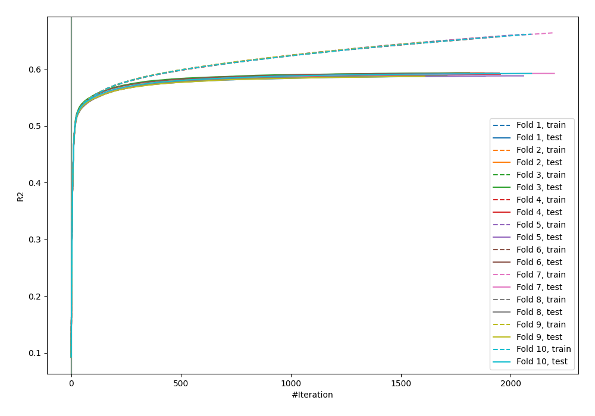
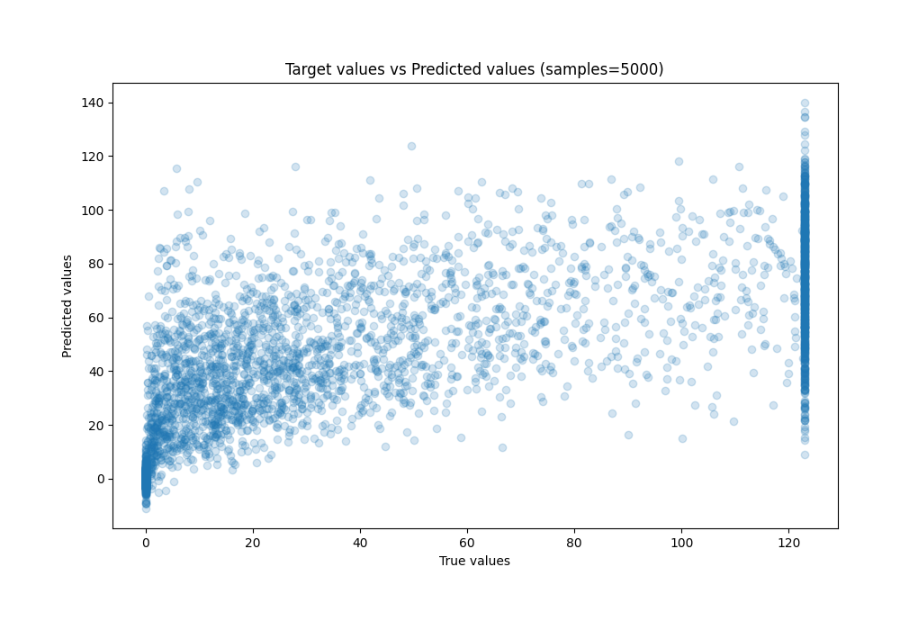
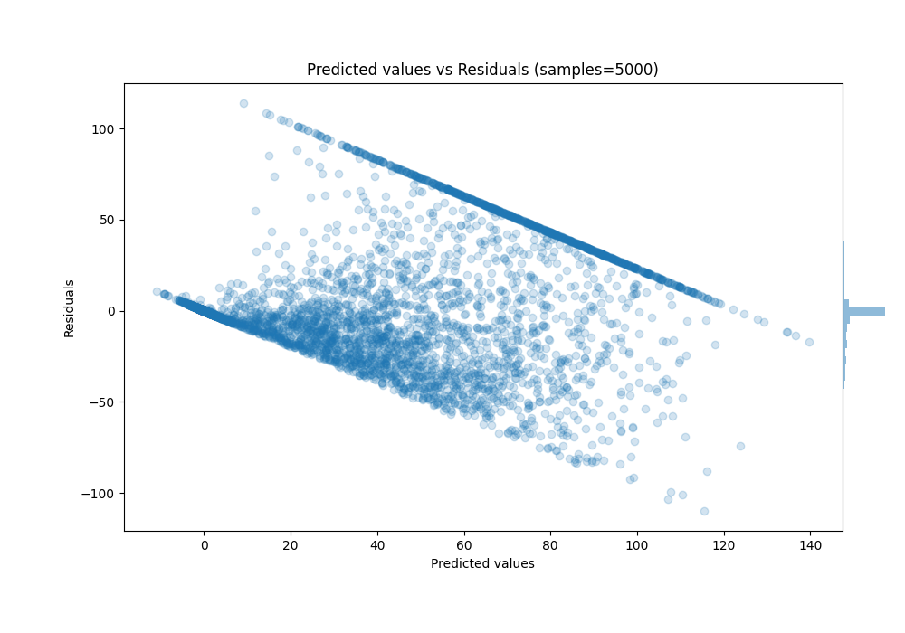

# Summary of 30_CatBoost

[<< Go back](../README.md)

## CatBoost
- **n_jobs**: -1
- **learning_rate**: 0.1
- **depth**: 8
- **rsm**: 1.0
- **loss_function**: RMSE
- **eval_metric**: R2
- **explain_level**: 0

## Validation
 - **validation_type**: kfold
 - **k_folds**: 10
 - **shuffle**: True

## Optimized metric
r2

## Training time

345.3 seconds

### Metric details:
| Metric   |         Score |
|:---------|--------------:|
| MAE      |  17.5538      |
| MSE      | 776.535       |
| RMSE     |  27.8664      |
| R2       |   0.590976    |
| MAPE     |   1.93967e+15 |

## Learning curves

## True vs Predicted

## Predicted vs Residuals

[<< Go back](../README.md)
