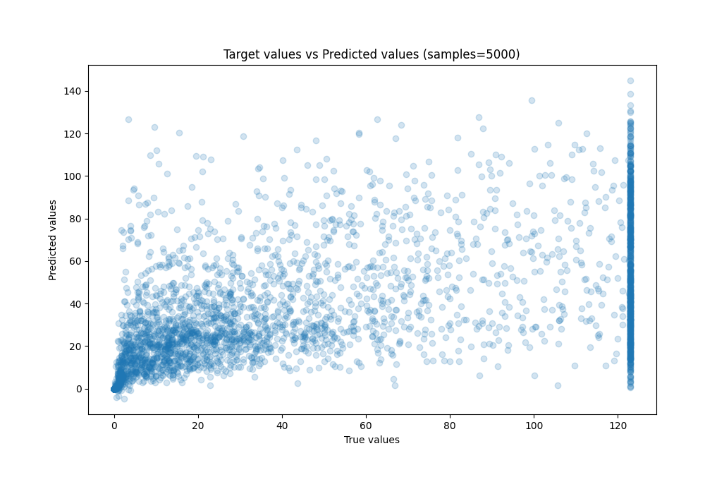

# Summary of 31_CatBoost

[<< Go back](../README.md)

## CatBoost
- **n_jobs**: -1
- **learning_rate**: 0.025
- **depth**: 6
- **rsm**: 1.0
- **loss_function**: MAPE
- **eval_metric**: R2
- **explain_level**: 0

## Validation
 - **validation_type**: kfold
 - **k_folds**: 10
 - **shuffle**: True

## Optimized metric
r2

## Training time

368.1 seconds

### Metric details:
| Metric   |          Score |
|:---------|---------------:|
| MAE      |   17.8843      |
| MSE      | 1068.93        |
| RMSE     |   32.6944      |
| R2       |    0.436965    |
| MAPE     |    4.78034e+09 |

## Learning curves

## True vs Predicted

## Predicted vs Residuals

[<< Go back](../README.md)
