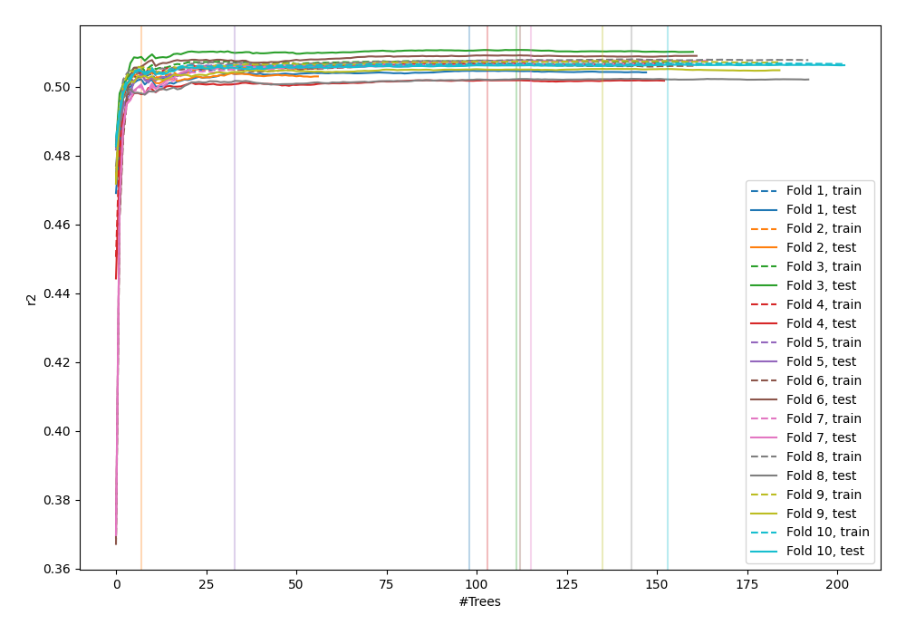
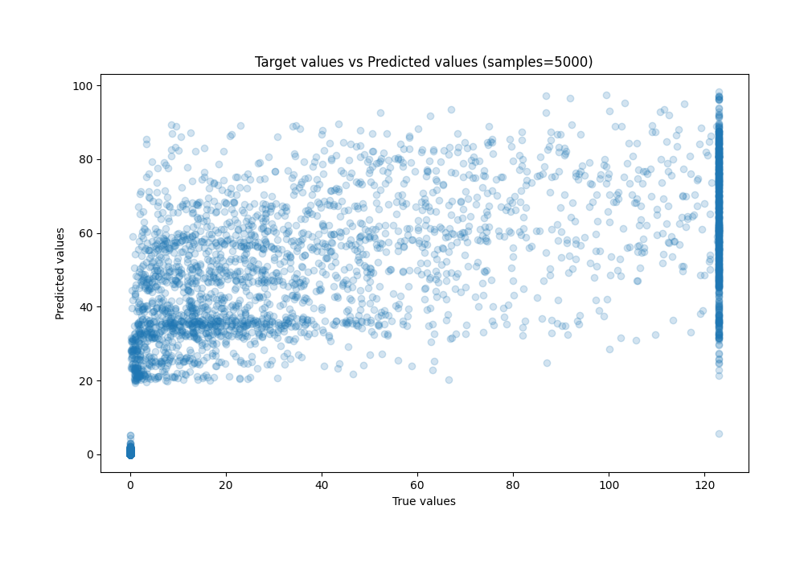
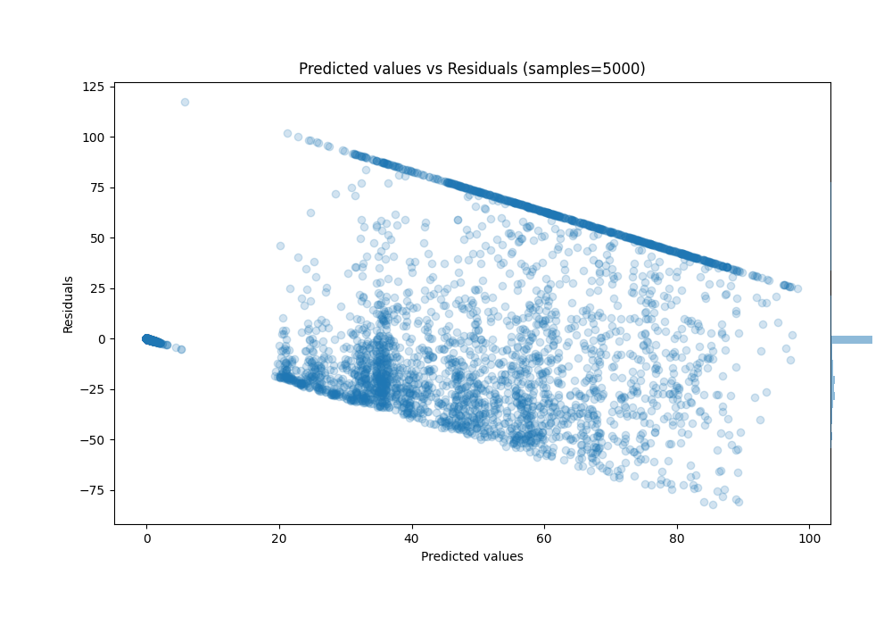

# Summary of 33_RandomForest

[<< Go back](../README.md)

## Random Forest
- **n_jobs**: -1
- **criterion**: squared_error
- **max_features**: 0.5
- **min_samples_split**: 30
- **max_depth**: 6
- **eval_metric_name**: r2
- **explain_level**: 0

## Validation
 - **validation_type**: kfold
 - **k_folds**: 10
 - **shuffle**: True

## Optimized metric
r2

## Training time

207.2 seconds

### Metric details:
| Metric   |         Score |
|:---------|--------------:|
| MAE      |  20.1123      |
| MSE      | 938.292       |
| RMSE     |  30.6316      |
| R2       |   0.505774    |
| MAPE     |   8.02087e+14 |

## Learning curves

## True vs Predicted

## Predicted vs Residuals

[<< Go back](../README.md)
