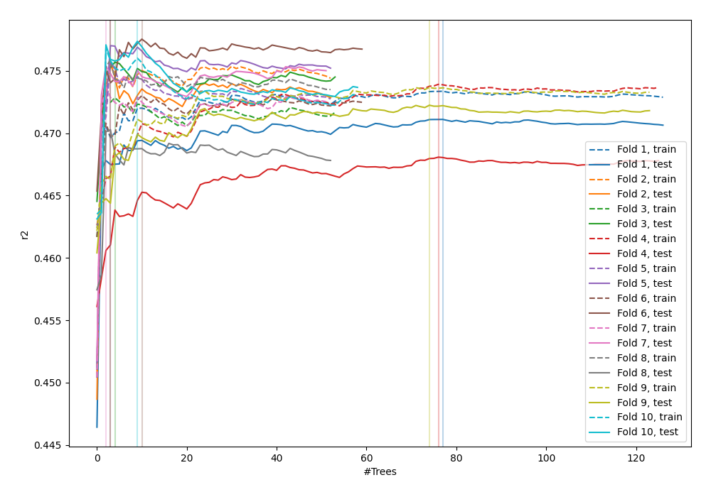
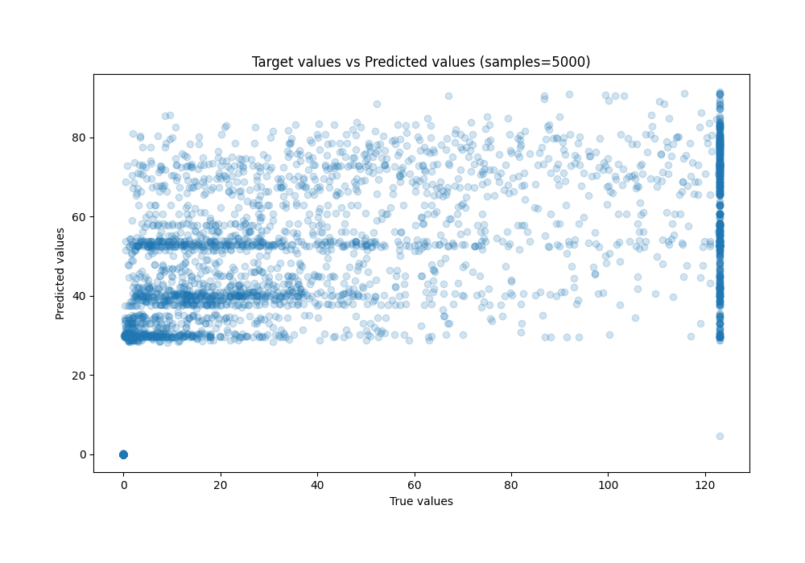
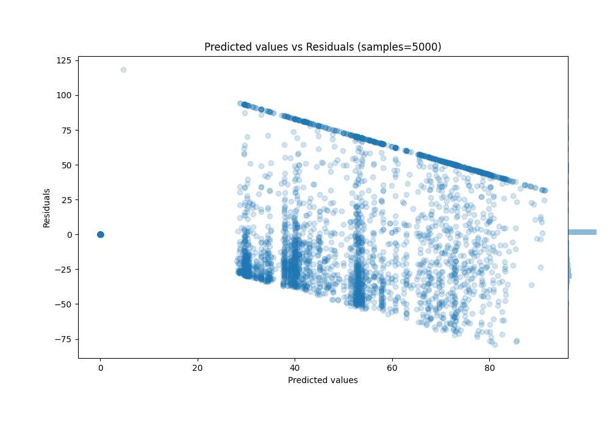

# Summary of 35_RandomForest

[<< Go back](../README.md)

## Random Forest
- **n_jobs**: -1
- **criterion**: squared_error
- **max_features**: 0.8
- **min_samples_split**: 50
- **max_depth**: 4
- **eval_metric_name**: r2
- **explain_level**: 0

## Validation
 - **validation_type**: kfold
 - **k_folds**: 10
 - **shuffle**: True

## Optimized metric
r2

## Training time

140.4 seconds

### Metric details:
| Metric   |        Score |
|:---------|-------------:|
| MAE      |  20.7854     |
| MSE      | 998.544      |
| RMSE     |  31.5997     |
| R2       |   0.474038   |
| MAPE     |   7.1485e+12 |

## Learning curves

## True vs Predicted

## Predicted vs Residuals

[<< Go back](../README.md)
