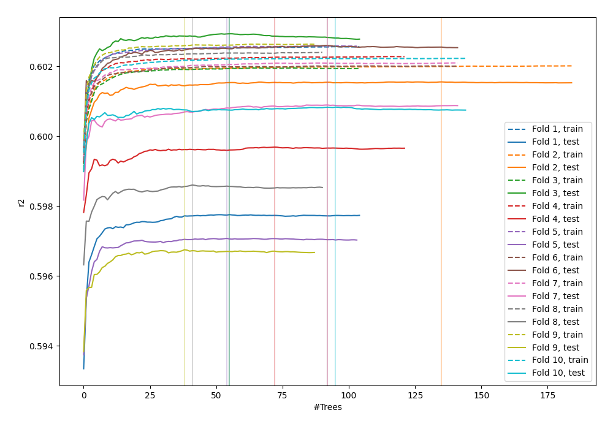
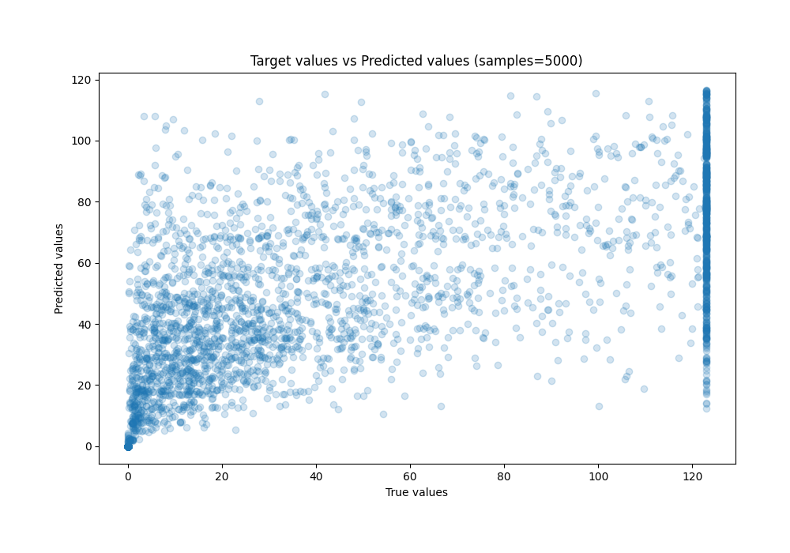
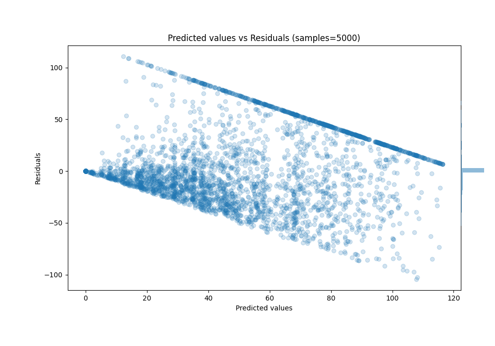

# Summary of 38_RandomForest_Stacked

[<< Go back](../README.md)

## Random Forest
- **n_jobs**: -1
- **criterion**: squared_error
- **max_features**: 0.8
- **min_samples_split**: 40
- **max_depth**: 6
- **eval_metric_name**: r2
- **explain_level**: 0

## Validation
 - **validation_type**: kfold
 - **k_folds**: 10
 - **shuffle**: True

## Optimized metric
r2

## Training time

1336.5 seconds

### Metric details:
| Metric   |         Score |
|:---------|--------------:|
| MAE      |  16.727       |
| MSE      | 759.639       |
| RMSE     |  27.5615      |
| R2       |   0.599876    |
| MAPE     |   2.52867e+13 |

## Learning curves

## True vs Predicted

## Predicted vs Residuals

[<< Go back](../README.md)
