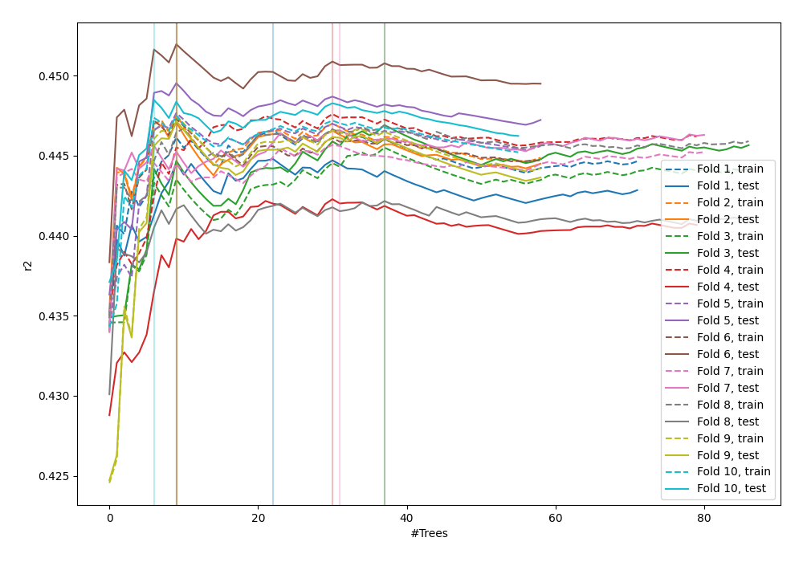
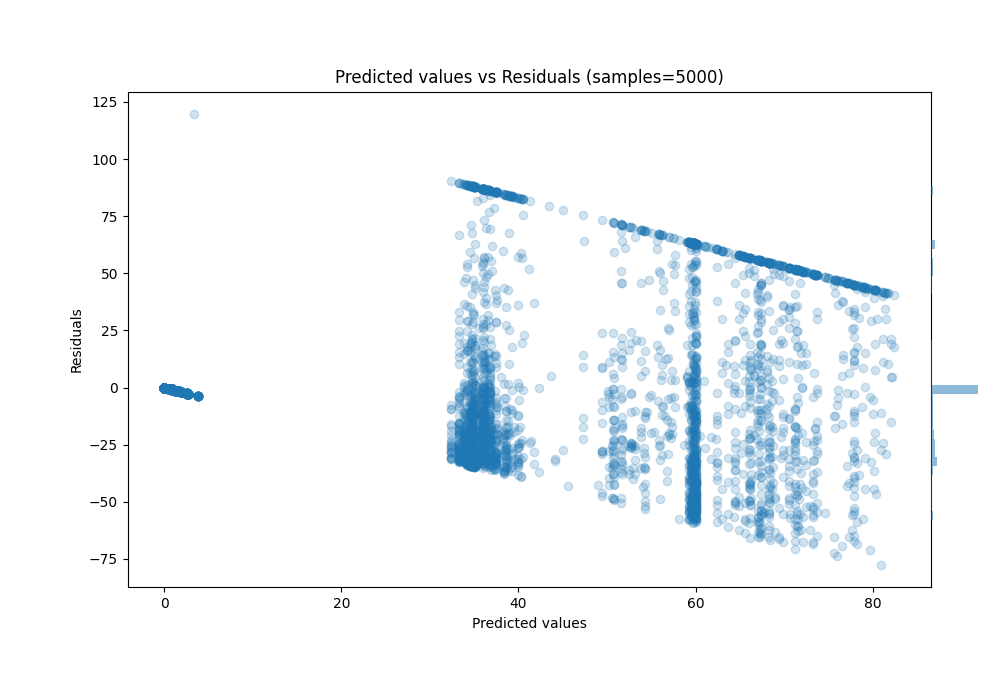

# Summary of 39_RandomForest

[<< Go back](../README.md)

## Random Forest
- **n_jobs**: -1
- **criterion**: squared_error
- **max_features**: 0.9
- **min_samples_split**: 40
- **max_depth**: 3
- **eval_metric_name**: r2
- **explain_level**: 0

## Validation
 - **validation_type**: kfold
 - **k_folds**: 10
 - **shuffle**: True

## Optimized metric
r2

## Training time

99.1 seconds

### Metric details:
| Metric   |          Score |
|:---------|---------------:|
| MAE      |   21.7138      |
| MSE      | 1050.42        |
| RMSE     |   32.4102      |
| R2       |    0.446712    |
| MAPE     |    1.49696e+15 |

## Learning curves

## True vs Predicted

## Predicted vs Residuals

[<< Go back](../README.md)
