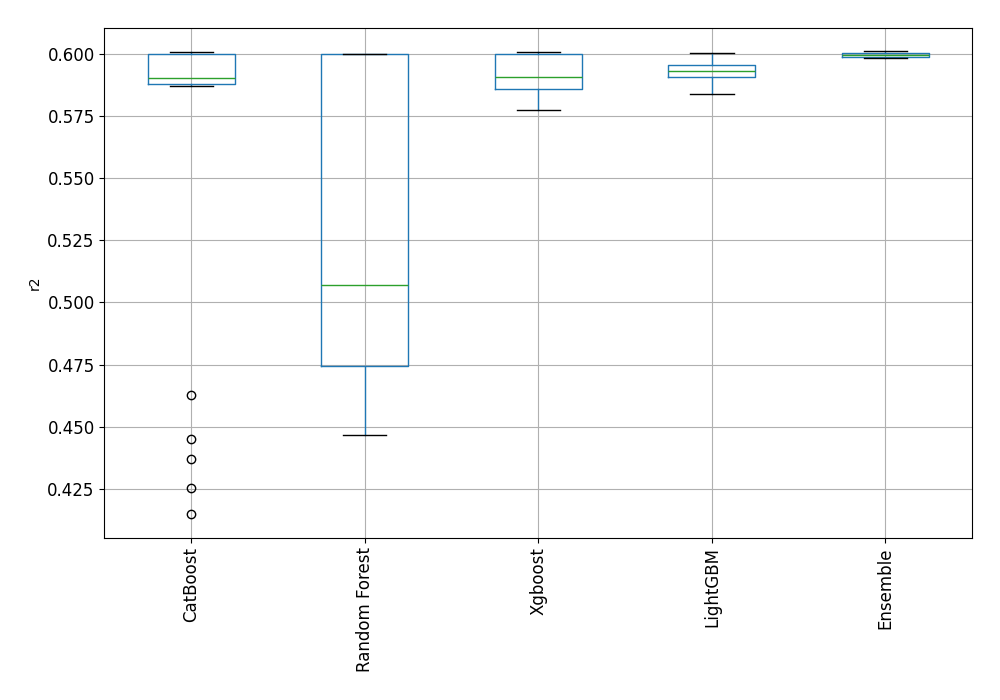

# AutoML Leaderboard

| Best model   | name                                                                             | model_type    | metric_type   |   metric_value |   train_time |
|:-------------|:---------------------------------------------------------------------------------|:--------------|:--------------|---------------:|-------------:|
|              | [1_Default_LightGBM](1_Default_LightGBM/README.md)                               | LightGBM      | r2            |       0.593246 |       372.23 |
|              | [2_Default_Xgboost](2_Default_Xgboost/README.md)                                 | Xgboost       | r2            |       0.587772 |       350.94 |
|              | [3_Default_CatBoost](3_Default_CatBoost/README.md)                               | CatBoost      | r2            |       0.588676 |       457.56 |
|              | [4_Default_RandomForest](4_Default_RandomForest/README.md)                       | Random Forest | r2            |       0.473426 |       130.9  |
|              | [14_LightGBM](14_LightGBM/README.md)                                             | LightGBM      | r2            |       0.591768 |       166.25 |
|              | [5_Xgboost](5_Xgboost/README.md)                                                 | Xgboost       | r2            |       0.587816 |       207.62 |
|              | [23_CatBoost](23_CatBoost/README.md)                                             | CatBoost      | r2            |       0.590195 |       492.7  |
|              | [32_RandomForest](32_RandomForest/README.md)                                     | Random Forest | r2            |       0.465268 |       203.03 |
|              | [15_LightGBM](15_LightGBM/README.md)                                             | LightGBM      | r2            |       0.587144 |       344.19 |
|              | [6_Xgboost](6_Xgboost/README.md)                                                 | Xgboost       | r2            |       0.578589 |       167.21 |
|              | [24_CatBoost](24_CatBoost/README.md)                                             | CatBoost      | r2            |       0.587002 |       275.81 |
|              | [33_RandomForest](33_RandomForest/README.md)                                     | Random Forest | r2            |       0.505774 |       208.07 |
|              | [16_LightGBM](16_LightGBM/README.md)                                             | LightGBM      | r2            |       0.591799 |       428.76 |
|              | [7_Xgboost](7_Xgboost/README.md)                                                 | Xgboost       | r2            |       0.592484 |       205.74 |
|              | [25_CatBoost](25_CatBoost/README.md)                                             | CatBoost      | r2            |       0.462884 |       567.59 |
|              | [34_RandomForest](34_RandomForest/README.md)                                     | Random Forest | r2            |       0.449901 |       100    |
|              | [17_LightGBM](17_LightGBM/README.md)                                             | LightGBM      | r2            |       0.593185 |       253.95 |
|              | [8_Xgboost](8_Xgboost/README.md)                                                 | Xgboost       | r2            |       0.577428 |       547.99 |
|              | [26_CatBoost](26_CatBoost/README.md)                                             | CatBoost      | r2            |       0.414758 |       146.36 |
|              | [35_RandomForest](35_RandomForest/README.md)                                     | Random Forest | r2            |       0.474038 |       141.36 |
|              | [18_LightGBM](18_LightGBM/README.md)                                             | LightGBM      | r2            |       0.586543 |        99.93 |
|              | [9_Xgboost](9_Xgboost/README.md)                                                 | Xgboost       | r2            |       0.584396 |       451.17 |
|              | [27_CatBoost](27_CatBoost/README.md)                                             | CatBoost      | r2            |       0.587367 |      1645.84 |
|              | [36_RandomForest](36_RandomForest/README.md)                                     | Random Forest | r2            |       0.450279 |       109.63 |
|              | [19_LightGBM](19_LightGBM/README.md)                                             | LightGBM      | r2            |       0.591803 |       180.51 |
|              | [10_Xgboost](10_Xgboost/README.md)                                               | Xgboost       | r2            |       0.582771 |       369.22 |
|              | [28_CatBoost](28_CatBoost/README.md)                                             | CatBoost      | r2            |       0.425323 |       105.7  |
|              | [37_RandomForest](37_RandomForest/README.md)                                     | Random Forest | r2            |       0.473208 |       190.69 |
|              | [20_LightGBM](20_LightGBM/README.md)                                             | LightGBM      | r2            |       0.593037 |       116.14 |
|              | [11_Xgboost](11_Xgboost/README.md)                                               | Xgboost       | r2            |       0.583639 |       100.89 |
|              | [29_CatBoost](29_CatBoost/README.md)                                             | CatBoost      | r2            |       0.445053 |        98.41 |
|              | [38_RandomForest](38_RandomForest/README.md)                                     | Random Forest | r2            |       0.507211 |       193.86 |
|              | [21_LightGBM](21_LightGBM/README.md)                                             | LightGBM      | r2            |       0.591489 |       145.47 |
|              | [12_Xgboost](12_Xgboost/README.md)                                               | Xgboost       | r2            |       0.584851 |       137.27 |
|              | [30_CatBoost](30_CatBoost/README.md)                                             | CatBoost      | r2            |       0.590976 |       346.2  |
|              | [39_RandomForest](39_RandomForest/README.md)                                     | Random Forest | r2            |       0.446712 |        99.98 |
|              | [22_LightGBM](22_LightGBM/README.md)                                             | LightGBM      | r2            |       0.587092 |        81.57 |
|              | [13_Xgboost](13_Xgboost/README.md)                                               | Xgboost       | r2            |       0.5858   |       461.98 |
|              | [31_CatBoost](31_CatBoost/README.md)                                             | CatBoost      | r2            |       0.436965 |       369.02 |
|              | [40_RandomForest](40_RandomForest/README.md)                                     | Random Forest | r2            |       0.473634 |       126.24 |
|              | [1_Default_LightGBM_GoldenFeatures](1_Default_LightGBM_GoldenFeatures/README.md) | LightGBM      | r2            |       0.590581 |       313.62 |
|              | [17_LightGBM_GoldenFeatures](17_LightGBM_GoldenFeatures/README.md)               | LightGBM      | r2            |       0.590707 |       217.71 |
|              | [20_LightGBM_GoldenFeatures](20_LightGBM_GoldenFeatures/README.md)               | LightGBM      | r2            |       0.590649 |       114.51 |
|              | [1_Default_LightGBM_KMeansFeatures](1_Default_LightGBM_KMeansFeatures/README.md) | LightGBM      | r2            |       0.583939 |       254.43 |
|              | [17_LightGBM_KMeansFeatures](17_LightGBM_KMeansFeatures/README.md)               | LightGBM      | r2            |       0.58565  |       215.94 |
|              | [20_LightGBM_KMeansFeatures](20_LightGBM_KMeansFeatures/README.md)               | LightGBM      | r2            |       0.585904 |       112.7  |
|              | [1_Default_LightGBM_RandomFeature](1_Default_LightGBM_RandomFeature/README.md)   | LightGBM      | r2            |       0.589615 |      1386.4  |
|              | [41_LightGBM](41_LightGBM/README.md)                                             | LightGBM      | r2            |       0.591509 |       160.82 |
|              | [42_LightGBM](42_LightGBM/README.md)                                             | LightGBM      | r2            |       0.591343 |       139.25 |
|              | [43_LightGBM](43_LightGBM/README.md)                                             | LightGBM      | r2            |       0.594357 |       204.03 |
|              | [44_LightGBM](44_LightGBM/README.md)                                             | LightGBM      | r2            |       0.589085 |        59.35 |
|              | [45_Xgboost](45_Xgboost/README.md)                                               | Xgboost       | r2            |       0.591448 |       279.72 |
|              | [46_CatBoost](46_CatBoost/README.md)                                             | CatBoost      | r2            |       0.591012 |       480.29 |
|              | [47_CatBoost](47_CatBoost/README.md)                                             | CatBoost      | r2            |       0.589701 |       471.1  |
|              | [48_CatBoost](48_CatBoost/README.md)                                             | CatBoost      | r2            |       0.590306 |       559.66 |
|              | [49_CatBoost](49_CatBoost/README.md)                                             | CatBoost      | r2            |       0.588319 |       618.26 |
|              | [50_Xgboost](50_Xgboost/README.md)                                               | Xgboost       | r2            |       0.586578 |       332.05 |
|              | [51_Xgboost](51_Xgboost/README.md)                                               | Xgboost       | r2            |       0.588936 |       173.65 |
|              | [52_Xgboost](52_Xgboost/README.md)                                               | Xgboost       | r2            |       0.584893 |       467.29 |
|              | [53_Xgboost](53_Xgboost/README.md)                                               | Xgboost       | r2            |       0.588691 |       212.32 |
|              | [54_RandomForest](54_RandomForest/README.md)                                     | Random Forest | r2            |       0.507137 |       229.1  |
|              | [55_RandomForest](55_RandomForest/README.md)                                     | Random Forest | r2            |       0.507236 |       228.87 |
|              | [56_RandomForest](56_RandomForest/README.md)                                     | Random Forest | r2            |       0.505737 |       232.04 |
|              | [57_RandomForest](57_RandomForest/README.md)                                     | Random Forest | r2            |       0.505513 |       191.65 |
|              | [58_RandomForest](58_RandomForest/README.md)                                     | Random Forest | r2            |       0.474604 |       133.47 |
|              | [59_LightGBM](59_LightGBM/README.md)                                             | LightGBM      | r2            |       0.594357 |       227.58 |
|              | [60_LightGBM](60_LightGBM/README.md)                                             | LightGBM      | r2            |       0.593246 |       321.13 |
|              | [61_LightGBM](61_LightGBM/README.md)                                             | LightGBM      | r2            |       0.593246 |       321.19 |
|              | [62_LightGBM](62_LightGBM/README.md)                                             | LightGBM      | r2            |       0.593185 |       245.12 |
|              | [63_LightGBM](63_LightGBM/README.md)                                             | LightGBM      | r2            |       0.593185 |       246.4  |
|              | [64_Xgboost](64_Xgboost/README.md)                                               | Xgboost       | r2            |       0.591394 |       209.71 |
|              | [65_Xgboost](65_Xgboost/README.md)                                               | Xgboost       | r2            |       0.592926 |       243.5  |
|              | [66_Xgboost](66_Xgboost/README.md)                                               | Xgboost       | r2            |       0.590073 |       300.28 |
|              | [67_Xgboost](67_Xgboost/README.md)                                               | Xgboost       | r2            |       0.591943 |       360.14 |
|              | [68_CatBoost](68_CatBoost/README.md)                                             | CatBoost      | r2            |       0.592023 |      1170.43 |
|              | [69_CatBoost](69_CatBoost/README.md)                                             | CatBoost      | r2            |       0.588689 |       250.26 |
|              | [70_CatBoost](70_CatBoost/README.md)                                             | CatBoost      | r2            |       0.591935 |       711.89 |
|              | [71_CatBoost](71_CatBoost/README.md)                                             | CatBoost      | r2            |       0.588865 |       188.66 |
|              | [72_CatBoost](72_CatBoost/README.md)                                             | CatBoost      | r2            |       0.590602 |      1080.02 |
|              | [73_CatBoost](73_CatBoost/README.md)                                             | CatBoost      | r2            |       0.587922 |       278.71 |
|              | [74_Xgboost](74_Xgboost/README.md)                                               | Xgboost       | r2            |       0.588622 |       189.05 |
|              | [75_RandomForest](75_RandomForest/README.md)                                     | Random Forest | r2            |       0.508208 |       230.58 |
|              | [76_RandomForest](76_RandomForest/README.md)                                     | Random Forest | r2            |       0.505811 |       285.37 |
|              | [77_RandomForest](77_RandomForest/README.md)                                     | Random Forest | r2            |       0.508213 |       261.69 |
|              | [78_RandomForest](78_RandomForest/README.md)                                     | Random Forest | r2            |       0.505879 |       268.97 |
|              | [79_RandomForest](79_RandomForest/README.md)                                     | Random Forest | r2            |       0.508252 |       278.28 |
|              | [80_RandomForest](80_RandomForest/README.md)                                     | Random Forest | r2            |       0.50595  |       208.54 |
|              | [43_LightGBM_BoostOnErrors](43_LightGBM_BoostOnErrors/README.md)                 | LightGBM      | r2            |       0.593511 |       242.54 |
|              | [Ensemble](Ensemble/README.md)                                                   | Ensemble      | r2            |       0.598153 |        87.04 |
|              | [59_LightGBM_Stacked](59_LightGBM_Stacked/README.md)                             | LightGBM      | r2            |       0.600212 |        62.45 |
|              | [65_Xgboost_Stacked](65_Xgboost_Stacked/README.md)                               | Xgboost       | r2            |       0.600312 |        92.57 |
|              | [68_CatBoost_Stacked](68_CatBoost_Stacked/README.md)                             | CatBoost      | r2            |       0.600323 |       185.12 |
|              | [79_RandomForest_Stacked](79_RandomForest_Stacked/README.md)                     | Random Forest | r2            |       0.599847 |      1621.12 |
|              | [43_LightGBM_Stacked](43_LightGBM_Stacked/README.md)                             | LightGBM      | r2            |       0.600212 |        67.66 |
|              | [7_Xgboost_Stacked](7_Xgboost_Stacked/README.md)                                 | Xgboost       | r2            |       0.600025 |        92.98 |
|              | [70_CatBoost_Stacked](70_CatBoost_Stacked/README.md)                             | CatBoost      | r2            |       0.600524 |       147.52 |
|              | [77_RandomForest_Stacked](77_RandomForest_Stacked/README.md)                     | Random Forest | r2            |       0.599854 |      1558.85 |
|              | [1_Default_LightGBM_Stacked](1_Default_LightGBM_Stacked/README.md)               | LightGBM      | r2            |       0.600481 |        57.06 |
|              | [67_Xgboost_Stacked](67_Xgboost_Stacked/README.md)                               | Xgboost       | r2            |       0.600566 |        84.83 |
|              | [46_CatBoost_Stacked](46_CatBoost_Stacked/README.md)                             | CatBoost      | r2            |       0.599872 |       105    |
|              | [75_RandomForest_Stacked](75_RandomForest_Stacked/README.md)                     | Random Forest | r2            |       0.599878 |      1501.27 |
|              | [60_LightGBM_Stacked](60_LightGBM_Stacked/README.md)                             | LightGBM      | r2            |       0.600481 |        58.09 |
|              | [45_Xgboost_Stacked](45_Xgboost_Stacked/README.md)                               | Xgboost       | r2            |       0.60029  |        86.3  |
|              | [30_CatBoost_Stacked](30_CatBoost_Stacked/README.md)                             | CatBoost      | r2            |       0.600076 |        85.5  |
|              | [55_RandomForest_Stacked](55_RandomForest_Stacked/README.md)                     | Random Forest | r2            |       0.599876 |      1423.11 |
|              | [61_LightGBM_Stacked](61_LightGBM_Stacked/README.md)                             | LightGBM      | r2            |       0.600481 |        57.05 |
|              | [64_Xgboost_Stacked](64_Xgboost_Stacked/README.md)                               | Xgboost       | r2            |       0.599951 |        89.98 |
|              | [72_CatBoost_Stacked](72_CatBoost_Stacked/README.md)                             | CatBoost      | r2            |       0.600507 |       157.16 |
|              | [38_RandomForest_Stacked](38_RandomForest_Stacked/README.md)                     | Random Forest | r2            |       0.599876 |      1337.44 |
|              | [63_LightGBM_Stacked](63_LightGBM_Stacked/README.md)                             | LightGBM      | r2            |       0.600392 |        59.05 |
|              | [66_Xgboost_Stacked](66_Xgboost_Stacked/README.md)                               | Xgboost       | r2            |       0.600251 |        85.91 |
|              | [48_CatBoost_Stacked](48_CatBoost_Stacked/README.md)                             | CatBoost      | r2            |       0.60015  |        95.06 |
|              | [54_RandomForest_Stacked](54_RandomForest_Stacked/README.md)                     | Random Forest | r2            |       0.599888 |      1327.9  |
|              | [17_LightGBM_Stacked](17_LightGBM_Stacked/README.md)                             | LightGBM      | r2            |       0.600392 |        59.44 |
|              | [51_Xgboost_Stacked](51_Xgboost_Stacked/README.md)                               | Xgboost       | r2            |       0.599985 |        60.69 |
|              | [23_CatBoost_Stacked](23_CatBoost_Stacked/README.md)                             | CatBoost      | r2            |       0.600083 |        96.39 |
|              | [80_RandomForest_Stacked](80_RandomForest_Stacked/README.md)                     | Random Forest | r2            |       0.599852 |      1673.59 |
|              | [62_LightGBM_Stacked](62_LightGBM_Stacked/README.md)                             | LightGBM      | r2            |       0.600392 |        59.23 |
|              | [53_Xgboost_Stacked](53_Xgboost_Stacked/README.md)                               | Xgboost       | r2            |       0.600123 |        69.54 |
|              | [47_CatBoost_Stacked](47_CatBoost_Stacked/README.md)                             | CatBoost      | r2            |       0.600159 |       103.3  |
|              | [78_RandomForest_Stacked](78_RandomForest_Stacked/README.md)                     | Random Forest | r2            |       0.599862 |      1580.92 |
|              | [20_LightGBM_Stacked](20_LightGBM_Stacked/README.md)                             | LightGBM      | r2            |       0.599629 |        45.67 |
|              | [74_Xgboost_Stacked](74_Xgboost_Stacked/README.md)                               | Xgboost       | r2            |       0.599793 |        63.43 |
|              | [71_CatBoost_Stacked](71_CatBoost_Stacked/README.md)                             | CatBoost      | r2            |       0.599644 |        60.13 |
|              | [76_RandomForest_Stacked](76_RandomForest_Stacked/README.md)                     | Random Forest | r2            |       0.599853 |      1664.68 |
|              | [5_Xgboost_Stacked](5_Xgboost_Stacked/README.md)                                 | Xgboost       | r2            |       0.600319 |        59.27 |
|              | [69_CatBoost_Stacked](69_CatBoost_Stacked/README.md)                             | CatBoost      | r2            |       0.599246 |        68.75 |
|              | [33_RandomForest_Stacked](33_RandomForest_Stacked/README.md)                     | Random Forest | r2            |       0.599785 |       963.93 |
| **the best** | [Ensemble_Stacked](Ensemble_Stacked/README.md)                                   | Ensemble      | r2            |       0.60114  |       177.41 |

### AutoML Performance

### AutoML Performance Boxplot

### Spearman Correlation of Models

