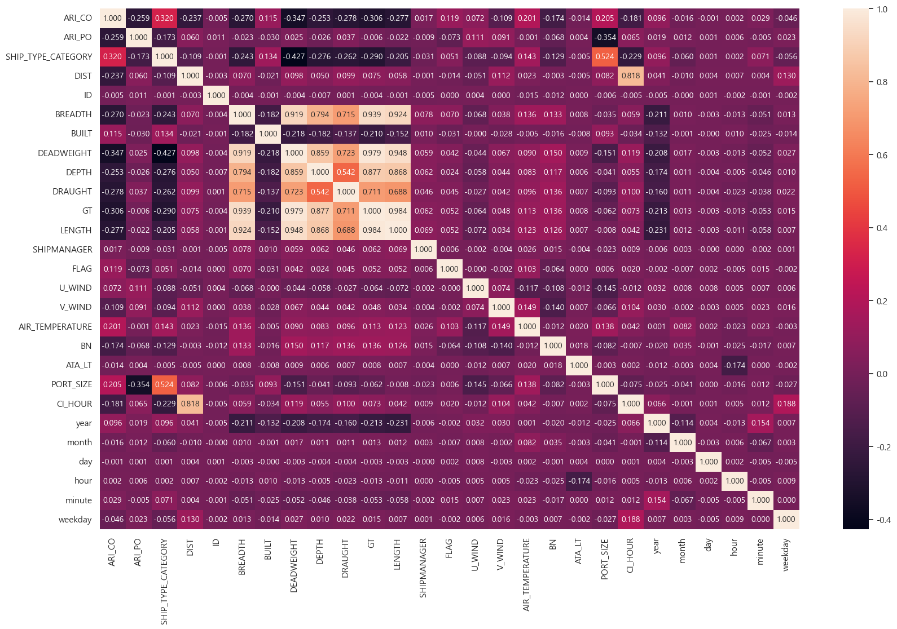

# 프로젝트 배경
코로나19 이후 물류 정체로 인해 다수의 항만에서 선박 대기 시간이 길어지고, 이로 인한 물류 지연이 화두가 되고 있습니다. 

특히 전 세계 물동량의 85%를 차지하는 해운 물류 분야에서 항만 정체는 큰 문제로 인식되고 있는 상황입니다. 

저희 조는 접안 전에 선박이 해상에 정박하는 시간을 대기시간으로 정의하고, 선박의 제원 및 운항 정보를 활용하여 산출된 항차 데이터를 활용해 항만 內 선박의 대기 시간을 예측하는 AI 알고리즘을 개발하였습니다.

# 데이터 수집
!(https://dacon.io/competitions/official/236158/overview/description)

# 데이터 분석

